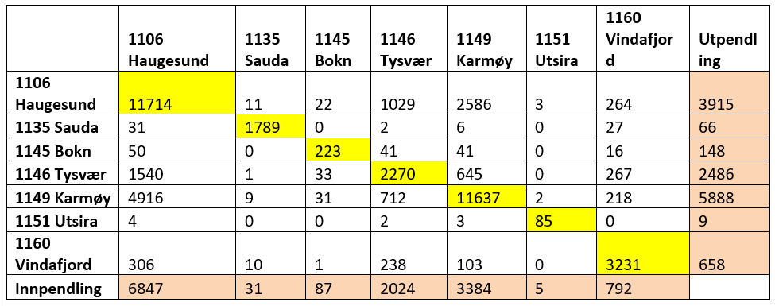
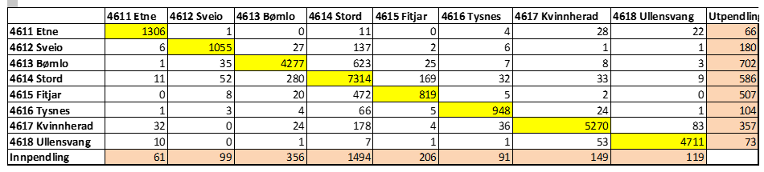
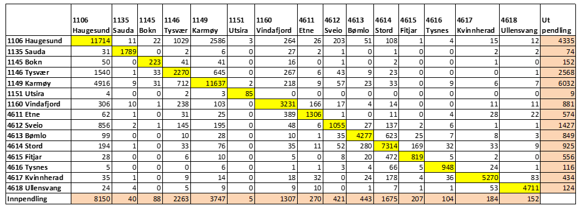

```{r setup, include=FALSE}
suppressPackageStartupMessages({
  library(readr)
  library(ggplot2)
  library(knitr)
  library(viridis)
  library(tidyverse)
  library(kableExtra)
  options(scipen = 999)
  })
knitr::opts_chunk$set(echo=FALSE, include = TRUE)
```

# Romlige forskjeller i næringsstruktur, virkninger av eksogene sjokk i basissysselsettingen, og lokale forskjeller I sysselsettingsvekst.

I denne oppgaven vil vi se på næringsstrukturer på Haugalandet, Sunnhordland og Ullensvang.

Problemstillinger og beregninger vi vil se nærmere på

-   Beskrive situasjonen slik den er for 2020, og for utviklingen over tid.
-   Sysselsettingsutviklingen for ulike næringer i ulike kommuner og for regionen samlet.
-   Andelen av sysselsettingen innenfor enkeltnæringer, og sammenligne situasjonen og utviklingen for lokale kommuner og lokal region med det som gjelder for nasjonen samlet.
-   Beregne lokaliseringskvotienter for ulike næringer i ulike kommuner, og for regionen(e) samlet.
-   Beregne ulike aggregeringsnivåer av næringer og geografi, identifiser mulige klynger basert på verdiene for lokaliseringskvotientene.
-   Gjøre en vurdering av hvor konsentrert/spredt en næring er fordelt mellom kommunene i regionen, basert på beregninger av den romlige Gini-indeksen.
-   Vurdere om sammenligningsgrunnlaget bør være samlet sysselsetting i regionen, eller samlet sysselsetting av nasjonen, og finne ut hvilken rolle det spiller om en bruker regionale eller nasjonale anslag for samlet sysselsetting.
-   Finne ut om næringsstrukturen i regionen har blitt mer eller mindre diversifisert, mangfoldig, over tid.
-   Beregne en regional mangfold-indeks og finne ut hvordan verdiene på en slik indeks er endret over tid.
-   Vurdere om sysselsettingsandelene skal sammenlignes med nasjonale eller regionale andeler for de ulike næringene
-   Gjenta beregninger for andeler av arbeidstakere i ulike næringer, lokaliseringskvotienter, den romlige Gini- koeffisienten og målet for mangfold av næringer, med utgangspunkt i data spesifisert etter arbeidstakernes bosted.
-   Sammenligne resultatene for data etter arbeidssted, og kommenter hvilken informasjon resultatene gir om romlig mobilitet i arbeidsmarkedet.
-   Gi en kort oversikt over pendlerstrømmer mellom kommunene i regionen
-   Beregne og presentere andeler av arbeidstakere med bosted i en kommune som har arbeidssted i andre kommuner, og gjør det samme for andelen av jobbene i en kommune som er besatt av arbeidstakere fra andre kommuner.
-   Diskutere forskjeller mellom kommunene i regionen, og drøft utviklingen over tid for ulike kommuner
-   Beregne og presentere andelen av arbeidstakere som bor og jobber innenfor samme kommune. Se om det er systematiske forskjeller sett i forhold til sentralitet og tilgjengelighet i det lokale arbeidsmarkedet. Og om det er bestemte trender i utviklingen for ulike kommuner.
-   Bruke beregningene av lokaliseringkvotienter til å dele næringene inn i lokal- og basisnæringer
-   Formulere en økonomisk basemodell og beregne økonomiske basemuliplikatorer for enkeltkommuner og region(er).
-   Vurdere lokale virkninger av alternative lokaliseringer i Odda, Husnes og Leirvik
-   Drøfte virkninger av et slikt positivt eksogent sjokk for den lokale økonomien gjennom bruk av en basemodell
-   Finne ut hvordan virkningene eventuelt spres til andre kommuner i regionen og hvordan en kan bruke data for pendlestrømmer til å predikere virkninger på sysselsettingen i ulike kommuner.
-   Sammenligne disse prediksjonene med de vi får når vi gjennomfører analysen på regionalt nivå.
-   Gi en shift-share analyse i en diskusjon av forskjeller i vekst for eksempel mellom indre, midtre og ytre deler av regionen, eller eventuelt områder/kommuner som har hatt sterk og svak befolkningsutvikling.

## Oversikt over befolkningene i regionene

### Haugalandet

Haugalandet består av kommunene Bokn (852), Haugesund (37357), Karmøy (42186), Sauda (4595), Tysvær(11065), Utsira(198) og Vindafjord(8714).
tilsammen bor det 104967 personer i denne regionen.
i tidsperioden vi har hentet inn data har det vert kommunesammenslåing i denne regionen.
Da ble Ølen og vindafjord slått i sammen til en kommune (hvordan har vi tatt hensyn til dette???)

### Sunnhordland og Ullensvang

Sunnhordland og Ullensvang består av kommunene Bømlo(11957), Etne(4062), Fitjar(3189), Kvinnherad(13071), Stord(18759), Sveio(5766), Tysnes(2869) og Ullensvang(11048).
Tilsammen bor det 70721 personer i denne regionen.

Tallene er hentet fra SSB 09.01.21 (<https://www.ssb.no/statbank/table/01223/tableViewLayout1/>) gjelder for 4 kvartal 2020.

"Forklar litt om de forskjellige næringene"..... 

```{r csv_filer}
syssel_arb <- read_csv("Data/syssel_arb.csv", show_col_types = FALSE)
hld_arb <- read_csv("Data/hld_arb.csv", show_col_types = FALSE)
sun_arb <- read_csv("Data/sun_arb.csv", show_col_types = FALSE)
har_arb <- read_csv("Data/har_arb.csv", show_col_types = FALSE)
syssel_bos <- read_csv("Data/syssel_bos.csv", show_col_types = FALSE)
hld_bos <- read_csv("Data/hld_bos.csv", show_col_types = FALSE)
sun_bos <- read_csv("Data/sun_bos.csv", show_col_types = FALSE)
har_bos <- read_csv("Data/har_bos.csv", show_col_types = FALSE)
Pendling <- read_csv("Data/Pendling.csv", show_col_types = FALSE)
hgl_Pendling <- read_csv("Data/hgl_Pendling.csv", show_col_types = FALSE)
sun_Pendling <- read_csv("Data/sun_Pendling.csv", show_col_types = FALSE)
```

# 1 Sysselsetting i ulike næringer, etter arbeidssted

## Haugalandet

Første regionen vi velger å se på er Haugalandet.
Her ønsker vi å se på utviklingen fra 2008 til 2020, av antall ansatte i sin helhet i regionen, samt de 6 mest relevante næringene.

```{r Arbeidssted_Haugalandet_1}
hld_arb %>% 
  ggplot(mapping = aes(x = År, y = `Alle Næringer`)) +
  geom_line() +
  labs(title = "Fig. 1: Haugalandet")+
  ylab("Antall ansatte i  \n alle næringer") +
  theme(axis.title.y = element_text(angle=0))+
  scale_x_continuous(breaks = seq(2008, 2020, by = 1))
```

I 2020 er det i underkant av 50 000 ansatte i alle næringer på Haugalandet.
Av Fig.
1 ser vi at Haugalandet fikk en nedgang i antall ansatte i 2015 og 2016.
I 2017 og 2018 ble det vekst, frem til det snudde i 2019 igjen.

```{r Arbeidssted_Haugalandet_2}
syssel_arb %>% 
  filter(knr %in% c(1106, 1135, 1145, 1146, 1149, 1151, 1160)) %>% 
  ggplot(mapping = aes(x = as.Date(paste0(aar, "-01-01")), y = `Alle Næringer`, (angle=0))) +
  scale_fill_distiller(palette = "Dark2") +
  geom_line(aes(group = knavn, colour = knavn)) +
  scale_size_manual(values = c(seq(2.0, 2, by = -0.1))) +
  geom_hline(yintercept = 0) +
  labs(title = "Fig. 2: Haugalandet", x = "År", y = "Antall ansatte i  \n alle næringer") +
  theme(axis.title.y = element_text(angle=0))+
  theme(legend.position = 'bottom')
```

I Fig.
2 ser vi at flere av kommunene på Haugalandet har hatt liten arbeidsplassvekst, med unntak av Tysvær, Vindafjord og Karmøy i den siste tiårsperioden.
Vi ser dette mer tydelig på fig.
3 og 4.

```{r hld_arb_long}
hld_arb_long <- syssel_arb %>%
  pivot_longer(
    cols = `Alle Næringer`:Uoppgitt,
    names_to = "Næring",
    values_to = "Ansatte")
```

```{r Næring_Total_Haugalandet_3_Største_Arbeidsted}
hld_arb_long %>% 
  filter(knavn %in% c("Haugesund", "Karmøy", "Vindafjord")) %>% 
  filter(Næring %in% "Alle Næringer") %>% 
  ggplot(mapping = aes(x = aar, y = Ansatte)) +
  scale_color_viridis(discrete = TRUE, option = "A") +
  labs(title = "Fig. 3: Haugalandet: Haugesund, Karmøy og Vindafjord", x = "År", y = "Antall ansatte") +
  geom_line(mapping = aes(group = Næring, colour = Næring)) +
  facet_wrap(facets = ~ knavn, scales = "free_y", ncol = 3) +
  theme(legend.position = 'bottom') + 
  scale_x_continuous(breaks = seq(2008, 2020, by = 2)) + 
  theme(axis.text.x = element_text(angle = 90, vjust = 0.5, hjust=1))
```

```{r Næring_Total_Haugalandet_4_Minste_Arbeidsted}
hld_arb_long %>% 
  filter(knavn %in% c("Bokn", "Sauda", "Tysvær", "Utsira")) %>% 
  filter(Næring %in% "Alle Næringer") %>% 
  ggplot(mapping = aes(x = aar, y = Ansatte)) +
  scale_color_viridis(discrete = TRUE, option = "A") +
  labs(title = "Fig. 4: Haugalandet: Bokn, Sauda Tysvær og Utsira", x = "År", y = "Antall ansatte") +
  geom_line(mapping = aes(group = Næring, colour = Næring)) +
  facet_wrap(facets = ~ knavn, scales = "free_y", ncol = 2) +
  theme(legend.position = 'bottom') + 
  scale_x_continuous(breaks = seq(2008, 2020, by = 2)) + 
  theme(axis.text.x = element_text(angle = 90, vjust = 0.5, hjust=1))
```

Figur 3 og 4 viser utviklingen av det totale antall ansatte i alle næringer på kommunalt nivå, innenfor Haugaland-regionen.

I disse figurene, så ser vi tydelig at Haugesund har hatt reduksjon i antall ansatte totalt sett, mens Karmøy, Vindafjord og Tysvær har hatt en markant vekst de siste ti årene.
Siden Haugesund har flest arbeidsplasser betyr utviklingen i Haugesund mye for de samlede tallene.

```{r Næringsfordeling_og_Utvikling_Haugelandet_3_Største_Arbeidssted}
hld_arb_long %>% 
  filter(knavn %in% c("Haugesund", "Karmøy", "Vindafjord")) %>% 
  filter(Næring %in% c("Industri", "Helse- og Sosialtjenester", "Finansiering og Forsikring", "Elektrisitet, Vann og Renovasjon", "Bygge- og Anleggsvirksomhet", "Jordbruk, Skogbrug og Fiske")) %>% 
  ggplot(mapping = aes(x = as.Date(paste0(aar, "-01-01")), y = Ansatte)) +
  scale_fill_distiller(palette = "Dark2") +
  labs(title = "Fig. 5: Haugalandet: Haugesund, Karmøy og Vindafjord", x = "År", y = "Antall ansatte") +
  geom_line(mapping = aes(group = Næring, colour = Næring)) +
  facet_wrap(facets = ~ knavn, scales = "free_y", ncol = 3) +
  theme(legend.position = 'bottom')
```

```{r Næringsfordeling_og_Utvikling_Haugelandet_4_Minste_Arbeidssted}
hld_arb_long %>% 
  filter(knavn %in% c("Bokn", "Sauda", "Tysvær", "Utsira")) %>% 
  filter(Næring %in% c("Industri", "Helse- og Sosialtjenester", "Finansiering og Forsikring", "Elektrisitet, Vann og Renovasjon", "Bygge- og Anleggsvirksomhet", "Jordbruk, Skogbrug og Fiske")) %>% 
  ggplot(mapping = aes(x = as.Date(paste0(aar, "-01-01")), y = Ansatte)) +
  scale_fill_distiller(palette = "Dark2") +
  labs(title = "Fig. 6: Haugalandet: Bokn, Sauda, Tysvær og Utsira", x = "År", y = "Antall ansatte") +
  geom_line(mapping = aes(group = Næring, colour = Næring)) +
  facet_wrap(facets = ~ knavn, scales = "free_y", ncol = 2) +
  theme(legend.position = 'bottom')
```

Figur 5 og 6 viser utviklingen av de 6 mest relevante næringene i Haugalandsregionen på kommune nivå.

Vi ser i de tre største kommunene, Haugesund, Karmøy og Vindafjord utgjør næringene Helse- og Sosialtjenester og Industri de største.
Helse- og Sosialtjenester har vokst jevnt og trutt de siste tiårene, mens antall ansatte i industrinæringen har variert fra kommune til kommune.
I Haugalandet utgjør primærnæringer (jordbruk, Skogbrug og Fiske) en større andel, enn hos Karmøy og Haugesund hvor primærnæringene kun utgjøre en liten andel.

### Sysselsettingsutviklingen for ulike næringer i ulike kommuner og for regionen samlet.

Det er relativt store kommunevise forskjeller i næringsstrukturen.
Rogaland har en forholdsvis ensidig næringsstruktur, olje og gass er dominerende.
Fylket er suverent dominerende for fossil energi.
De har for øvrig de siste årene satset på et en mer differensiert næringsstruktur og næringsliv ved å satse på helse, IKT og fornybar energi.

I våre modeller, er satsingen på helse den mest tydelige.
Av rent tekniske grunner er det vanskelig å se utviklingen i enkelte næringer som utgjør små andeler, på grunn av skalaen som er benyttet.
Til tross for dette, kan man se at næringsstrukturen i regionen samlet generelt sett har endret seg lite.

Rogaland har gode jordbruksmuligheter, men i Fig.
2: Haugalandet ser vi en nedgang i sysselsettingen de siste tiårene, mens det er en marginal økning i Sunnhordaland, jf.
Fig 9.
I Fig.
12: ser vi at Tysnes har hatt en markant økning i primærnæringen, relativt sett.

Universitets- og høgskolesektoren er liten i Rogaland, og den består for det første av Universitetet i Stavanger (UiS) og Høgskulen på Vestlandet (HVL) med campus Haugesund.

Haugaland Vekst, som er eigd/drevet av Haugalandsregionen er i spissen på å legge til rette for å etablere ny industri samt andre arbeidsplasser i regionen.

I helsesektoren er Stavanger universitetssykehus (SuS) sentralt.

## Sunnhordland

Videre ønsker vi å se på den samme utviklingen, men denne gangen i Sunnhordlandsregionen.

```{r Arbeidssted_Sunnhordland_1}
sun_arb %>% 
  ggplot(mapping = aes(x = År, y = `Alle Næringer`)) +
  geom_line() +
  labs(title = "Fig. 7: Sunnhordaland", x = "År", y = "Antall ansatte i  \n alle næringer") +
  theme(axis.title.y = element_text(angle=0))+ 
  scale_x_continuous(breaks = seq(2008, 2020, by = 1))
```

Her viser figur 7 utviklingen til den totale summen av ansatte i Sunnhordlandsregionen fra 2008 til 2020.
Sunnhordaland har i 2020 i underkant av 25 500 ansatte.
Vi ser ut ifrå figuren at Sunnhordlandsregionen hadde ein markant vekst ifrå 2008 til 2014 med periodar med svak nedgang.
Fra 2014 har det vært en reduksjon i totalt antall ansatte.

```{r Arbeidssted_Sunnhordland_2}
syssel_arb %>% 
  filter(knr %in% c(4611, 4612, 4613, 4614, 4615, 4616, 4617)) %>% 
  ggplot(mapping = aes(x = aar, y = `Alle Næringer`)) +
  scale_fill_distiller(palette = "Dark2") +
  geom_line(aes(group = knavn, colour = knavn)) +
  scale_size_manual(values = c(seq(2.0, 2, by = -0.1))) +
  geom_hline(yintercept = 0) +
  scale_x_continuous(breaks = seq(2008, 2020, by = 1)) +
   labs(title = "Fig. 8: Sunnhordland", x = "År") +
  theme(legend.position = 'bottom')
```

Figur 8 viser utviklingen av totalt ansatte i Sunnhordlandsregionen på kommunenivå i hele regionen fra 2008 til 2020.
Denne figuren gir oss en oversikt, men er ikke heilt brukervennelig.
Vi lager dermed en mer oversiktlig figur, jf.
figur 9 & 10.

```{r sun_arb_long}
sun_arb_long <- syssel_arb %>%
  pivot_longer(
    cols = `Alle Næringer`:Uoppgitt,
    names_to = "Næring",
    values_to = "Ansatte")
```

```{r Næring_Total_Sunnhordland_3_Største_Arbeidsted}
sun_arb_long %>% 
  filter(knavn %in% c("Bømlo", "Kvinnherad", "Stord")) %>% 
  filter(Næring %in% "Alle Næringer") %>% 
  ggplot(mapping = aes(x = aar, y = Ansatte)) +
  scale_color_viridis(discrete = TRUE, option = "A") +
  labs(title = "Fig. 9: Sunnhordland: Bømlo, Kvinnherad og Stord", x = "År", y = "Antall ansatte") +
  geom_line(mapping = aes(group = Næring, colour = Næring)) +
  facet_wrap(facets = ~ knavn, scales = "free_y", ncol = 3) +
  theme(legend.position = 'bottom') + 
  scale_x_continuous(breaks = seq(2008, 2020, by = 2)) + 
  theme(axis.text.x = element_text(angle = 90, vjust = 0.5, hjust=1))
```

```{r Næring_Total_Sunnhordland_4_Minste_Arbeidsted}
sun_arb_long %>% 
  filter(knavn %in% c("Etne", "Fitjar", "Sveio", "Tysnes")) %>% 
  filter(Næring %in% "Alle Næringer") %>% 
  ggplot(mapping = aes(x = aar, y = Ansatte)) +
  scale_color_viridis(discrete = TRUE, option = "A") +
  labs(title = "Fig. 10: Sunnhordland: Etne, Fithar, Sveio og Tysnes", x = "År", y = "Antall ansatte") +
  geom_line(mapping = aes(group = Næring, colour = Næring)) +
  facet_wrap(facets = ~ knavn, scales = "free_y", ncol = 2) +
  theme(legend.position = 'bottom') + 
  scale_x_continuous(breaks = seq(2008, 2020, by = 2)) + 
  theme(axis.text.x = element_text(angle = 90, vjust = 0.5, hjust=1))
```

Vi ser her ut ifra figur 9 og 10 utviklingen for hver enkelt kommune i Sunnhordland totalt sett, og her ser vi mye tydligere utviklingen fra 2008 til 2020.
En kan se her at Kvinnherad, Etne og Fitjar har hatt en reduksjon i totalt ansatte, mens Tysnes og Sveio har hatt ein kraftig vekst.
En interessant bemerking er Stord i 2014 og Kvinnherad fra 2008 til 2017.

For å få et bedre oversikt over utviklingen i kommunen ønsker vi å se på de 6 mest relevante næringene i hver kommune.

```{r Næringsfordeling_og_Utvikling_Sunnhordland_3_Største_Arbeidssted}
sun_arb_long %>% 
  filter(knavn %in% c("Bømlo", "Stord", "Kvinnherad")) %>% 
  filter(Næring %in% c("Industri", "Helse- og Sosialtjenester", "Finansiering og Forsikring", "Elektrisitet, Vann og Renovasjon", "Bygge- og Anleggsvirksomhet", "Jordbruk, Skogbrug og Fiske")) %>% 
  ggplot(mapping = aes(x = aar, y = Ansatte)) +
  scale_fill_distiller(palette = "Dark2") +
  labs(title = "Fig. 11: Sunnhordland: Bømlo, Kvinnherad og Stord", x = "År", y = "Antall ansatte") +
  geom_line(mapping = aes(group = Næring, colour = Næring)) +
  facet_wrap(facets = ~ knavn, scales = "free_y", ncol = 3) +
  theme(legend.position = 'bottom') + 
  scale_x_continuous(breaks = seq(2008, 2020, by = 2)) + 
  theme(axis.text.x = element_text(angle = 90, vjust = 0.5, hjust=1))
```

```{r Næringsfordeling_og_Utvikling_Sunnhordland_4_Minste_Arbeidssted}
sun_arb_long %>% 
  filter(knavn %in% c("Etne", "Sveio", "Fitjar", "Tysnes")) %>% 
  filter(Næring %in% c("Industri", "Helse- og Sosialtjenester", "Finansiering og Forsikring", "Elektrisitet, Vann og Renovasjon", "Bygge- og Anleggsvirksomhet", "Jordbruk, Skogbrug og Fiske")) %>% 
  ggplot(mapping = aes(x = as.Date(paste0(aar, "-01-01")), y = Ansatte)) +
  scale_fill_distiller(palette = "Dark2") +
  labs(title = "Fig. 12: Sunnhordland: Etne, Fitjar, Sveio og Tysnes", x = "År", y = "Antall ansatte") +
  geom_line(mapping = aes(group = Næring, colour = Næring)) +
  facet_wrap(facets = ~ knavn, scales = "free_y", ncol = 2) +
  theme(legend.position = 'bottom')
```

Figur 11 og 12 viser de 6 mest relevante næringene i hver enkelt kommune i Sunnhordlandsregionen fra 2008 til 2020.

En ser ut ifra figur 11 at i de tre største kommunene, *Bømlo*, *Kvinnherad* og *Stord* så har de alle hatt en reduksjon i industrien, samtidig som de har hatt en vekst i helse- og sosialtjenester.
Tysnes har vært stabil når det kommer til industri, men har sett ein markant vekst i primærnæringen (Jordbruk, Skogbruk og Fiske).

### Sysselsettingsutviklingen for ulike næringer i ulike kommuner og for regionen samlet.

Det første bemerkelsesverdige i Sunnhordlandsregionen er den markante reduksjonen i industri i Stord kommune i 2014, samt Kvinnherad fra 2008.
Dette stemmer overens med to hendelser.
Den første er oljeknekken i 2014 som medførte at bl.a.
Aker Stord AS som er avhengig av Olje-industrien måtte permitere.

Stord er en kommune som har mye offshore industri.
I 2008/2009 så stengte Sør-Norge Aluminium "B-Hallen" som medførte 50% reduksjon i produksjon, og dermed ansatte.
Interessant å bemerke at i Kvinnherad så er antall industriarbeidere redusert samtidig som antall ansatte i Helse- og Sosialetjenester økt.
Bømlo har også sett en stabil reduksjon i ansatte innen industri, samt vekst i Helse- og Sosialetjenester frem til 2018.

Ser en på hele Sunnhordlandsregionen i sin helhet, så ser vi en svært tydelig vekst innen Helse- og Sosialetjenester, og reduksjon innen industri i hele regionen.
Kvinnherad, Tysnes og Fitjar har opplevd ein markant vekst innen primærnæring.
**Kan det vere ein grunn til dette som burde diskuterast??**

# Fortsett Her (OA, KH)

## Hardanger

Til slutt må vi gjere det samme med *Hardanger*

I henhold til oppgavens krav til betrakter vi *Hardanger* før 2019 som Ullensvang- og Odda kommune som to separerte kommuner.
i 2020 så ble Ullensvang, Odda og Jondal slått sammen til Ullensvang.
Dette forklarer den voldsomme økningen i sysselsetting i regionen ved tidspunktet for kommunesammenslåing.

```{r Arbeidssted_Hardanger_1}
har_arb %>% 
  ggplot(mapping = aes(x = År, y = `Alle Næringer`)) +
  geom_line() +
  labs(title = "Fig. 13: Hardanger", y= "Alle Næringer") + 
  scale_x_continuous(breaks = seq(2008, 2020, by = 2))
```

```{r Arbeidssted_Hardanger_2}
syssel_arb %>% 
  filter(knr %in% c(4618, 1228)) %>% 
  ggplot(mapping = aes(x = aar, y = `Alle Næringer`)) +
  scale_fill_distiller(palette = "Dark2") +
  geom_line(aes(group = knavn, colour = knavn)) +
  scale_color_manual(values=c('#111111','#054987')) +
  scale_size_manual(values = c(seq(2.0, 2, by = -0.1))) +
  geom_hline(yintercept = 0) +
  scale_x_continuous(breaks = seq(2008, 2020, by = 1)) +
   labs(title = "Fig. 14: Hardanger", x = "År") +
  theme(legend.position = 'bottom')
```

```{r har_arb_long}
har_arb_long <- syssel_arb %>%
  pivot_longer(
    cols = `Alle Næringer`:Uoppgitt,
    names_to = "Næring",
    values_to = "Ansatte")
```

```{r Næring_Total_Hardanger_Arbeidsted}
har_arb_long %>% 
  filter(knavn %in% c("Odda", "Ullensvang")) %>% 
  filter(Næring %in% "Alle Næringer") %>% 
  ggplot(mapping = aes(x = as.Date(paste0(aar, "-01-01")), y = Ansatte)) +
  scale_color_viridis(discrete = TRUE, option = "A") +
  labs(title = "Fig. 15: Hardanger: Odda og Ullensvang", x = "År", y = "Antall ansatte") +
  geom_line(mapping = aes(group = Næring, colour = Næring)) +
  facet_wrap(facets = ~ knavn, scales = "free_y", ncol = 2) +
  theme(legend.position = 'bottom')
```

```{r Næringsfordeling_og_Utvikling_Hardanger_Arbeidssted}
har_arb_long %>% 
  filter(knavn %in% c("Odda", "Ullensvang")) %>% 
  filter(Næring %in% c("Industri", "Helse- og Sosialtjenester", "Finansiering og Forsikring", "Elektrisitet, Vann og Renovasjon", "Bygge- og Anleggsvirksomhet", "Jordbruk, Skogbrug og Fiske")) %>% 
  ggplot(mapping = aes(x = as.Date(paste0(aar, "-01-01")), y = Ansatte)) +
  scale_fill_distiller(palette = "Dark2") +
  labs(title = "Fig. 16: Hardanger: Odda, Ullensvang", x = "År", y = "Antall ansatte") +
  geom_line(mapping = aes(group = Næring, colour = Næring)) +
  facet_wrap(facets = ~ knavn, scales = "free_y", ncol = 3) +
  theme(legend.position = 'bottom')
```

Ullensvang kommune har stor kraftproduksjon og hovednæringen er industri.
Majoriteten av kraftproduksjonen foregår i tidligere Odda.
Odda er et ensidig industristed, men har også en maritim næring i tillegg.
I figur 16 ser vi at industrinæringen utgjør en betraktelig større andel av sysselsettingen i her.
Industrinæringen er også omfattet og bygg- og anleggsvirksomhet.
På motsatt side er jordbruk, helse- og sosialtjenester dominerende i Ullensvang.

**Generelt om Ullensvang kommune**

Ullensvang kommune (med Odda) har hatt en jevn og negativ befolkningsvekst i mange tiår.
Det gjenspeiles ikke tydelig i våre modeller på grunn av skalaen som er brukt.
I tillegg har vi ikke hensyntatt innvandrende arbeidere, eller midlertidige fraflyttede som for eksempel studenter.

# 2 (Dette er >EGENTLIG< siste del av oppgåve 3. Denne og Gini/RDI for oppgåve 3 bør bli byttast om)

Finner lokaliseringskvotienter for ulike næringer i ulike kommuner, og for regionen samlet

```{r}
#ordner etter kommunenavn og år
tmp <- syssel_bos
```

```{r}
hau20 <- syssel_bos %>% 
  filter(aar == "2020", knavn == "Haugesund")
```

```{r}
(hau20$Industri/hau20$`Alle Næringer`)
1905/18137
```

```{r}
lq_syssel_bos <- syssel_bos %>% 
  mutate(Eir_Er_industri = Industri/`Alle Næringer`,
         Eir_Er_Jordbruk = `Jordbruk, Skogbrug og Fiske`/`Alle Næringer`,
         Eir_Er_Undervisning = Undervisning/`Alle Næringer`,
         Eir_Er_Helse = `Helse- og Sosialtjenester`/`Alle Næringer`)
```

```{r}
library(readxl)
nasjonalt_bosted <- read_excel("Data/nasjonalt_bosted.xlsx")
```

```{r}
nasjonalt_bosted <- nasjonalt_bosted %>% 
  mutate(Ein_En_Industri = Industri/`Alle Næringer`,
         Ein_En_Jordbruk = `Jordbruk, Skogbruk og Fiske`/`Alle Næringer`,
         Ein_En_Undervisning = Undervisning/`Alle Næringer`,
         Ein_En_Helse = `Helse- og Sosialtjenester`/`Alle Næringer`)
```


```{r}
LQ_bos_Jordbruk <- lq_syssel_bos%>% 
  select(aar, knavn, Eir_Er_Jordbruk) %>% 
  mutate(aar = as.character(aar)) %>% 
  left_join(select(.data = nasjonalt_bosted, aar, Ein_En_Jordbruk), by = c("aar")) %>% 
  mutate(andel = Eir_Er_Jordbruk/Ein_En_Jordbruk
  )

LQ_bos_Industri <- lq_syssel_bos %>% 
  select(aar, knavn, Eir_Er_industri) %>% 
  mutate(aar = as.character(aar)) %>% 
  left_join(select(.data = nasjonalt_bosted, aar, Ein_En_Industri), by = c("aar")) %>% 
  mutate(andel = Eir_Er_industri/Ein_En_Industri)


LQ_bos_Undervisning <- lq_syssel_bos %>% 
  select(aar, knavn, Eir_Er_Undervisning) %>% 
  mutate(aar = as.character(aar)) %>% 
  left_join(select(.data = nasjonalt_bosted, aar, Ein_En_Undervisning), by = c("aar")) %>% 
  mutate(andel = Eir_Er_Undervisning/Ein_En_Undervisning)


LQ_bos_Helse <- lq_syssel_bos %>% 
  select(aar, knavn, Eir_Er_Helse) %>% 
  mutate(aar = as.character(aar)) %>% 
  left_join(select(.data = nasjonalt_bosted, aar, Ein_En_Helse), by = c("aar")) %>% 
  mutate(andel = Eir_Er_Helse/Ein_En_Helse)
```

```{r}
syssel_bos <- syssel_bos %>% 
  mutate(LQ_bos_Jordbruk = LQ_bos_Jordbruk$andel,
         LQ_bos_Industri = LQ_bos_Industri$andel,
         LQ_bos_Undervisning = LQ_bos_Undervisning$andel,
         LQ_bos_Helse = LQ_bos_Helse$andel)
```

```{r}
LQ_bos <- syssel_bos %>% 
  select(aar, knavn, LQ_bos_Jordbruk, LQ_bos_Industri, LQ_bos_Undervisning, LQ_bos_Helse)
```

```{r}
LQ_bos[is.na(LQ_bos)] = 0
```


For region Haugaland:

```{r hld_bos_Eir_Er}
hld_bos_LQ <- hld_bos %>% 
  mutate(Eir_Er_Jordbruk = `Jordbruk, Skogbruk og Fiske`/`Alle Næringer`,
         Eir_Er_Industri = Industri/`Alle Næringer`,
         Eir_Er_El_Vann_Reno = `Elektrisitet, Vann og Renovasjon`/`Alle Næringer`,
         Eir_Er_Bygg_og_Anlegg = `Bygge- og Annleggsvirksomhet`/`Alle Næringer`,
         Eir_Er_Finans = `Finansiering og Forsikring`/`Alle Næringer`,
         Eir_Er_Undervisning = Undervisning/`Alle Næringer`,
         Eir_Er_Helse = `Helse- og Sosialtjenester`/`Alle Næringer`,
         
         Ein_En_Jordbruk = nasjonalt_bosted$`Jordbruk, Skogbruk og Fiske`/nasjonalt_bosted$`Alle Næringer`,

         Ein_En_Industri = nasjonalt_bosted$Industri/nasjonalt_bosted$`Alle Næringer`,

         Ein_En_El_Vann_Reno = nasjonalt_bosted$`Elektrisitet, Vann og Renovasjon`/nasjonalt_bosted$`Alle Næringer`,
         
         Ein_En_Bygg_og_Anlegg = nasjonalt_bosted$`Bygge- og Anleggsvirksomhet`/nasjonalt_bosted$`Alle Næringer`,
         
         Ein_En_Finans = nasjonalt_bosted$`Finansiering og Forsikring`/nasjonalt_bosted$`Alle Næringer`,
         
         Ein_En_Undervisning = nasjonalt_bosted$Undervisning/nasjonalt_bosted$`Alle Næringer`,
         
         Ein_En_Helse = nasjonalt_bosted$`Helse- og Sosialtjenester`/nasjonalt_bosted$`Alle Næringer`,
         
         LQ_Primær = Eir_Er_Jordbruk/Ein_En_Jordbruk,
         LQ_Industri = Eir_Er_Industri/Ein_En_Industri,
         LQ_El_Vann_Reno = Eir_Er_El_Vann_Reno/Ein_En_El_Vann_Reno,
         LQ_Bygg_og_Anlegg = Eir_Er_Bygg_og_Anlegg/Ein_En_Bygg_og_Anlegg,
         LQ_Finans = Eir_Er_Finans/Ein_En_Finans,
         LQ_Undervisning = Eir_Er_Undervisning/Ein_En_Undervisning,
         LQ_Helse = Eir_Er_Helse/Ein_En_Helse
) %>% 
  select(År, `Alle Næringer`, LQ_Primær, LQ_Industri, LQ_El_Vann_Reno, LQ_Bygg_og_Anlegg, LQ_Finans, LQ_Undervisning, LQ_Helse) %>% 
  mutate_if(is.numeric, round, digits=6)
```

```{r}
kable(hld_bos_LQ,
             col.names = c("År",
                           "Alle",
                           "Jordbruk",
                           "Industri",
                           "Vann",
                           "Bygg",
                           "Finans",
                           "Underv.",
                           "Helse")) %>%
  add_header_above(c("Lokalkvotient, region: Haugalandet"=9))
```


### GINI Regionaltnivå
#### Haugalandet


```{r}
hld_bos_GINI <- hld_bos %>% 
  mutate(
    GINI_Primær = ((hld_bos$`Jordbruk, Skogbruk og Fiske`/nasjonalt_bosted$`Jordbruk, Skogbruk og Fiske` - hld_bos$`Alle Næringer`/nasjonalt_bosted$`Alle Næringer`)^2),
    
    GINI_Industri = ((hld_bos$Industri/nasjonalt_bosted$Industri - hld_bos$`Alle Næringer`/nasjonalt_bosted$`Alle Næringer`)^2),
    
    GINI_Helse = ((hld_bos$`Helse- og Sosialtjenester`/nasjonalt_bosted$`Helse- og Sosialtjenester` - hld_bos$`Alle Næringer`/nasjonalt_bosted$`Alle Næringer`)^2))
```

```{r}
hld_bos_GINI <- hld_bos_GINI %>% 
  mutate(
    RDI_Primær = 1 / abs(hld_bos$`Jordbruk, Skogbruk og Fiske` / hld_bos$`Alle Næringer` -
  nasjonalt_bosted$`Jordbruk, Skogbruk og Fiske` / nasjonalt_bosted$`Alle Næringer`),
    
    RDI_Industri = 1 / abs(hld_bos$Industri / hld_bos$`Alle Næringer` -
  nasjonalt_bosted$Industri / nasjonalt_bosted$`Alle Næringer`),
    
    RDI_Helse = 1 / abs(hld_bos$`Helse- og Sosialtjenester`/hld_bos$`Alle Næringer` -
  nasjonalt_bosted$`Helse- og Sosialtjenester`/nasjonalt_bosted$`Alle Næringer`)) %>% 
  
  select(År, `Alle Næringer`, GINI_Primær, GINI_Industri, GINI_Helse, RDI_Primær, RDI_Industri, RDI_Helse) %>% 
  mutate_if(is.numeric, round, digits=6)
```

```{r}
kable(hld_bos_GINI,
             col.names = c("År",
                           "Alle",
                           "Primær",
                           "Industri",
                           "Helse",
                           "Primær",
                           "Industri",
                           "Helse")) %>%
  add_header_above(c(" "=2, "GINI" = 3, "RDI" = 3)) %>%
  add_header_above(c("Haugalandet"=8))
```

### GINI Kommunalt nivå
#### Haugesund

```{r}
Haug_bos_GINI <- syssel_bos %>% 
  filter(knr %in% "1106")
```

```{r}
Haug_bos_GINI <- Haug_bos_GINI %>% 
  mutate(
    Eir_Er_Primær = `Jordbruk, Skogbrug og Fiske`/`Alle Næringer`,
    Eir_Er_Industri = Industri/`Alle Næringer`,
    Eir_Er_Helse = `Helse- og Sosialtjenester`/`Alle Næringer`,
    Ein_En_Primær = nasjonalt_bosted$`Jordbruk, Skogbruk og Fiske`/`Alle Næringer`,
    Ein_En_Industri = nasjonalt_bosted$Industri/`Alle Næringer`,
    Ein_En_Helse = nasjonalt_bosted$`Helse- og Sosialtjenester`/`Alle Næringer`,
    LQ_Primær = Eir_Er_Primær / Ein_En_Primær,
    LQ_Industri = Eir_Er_Industri / Ein_En_Industri,
    LQ_Helse = Eir_Er_Helse / Ein_En_Helse) %>% 
  mutate_if(is.numeric, round, digits=4)
```

```{r}
names(Haug_bos_GINI)[[5]] <- "År"
```

```{r}
Haug_bos_GINI <- Haug_bos_GINI %>% 
  mutate(
    GINI_Primær = ((Haug_bos_GINI$`Jordbruk, Skogbrug og Fiske`/nasjonalt_bosted$`Jordbruk, Skogbruk og Fiske` - Haug_bos_GINI$`Alle Næringer`/nasjonalt_bosted$`Alle Næringer`)^2),
    
    GINI_Industri = ((Haug_bos_GINI$Industri/nasjonalt_bosted$Industri - Haug_bos_GINI$`Alle Næringer`/nasjonalt_bosted$`Alle Næringer`)^2),
    
    GINI_Helse = ((Haug_bos_GINI$`Helse- og Sosialtjenester`/nasjonalt_bosted$`Helse- og Sosialtjenester` - Haug_bos_GINI$`Alle Næringer`/nasjonalt_bosted$`Alle Næringer`)^2))
```

```{r}
Haug_bos_GINI <- Haug_bos_GINI %>%
  mutate(
    RDI_Primær = 1 / abs(Haug_bos_GINI$`Jordbruk, Skogbrug og Fiske` / Haug_bos_GINI$`Alle Næringer` -
  nasjonalt_bosted$`Jordbruk, Skogbruk og Fiske` / nasjonalt_bosted$`Alle Næringer`),
    
    RDI_Industri = 1 / abs(Haug_bos_GINI$Industri / Haug_bos_GINI$`Alle Næringer` -
  nasjonalt_bosted$Industri / nasjonalt_bosted$`Alle Næringer`),
    
    RDI_Helse = 1 / abs(Haug_bos_GINI$`Helse- og Sosialtjenester`/Haug_bos_GINI$`Alle Næringer` -
  nasjonalt_bosted$`Helse- og Sosialtjenester`/nasjonalt_bosted$`Alle Næringer`)) %>% 
  
  select(År, `Alle Næringer`, Eir_Er_Primær, Eir_Er_Industri, Eir_Er_Helse, Ein_En_Primær, Ein_En_Industri, Ein_En_Helse, LQ_Primær, LQ_Industri, LQ_Helse, GINI_Primær, GINI_Industri, GINI_Helse, RDI_Primær, RDI_Industri, RDI_Helse) %>% 
  mutate_if(is.numeric, round, digits=6)
```

```{r}
kable(
  Haug_bos_GINI %>% 
    select(År, `Alle Næringer`, GINI_Primær, GINI_Industri, GINI_Helse, RDI_Primær, RDI_Industri, RDI_Helse),
             col.names = c("År",
                           "Alle",
                           "Primær",
                           "Industri",
                           "Helse",
                           "Primær",
                           "Industri",
                           "Helse")) %>% 
  add_header_above(c(" "=2, "GINI" = 3, "RDI" = 3)) %>% 
  add_header_above(c("Haugesund: Gini & RDI"=8))

kable(
  Haug_bos_GINI %>% 
    select(År, `Alle Næringer`, Eir_Er_Primær, Eir_Er_Industri, Eir_Er_Helse, Ein_En_Primær, Ein_En_Industri, Ein_En_Helse, LQ_Primær, LQ_Industri, LQ_Helse),
             col.names = c("År",
                           "Alle",
                           "Primær",
                           "Industri",
                           "Helse",
                           "Primær",
                           "Industri",
                           "Helse",
                           "Primær",
                           "Industri",
                           "Helse")) %>% 
  add_header_above(c(" "=2, "Eir/Er" = 3, "Ein/En" = 3, "LQ" = 3)) %>% 
  add_header_above(c("Haugesund: Lokalkvotient"=11))
```
### GINI Kommunalt nivå
#### Bokn

```{r}
Bokn_bos_GINI <- syssel_bos %>% 
  filter(knr %in% "1145")
```

```{r}
Bokn_bos_GINI <- Bokn_bos_GINI %>% 
  mutate(
    Eir_Er_Primær = `Jordbruk, Skogbrug og Fiske`/`Alle Næringer`,
    Eir_Er_Industri = Industri/`Alle Næringer`,
    Eir_Er_Helse = `Helse- og Sosialtjenester`/`Alle Næringer`,
    Ein_En_Primær = nasjonalt_bosted$`Jordbruk, Skogbruk og Fiske`/`Alle Næringer`,
    Ein_En_Industri = nasjonalt_bosted$Industri/`Alle Næringer`,
    Ein_En_Helse = nasjonalt_bosted$`Helse- og Sosialtjenester`/`Alle Næringer`,
    LQ_Primær = Eir_Er_Primær / Ein_En_Primær,
    LQ_Industri = Eir_Er_Industri / Ein_En_Industri,
    LQ_Helse = Eir_Er_Helse / Ein_En_Helse) %>% 
  mutate_if(is.numeric, round, digits=4)
```

```{r}
names(Bokn_bos_GINI)[[5]] <- "År"
```

```{r}
Bokn_bos_GINI <- Bokn_bos_GINI %>% 
  mutate(
    GINI_Primær = ((Bokn_bos_GINI$`Jordbruk, Skogbrug og Fiske`/nasjonalt_bosted$`Jordbruk, Skogbruk og Fiske` - Bokn_bos_GINI$`Alle Næringer`/nasjonalt_bosted$`Alle Næringer`)^2),
    
    GINI_Industri = ((Bokn_bos_GINI$Industri/nasjonalt_bosted$Industri - Bokn_bos_GINI$`Alle Næringer`/nasjonalt_bosted$`Alle Næringer`)^2),
    
    GINI_Helse = ((Bokn_bos_GINI$`Helse- og Sosialtjenester`/nasjonalt_bosted$`Helse- og Sosialtjenester` - Bokn_bos_GINI$`Alle Næringer`/nasjonalt_bosted$`Alle Næringer`)^2))
```

```{r}
Bokn_bos_GINI <- Bokn_bos_GINI %>% 
  mutate(
    RDI_Primær = 1 / abs(Bokn_bos_GINI$`Jordbruk, Skogbrug og Fiske` / Bokn_bos_GINI$`Alle Næringer` -
  nasjonalt_bosted$`Jordbruk, Skogbruk og Fiske` / nasjonalt_bosted$`Alle Næringer`),
    
    RDI_Industri = 1 / abs(Bokn_bos_GINI$Industri / Bokn_bos_GINI$`Alle Næringer` -
  nasjonalt_bosted$Industri / nasjonalt_bosted$`Alle Næringer`),
    
    RDI_Helse = 1 / abs(Bokn_bos_GINI$`Helse- og Sosialtjenester`/Bokn_bos_GINI$`Alle Næringer` -
  nasjonalt_bosted$`Helse- og Sosialtjenester`/nasjonalt_bosted$`Alle Næringer`)) %>% 
  
  select(År, `Alle Næringer`, Eir_Er_Primær, Eir_Er_Industri, Eir_Er_Helse, Ein_En_Primær, Ein_En_Industri, Ein_En_Helse, LQ_Primær, LQ_Industri, LQ_Helse, GINI_Primær, GINI_Industri, GINI_Helse, RDI_Primær, RDI_Industri, RDI_Helse) %>% 
  mutate_if(is.numeric, round, digits=6)
```

```{r}
kable(
  Bokn_bos_GINI %>% 
    select(År, `Alle Næringer`, GINI_Primær, GINI_Industri, GINI_Helse, RDI_Primær, RDI_Industri, RDI_Helse),
             col.names = c("År",
                           "Alle",
                           "Primær",
                           "Industri",
                           "Helse",
                           "Primær",
                           "Industri",
                           "Helse")) %>% 
  add_header_above(c(" "=2, "GINI" = 3, "RDI" = 3)) %>% 
  add_header_above(c("Bokn: Gini & RDI"=8))

kable(
  Bokn_bos_GINI %>% 
    select(År, `Alle Næringer`, Eir_Er_Primær, Eir_Er_Industri, Eir_Er_Helse, Ein_En_Primær, Ein_En_Industri, Ein_En_Helse, LQ_Primær, LQ_Industri, LQ_Helse),
             col.names = c("År",
                           "Alle",
                           "Primær",
                           "Industri",
                           "Helse",
                           "Primær",
                           "Industri",
                           "Helse",
                           "Primær",
                           "Industri",
                           "Helse")) %>% 
  add_header_above(c(" "=2, "Eir/Er" = 3, "Ein/En" = 3, "LQ" = 3)) %>% 
  add_header_above(c("Bokn"=11))
```
### GINI Kommunalt nivå
#### Tysvær

```{r}
Tysv_bos_GINI <- syssel_bos %>% 
  filter(knr %in% "1146")
```

```{r}
Tysv_bos_GINI <- Tysv_bos_GINI %>% 
  mutate(
    Eir_Er_Primær = `Jordbruk, Skogbrug og Fiske`/`Alle Næringer`,
    Eir_Er_Industri = Industri/`Alle Næringer`,
    Eir_Er_Helse = `Helse- og Sosialtjenester`/`Alle Næringer`,
    Ein_En_Primær = nasjonalt_bosted$`Jordbruk, Skogbruk og Fiske`/`Alle Næringer`,
    Ein_En_Industri = nasjonalt_bosted$Industri/`Alle Næringer`,
    Ein_En_Helse = nasjonalt_bosted$`Helse- og Sosialtjenester`/`Alle Næringer`,
    LQ_Primær = Eir_Er_Primær / Ein_En_Primær,
    LQ_Industri = Eir_Er_Industri / Ein_En_Industri,
    LQ_Helse = Eir_Er_Helse / Ein_En_Helse) %>% 
  mutate_if(is.numeric, round, digits=4)
```

```{r}
names(Tysv_bos_GINI)[[5]] <- "År"
```

```{r}
Tysv_bos_GINI <- Tysv_bos_GINI %>% 
  mutate(
    GINI_Primær = ((Tysv_bos_GINI$`Jordbruk, Skogbrug og Fiske`/nasjonalt_bosted$`Jordbruk, Skogbruk og Fiske` - Tysv_bos_GINI$`Alle Næringer`/nasjonalt_bosted$`Alle Næringer`)^2),
    
    GINI_Industri = ((Tysv_bos_GINI$Industri/nasjonalt_bosted$Industri - Tysv_bos_GINI$`Alle Næringer`/nasjonalt_bosted$`Alle Næringer`)^2),
    
    GINI_Helse = ((Tysv_bos_GINI$`Helse- og Sosialtjenester`/nasjonalt_bosted$`Helse- og Sosialtjenester` - Tysv_bos_GINI$`Alle Næringer`/nasjonalt_bosted$`Alle Næringer`)^2))
```

```{r}
Tysv_bos_GINI <- Tysv_bos_GINI %>% 
  mutate(
    RDI_Primær = 1 / abs(Tysv_bos_GINI$`Jordbruk, Skogbrug og Fiske` / Tysv_bos_GINI$`Alle Næringer` -
  nasjonalt_bosted$`Jordbruk, Skogbruk og Fiske` / nasjonalt_bosted$`Alle Næringer`),
    
    RDI_Industri = 1 / abs(Tysv_bos_GINI$Industri / Tysv_bos_GINI$`Alle Næringer` -
  nasjonalt_bosted$Industri / nasjonalt_bosted$`Alle Næringer`),
    
    RDI_Helse = 1 / abs(Tysv_bos_GINI$`Helse- og Sosialtjenester`/Tysv_bos_GINI$`Alle Næringer` -
  nasjonalt_bosted$`Helse- og Sosialtjenester`/nasjonalt_bosted$`Alle Næringer`)) %>% 
  
  select(År, `Alle Næringer`, Eir_Er_Primær, Eir_Er_Industri, Eir_Er_Helse, Ein_En_Primær, Ein_En_Industri, Ein_En_Helse, LQ_Primær, LQ_Industri, LQ_Helse, GINI_Primær, GINI_Industri, GINI_Helse, RDI_Primær, RDI_Industri, RDI_Helse) %>% 
  mutate_if(is.numeric, round, digits=6)
```

```{r}
kable(
  Tysv_bos_GINI %>% 
    select(År, `Alle Næringer`, GINI_Primær, GINI_Industri, GINI_Helse, RDI_Primær, RDI_Industri, RDI_Helse),
             col.names = c("År",
                           "Alle",
                           "Primær",
                           "Industri",
                           "Helse",
                           "Primær",
                           "Industri",
                           "Helse")) %>% 
  add_header_above(c(" "=2, "GINI" = 3, "RDI" = 3)) %>% 
  add_header_above(c("Tysvær: Gini & RDI"=8))

kable(
  Tysv_bos_GINI %>% 
    select(År, `Alle Næringer`, Eir_Er_Primær, Eir_Er_Industri, Eir_Er_Helse, Ein_En_Primær, Ein_En_Industri, Ein_En_Helse, LQ_Primær, LQ_Industri, LQ_Helse),
             col.names = c("År",
                           "Alle",
                           "Primær",
                           "Industri",
                           "Helse",
                           "Primær",
                           "Industri",
                           "Helse",
                           "Primær",
                           "Industri",
                           "Helse")) %>% 
  add_header_above(c(" "=2, "Eir/Er" = 3, "Ein/En" = 3, "LQ" = 3)) %>% 
  add_header_above(c("Tysvær"=11))
```
### GINI Kommunalt nivå
#### Karmøy

```{r}
Karm_bos_GINI <- syssel_bos %>% 
  filter(knr %in% "1149")
```

```{r}
Karm_bos_GINI <- Karm_bos_GINI %>% 
  mutate(
    Eir_Er_Primær = `Jordbruk, Skogbrug og Fiske`/`Alle Næringer`,
    Eir_Er_Industri = Industri/`Alle Næringer`,
    Eir_Er_Helse = `Helse- og Sosialtjenester`/`Alle Næringer`,
    Ein_En_Primær = nasjonalt_bosted$`Jordbruk, Skogbruk og Fiske`/`Alle Næringer`,
    Ein_En_Industri = nasjonalt_bosted$Industri/`Alle Næringer`,
    Ein_En_Helse = nasjonalt_bosted$`Helse- og Sosialtjenester`/`Alle Næringer`,
    LQ_Primær = Eir_Er_Primær / Ein_En_Primær,
    LQ_Industri = Eir_Er_Industri / Ein_En_Industri,
    LQ_Helse = Eir_Er_Helse / Ein_En_Helse) %>% 
  mutate_if(is.numeric, round, digits=4)
```

```{r}
names(Karm_bos_GINI)[[5]] <- "År"
```

```{r}
Karm_bos_GINI <- Karm_bos_GINI %>% 
  mutate(
    GINI_Primær = ((Karm_bos_GINI$`Jordbruk, Skogbrug og Fiske`/nasjonalt_bosted$`Jordbruk, Skogbruk og Fiske` - Karm_bos_GINI$`Alle Næringer`/nasjonalt_bosted$`Alle Næringer`)^2),
    
    GINI_Industri = ((Karm_bos_GINI$Industri/nasjonalt_bosted$Industri - Karm_bos_GINI$`Alle Næringer`/nasjonalt_bosted$`Alle Næringer`)^2),
    
    GINI_Helse = ((Karm_bos_GINI$`Helse- og Sosialtjenester`/nasjonalt_bosted$`Helse- og Sosialtjenester` - Karm_bos_GINI$`Alle Næringer`/nasjonalt_bosted$`Alle Næringer`)^2))
```

```{r}
Karm_bos_GINI <- Karm_bos_GINI %>% 
  mutate(
    RDI_Primær = 1 / abs(Karm_bos_GINI$`Jordbruk, Skogbrug og Fiske` / Karm_bos_GINI$`Alle Næringer` -
  nasjonalt_bosted$`Jordbruk, Skogbruk og Fiske` / nasjonalt_bosted$`Alle Næringer`),
    
    RDI_Industri = 1 / abs(Karm_bos_GINI$Industri / Karm_bos_GINI$`Alle Næringer` -
  nasjonalt_bosted$Industri / nasjonalt_bosted$`Alle Næringer`),
    
    RDI_Helse = 1 / abs(Karm_bos_GINI$`Helse- og Sosialtjenester`/Karm_bos_GINI$`Alle Næringer` -
  nasjonalt_bosted$`Helse- og Sosialtjenester`/nasjonalt_bosted$`Alle Næringer`)) %>% 
  
  select(År, `Alle Næringer`, Eir_Er_Primær, Eir_Er_Industri, Eir_Er_Helse, Ein_En_Primær, Ein_En_Industri, Ein_En_Helse, LQ_Primær, LQ_Industri, LQ_Helse, GINI_Primær, GINI_Industri, GINI_Helse, RDI_Primær, RDI_Industri, RDI_Helse) %>% 
  mutate_if(is.numeric, round, digits=6)
```

```{r}
kable(
  Karm_bos_GINI %>% 
    select(År, `Alle Næringer`, GINI_Primær, GINI_Industri, GINI_Helse, RDI_Primær, RDI_Industri, RDI_Helse),
             col.names = c("År",
                           "Alle",
                           "Primær",
                           "Industri",
                           "Helse",
                           "Primær",
                           "Industri",
                           "Helse")) %>% 
  add_header_above(c(" "=2, "GINI" = 3, "RDI" = 3)) %>% 
  add_header_above(c("Karmøy: Gini & RDI"=8))

kable(
  Karm_bos_GINI %>% 
    select(År, `Alle Næringer`, Eir_Er_Primær, Eir_Er_Industri, Eir_Er_Helse, Ein_En_Primær, Ein_En_Industri, Ein_En_Helse, LQ_Primær, LQ_Industri, LQ_Helse),
             col.names = c("År",
                           "Alle",
                           "Primær",
                           "Industri",
                           "Helse",
                           "Primær",
                           "Industri",
                           "Helse",
                           "Primær",
                           "Industri",
                           "Helse")) %>% 
  add_header_above(c(" "=2, "Eir/Er" = 3, "Ein/En" = 3, "LQ" = 3)) %>% 
  add_header_above(c("Karmøy"=11))
```
### Regionaltnivå Sunnhordaland


```{r sun_bos_Eir_Er}
sun_bos_LQ <- sun_bos %>% 
  mutate(Eir_Er_Jordbruk = `Jordbruk, Skogbruk og Fiske`/`Alle Næringer`,
         Eir_Er_Industri = Industri/`Alle Næringer`,
         Eir_Er_El_Vann_Reno = `Elektrisitet, Vann og Renovasjon`/`Alle Næringer`,
         Eir_Er_Bygg_og_Anlegg = `Bygge- og Annleggsvirksomhet`/`Alle Næringer`,
         Eir_Er_Finans = `Finansiering og Forsikring`/`Alle Næringer`,
         Eir_Er_Undervisning = Undervisning/`Alle Næringer`,
         Eir_Er_Helse = `Helse- og Sosialtjenester`/`Alle Næringer`,
         
         Ein_En_Jordbruk = nasjonalt_bosted$`Jordbruk, Skogbruk og Fiske`/nasjonalt_bosted$`Alle Næringer`,

         Ein_En_Industri = nasjonalt_bosted$Industri/nasjonalt_bosted$`Alle Næringer`,

         Ein_En_El_Vann_Reno = nasjonalt_bosted$`Elektrisitet, Vann og Renovasjon`/nasjonalt_bosted$`Alle Næringer`,
         
         Ein_En_Bygg_og_Anlegg = nasjonalt_bosted$`Bygge- og Anleggsvirksomhet`/nasjonalt_bosted$`Alle Næringer`,
         
         Ein_En_Finans = nasjonalt_bosted$`Finansiering og Forsikring`/nasjonalt_bosted$`Alle Næringer`,
         
         Ein_En_Undervisning = nasjonalt_bosted$Undervisning/nasjonalt_bosted$`Alle Næringer`,
         
         Ein_En_Helse = nasjonalt_bosted$`Helse- og Sosialtjenester`/nasjonalt_bosted$`Alle Næringer`,
         
         LQ_Primær = Eir_Er_Jordbruk/Ein_En_Jordbruk,
         LQ_Industri = Eir_Er_Industri/Ein_En_Industri,
         LQ_El_Vann_Reno = Eir_Er_El_Vann_Reno/Ein_En_El_Vann_Reno,
         LQ_Bygg_og_Anlegg = Eir_Er_Bygg_og_Anlegg/Ein_En_Bygg_og_Anlegg,
         LQ_Finans = Eir_Er_Finans/Ein_En_Finans,
         LQ_Undervisning = Eir_Er_Undervisning/Ein_En_Undervisning,
         LQ_Helse = Eir_Er_Helse/Ein_En_Helse
) %>% 
  select(År, `Alle Næringer`, LQ_Primær, LQ_Industri, LQ_El_Vann_Reno, LQ_Bygg_og_Anlegg, LQ_Finans, LQ_Undervisning, LQ_Helse) %>% 
  mutate_if(is.numeric, round, digits=6)
```

```{r}
kable(sun_bos_LQ,
             col.names = c("År",
                           "Alle",
                           "Jordbruk",
                           "Industri",
                           "Vann",
                           "Bygg",
                           "Finans",
                           "Underv.",
                           "Helse")) %>%
  add_header_above(c("Lokalkvotient, region: Sunnhordland"=9))

```

```{r}
sun_bos_GINI <- sun_bos %>% 
  mutate(
    GINI_Primær = ((sun_bos$`Jordbruk, Skogbruk og Fiske`/nasjonalt_bosted$`Jordbruk, Skogbruk og Fiske` - sun_bos$`Alle Næringer`/nasjonalt_bosted$`Alle Næringer`)^2),
    
    GINI_Industri = ((sun_bos$Industri/nasjonalt_bosted$Industri - sun_bos$`Alle Næringer`/nasjonalt_bosted$`Alle Næringer`)^2),
    
    GINI_Helse = ((sun_bos$`Helse- og Sosialtjenester`/nasjonalt_bosted$`Helse- og Sosialtjenester` - sun_bos$`Alle Næringer`/nasjonalt_bosted$`Alle Næringer`)^2))
```

```{r}
sun_bos_GINI <- sun_bos_GINI %>% 
  mutate(
    RDI_Primær = 1 / abs(sun_bos$`Jordbruk, Skogbruk og Fiske` / sun_bos$`Alle Næringer` -
  nasjonalt_bosted$`Jordbruk, Skogbruk og Fiske` / nasjonalt_bosted$`Alle Næringer`),
  
    RDI_Industri = 1 / abs(sun_bos$Industri / sun_bos$`Alle Næringer` -
  nasjonalt_bosted$Industri / nasjonalt_bosted$`Alle Næringer`),
  
    RDI_Helse = 1 / abs(sun_bos$`Helse- og Sosialtjenester`/sun_bos$`Alle Næringer` -
  nasjonalt_bosted$`Helse- og Sosialtjenester`/nasjonalt_bosted$`Alle Næringer`)) %>% 
  
  select(År, `Alle Næringer`, GINI_Primær, GINI_Industri, GINI_Helse, RDI_Primær, RDI_Industri, RDI_Helse) %>% 
  mutate_if(is.numeric, round, digits=6)
```

```{r}
kable(sun_bos_GINI,
             col.names = c("År",
                           "Alle",
                           "Primær",
                           "Industri",
                           "Helse",
                           "Primær",
                           "Industri",
                           "Helse")) %>%
  add_header_above(c(" "=2, "GINI" = 3, "RDI" = 3)) %>% 
  add_header_above(c("Region: Sunnhordland"=8))
```


#### Kommunale nivå i Sunnhordland 

##### Stord

```{r}
Stord_bos_GINI <- syssel_bos %>% 
  filter(knr %in% "4614")
```

```{r}
Stord_bos_GINI <- Stord_bos_GINI %>% 
  mutate(
    Eir_Er_Primær = `Jordbruk, Skogbrug og Fiske`/`Alle Næringer`,
    Eir_Er_Industri = Industri/`Alle Næringer`,
    Eir_Er_Helse = `Helse- og Sosialtjenester`/`Alle Næringer`,
    Ein_En_Primær = nasjonalt_bosted$`Jordbruk, Skogbruk og Fiske`/`Alle Næringer`,
    Ein_En_Industri = nasjonalt_bosted$Industri/`Alle Næringer`,
    Ein_En_Helse = nasjonalt_bosted$`Helse- og Sosialtjenester`/`Alle Næringer`,
    LQ_Primær = Eir_Er_Primær / Ein_En_Primær,
    LQ_Industri = Eir_Er_Industri / Ein_En_Industri,
    LQ_Helse = Eir_Er_Helse / Ein_En_Helse) %>% 
  mutate_if(is.numeric, round, digits=4)
```

```{r}
names(Stord_bos_GINI)[[5]] <- "År"
```

```{r}
Stord_bos_GINI <- Stord_bos_GINI %>% 
  mutate(
    GINI_Primær = ((Stord_bos_GINI$`Jordbruk, Skogbrug og Fiske`/nasjonalt_bosted$`Jordbruk, Skogbruk og Fiske` - Stord_bos_GINI$`Alle Næringer`/nasjonalt_bosted$`Alle Næringer`)^2),
    
    GINI_Industri = ((Stord_bos_GINI$Industri/nasjonalt_bosted$Industri - Stord_bos_GINI$`Alle Næringer`/nasjonalt_bosted$`Alle Næringer`)^2),
    
    GINI_Helse = ((Stord_bos_GINI$`Helse- og Sosialtjenester`/nasjonalt_bosted$`Helse- og Sosialtjenester` - Stord_bos_GINI$`Alle Næringer`/nasjonalt_bosted$`Alle Næringer`)^2))
```

```{r}
Stord_bos_GINI <- Stord_bos_GINI %>% 
  mutate(
    RDI_Primær = 1 / abs(Stord_bos_GINI$`Jordbruk, Skogbrug og Fiske` / Stord_bos_GINI$`Alle Næringer` -
  nasjonalt_bosted$`Jordbruk, Skogbruk og Fiske` / nasjonalt_bosted$`Alle Næringer`),
    
    RDI_Industri = 1 / abs(Stord_bos_GINI$Industri / Stord_bos_GINI$`Alle Næringer` -
  nasjonalt_bosted$Industri / nasjonalt_bosted$`Alle Næringer`),
    
    RDI_Helse = 1 / abs(Stord_bos_GINI$`Helse- og Sosialtjenester`/Stord_bos_GINI$`Alle Næringer` -
  nasjonalt_bosted$`Helse- og Sosialtjenester`/nasjonalt_bosted$`Alle Næringer`)) %>% 
  
  select(År, `Alle Næringer`, Eir_Er_Primær, Eir_Er_Industri, Eir_Er_Helse, Ein_En_Primær, Ein_En_Industri, Ein_En_Helse, LQ_Primær, LQ_Industri, LQ_Helse, GINI_Primær, GINI_Industri, GINI_Helse, RDI_Primær, RDI_Industri, RDI_Helse) %>% 
  mutate_if(is.numeric, round, digits=6)
```

```{r}
kable(
  Stord_bos_GINI %>% 
    select(År, `Alle Næringer`, GINI_Primær, GINI_Industri, GINI_Helse, RDI_Primær, RDI_Industri, RDI_Helse),
             col.names = c("År",
                           "Alle",
                           "Primær",
                           "Industri",
                           "Helse",
                           "Primær",
                           "Industri",
                           "Helse")) %>% 
  add_header_above(c(" "=2, "GINI" = 3, "RDI" = 3)) %>% 
  add_header_above(c("Stord: Gini & RDI"=8))

kable(
  Stord_bos_GINI %>% 
    select(År, `Alle Næringer`, Eir_Er_Primær, Eir_Er_Industri, Eir_Er_Helse, Ein_En_Primær, Ein_En_Industri, Ein_En_Helse, LQ_Primær, LQ_Industri, LQ_Helse),
             col.names = c("År",
                           "Alle",
                           "Primær",
                           "Industri",
                           "Helse",
                           "Primær",
                           "Industri",
                           "Helse",
                           "Primær",
                           "Industri",
                           "Helse")) %>% 
  add_header_above(c(" "=2, "Eir/Er" = 3, "Ein/En" = 3, "LQ" = 3)) %>% 
  add_header_above(c("Stord: "=11))
```


##### Kvinnherad

```{r}
Kvinn_bos_GINI <- syssel_bos %>% 
  filter(knr %in% "4617")
```

```{r}
Kvinn_bos_GINI <- Kvinn_bos_GINI %>% 
  mutate(
    Eir_Er_Primær = `Jordbruk, Skogbrug og Fiske`/`Alle Næringer`,
    Eir_Er_Industri = Industri/`Alle Næringer`,
    Eir_Er_Helse = `Helse- og Sosialtjenester`/`Alle Næringer`,
    Ein_En_Primær = nasjonalt_bosted$`Jordbruk, Skogbruk og Fiske`/`Alle Næringer`,
    Ein_En_Industri = nasjonalt_bosted$Industri/`Alle Næringer`,
    Ein_En_Helse = nasjonalt_bosted$`Helse- og Sosialtjenester`/`Alle Næringer`,
    LQ_Primær = Eir_Er_Primær / Ein_En_Primær,
    LQ_Industri = Eir_Er_Industri / Ein_En_Industri,
    LQ_Helse = Eir_Er_Helse / Ein_En_Helse) %>% 
  mutate_if(is.numeric, round, digits=4)
```

```{r}
names(Kvinn_bos_GINI)[[5]] <- "År"
```

```{r}
Kvinn_bos_GINI <- Kvinn_bos_GINI %>% 
  mutate(
    GINI_Primær = ((Kvinn_bos_GINI$`Jordbruk, Skogbrug og Fiske`/nasjonalt_bosted$`Jordbruk, Skogbruk og Fiske` - Kvinn_bos_GINI$`Alle Næringer`/nasjonalt_bosted$`Alle Næringer`)^2),
    
    GINI_Industri = ((Kvinn_bos_GINI$Industri/nasjonalt_bosted$Industri - Kvinn_bos_GINI$`Alle Næringer`/nasjonalt_bosted$`Alle Næringer`)^2),
    
    GINI_Helse = ((Kvinn_bos_GINI$`Helse- og Sosialtjenester`/nasjonalt_bosted$`Helse- og Sosialtjenester` - Kvinn_bos_GINI$`Alle Næringer`/nasjonalt_bosted$`Alle Næringer`)^2))
```

```{r}
Kvinn_bos_GINI <- Kvinn_bos_GINI %>% 
  mutate(
    RDI_Primær = 1 / abs(Kvinn_bos_GINI$`Jordbruk, Skogbrug og Fiske` / Kvinn_bos_GINI$`Alle Næringer` -
  nasjonalt_bosted$`Jordbruk, Skogbruk og Fiske` / nasjonalt_bosted$`Alle Næringer`),
    
    RDI_Industri = 1 / abs(Kvinn_bos_GINI$Industri / Kvinn_bos_GINI$`Alle Næringer` -
  nasjonalt_bosted$Industri / nasjonalt_bosted$`Alle Næringer`),
    
    RDI_Helse = 1 / abs(Kvinn_bos_GINI$`Helse- og Sosialtjenester`/Kvinn_bos_GINI$`Alle Næringer` -
  nasjonalt_bosted$`Helse- og Sosialtjenester`/nasjonalt_bosted$`Alle Næringer`)) %>% 
  
  select(År, `Alle Næringer`, Eir_Er_Primær, Eir_Er_Industri, Eir_Er_Helse, Ein_En_Primær, Ein_En_Industri, Ein_En_Helse, LQ_Primær, LQ_Industri, LQ_Helse, GINI_Primær, GINI_Industri, GINI_Helse, RDI_Primær, RDI_Industri, RDI_Helse) %>% 
  mutate_if(is.numeric, round, digits=6)
```

```{r}
kable(
  Kvinn_bos_GINI %>% 
    select(År, `Alle Næringer`, GINI_Primær, GINI_Industri, GINI_Helse, RDI_Primær, RDI_Industri, RDI_Helse),
             col.names = c("År",
                           "Alle",
                           "Primær",
                           "Industri",
                           "Helse",
                           "Primær",
                           "Industri",
                           "Helse")) %>% 
  add_header_above(c(" "=2, "GINI" = 3, "RDI" = 3)) %>% 
  add_header_above(c("Kvinnherad: Gini & RDI"=8))

kable(
  Kvinn_bos_GINI %>% 
    select(År, `Alle Næringer`, Eir_Er_Primær, Eir_Er_Industri, Eir_Er_Helse, Ein_En_Primær, Ein_En_Industri, Ein_En_Helse, LQ_Primær, LQ_Industri, LQ_Helse),
             col.names = c("År",
                           "Alle",
                           "Primær",
                           "Industri",
                           "Helse",
                           "Primær",
                           "Industri",
                           "Helse",
                           "Primær",
                           "Industri",
                           "Helse")) %>% 
  add_header_above(c(" "=2, "Eir/Er" = 3, "Ein/En" = 3, "LQ" = 3)) %>% 
  add_header_above(c("Kvinnherad: "=11))
```

##### Bømlo

```{r}
Bømlo_bos_GINI <- syssel_bos %>% 
  filter(knr %in% "4613")
```

```{r}
Bømlo_bos_GINI <- Bømlo_bos_GINI %>% 
  mutate(
    Eir_Er_Primær = `Jordbruk, Skogbrug og Fiske`/`Alle Næringer`,
    Eir_Er_Industri = Industri/`Alle Næringer`,
    Eir_Er_Helse = `Helse- og Sosialtjenester`/`Alle Næringer`,
    Ein_En_Primær = nasjonalt_bosted$`Jordbruk, Skogbruk og Fiske`/`Alle Næringer`,
    Ein_En_Industri = nasjonalt_bosted$Industri/`Alle Næringer`,
    Ein_En_Helse = nasjonalt_bosted$`Helse- og Sosialtjenester`/`Alle Næringer`,
    LQ_Primær = Eir_Er_Primær / Ein_En_Primær,
    LQ_Industri = Eir_Er_Industri / Ein_En_Industri,
    LQ_Helse = Eir_Er_Helse / Ein_En_Helse) %>% 
  mutate_if(is.numeric, round, digits=4)
```

```{r}
names(Bømlo_bos_GINI)[[5]] <- "År"
```

```{r}
Bømlo_bos_GINI <- Bømlo_bos_GINI %>% 
  mutate(
    GINI_Primær = ((Bømlo_bos_GINI$`Jordbruk, Skogbrug og Fiske`/nasjonalt_bosted$`Jordbruk, Skogbruk og Fiske` - Bømlo_bos_GINI$`Alle Næringer`/nasjonalt_bosted$`Alle Næringer`)^2),
    
    GINI_Industri = ((Bømlo_bos_GINI$Industri/nasjonalt_bosted$Industri - Bømlo_bos_GINI$`Alle Næringer`/nasjonalt_bosted$`Alle Næringer`)^2),
    
    GINI_Helse = ((Bømlo_bos_GINI$`Helse- og Sosialtjenester`/nasjonalt_bosted$`Helse- og Sosialtjenester` - Bømlo_bos_GINI$`Alle Næringer`/nasjonalt_bosted$`Alle Næringer`)^2))
```

```{r}
Bømlo_bos_GINI <- Bømlo_bos_GINI %>% 
  mutate(
    RDI_Primær = 1 / abs(Bømlo_bos_GINI$`Jordbruk, Skogbrug og Fiske` / Bømlo_bos_GINI$`Alle Næringer` -
  nasjonalt_bosted$`Jordbruk, Skogbruk og Fiske` / nasjonalt_bosted$`Alle Næringer`),
    
    RDI_Industri = 1 / abs(Bømlo_bos_GINI$Industri / Bømlo_bos_GINI$`Alle Næringer` -
  nasjonalt_bosted$Industri / nasjonalt_bosted$`Alle Næringer`),
    
    RDI_Helse = 1 / abs(Bømlo_bos_GINI$`Helse- og Sosialtjenester`/Bømlo_bos_GINI$`Alle Næringer` -
  nasjonalt_bosted$`Helse- og Sosialtjenester`/nasjonalt_bosted$`Alle Næringer`)) %>% 
  
  select(År, `Alle Næringer`, Eir_Er_Primær, Eir_Er_Industri, Eir_Er_Helse, Ein_En_Primær, Ein_En_Industri, Ein_En_Helse, LQ_Primær, LQ_Industri, LQ_Helse, GINI_Primær, GINI_Industri, GINI_Helse, RDI_Primær, RDI_Industri, RDI_Helse) %>% 
  mutate_if(is.numeric, round, digits=6)
```

```{r}
kable(
  Bømlo_bos_GINI %>% 
    select(År, `Alle Næringer`, GINI_Primær, GINI_Industri, GINI_Helse, RDI_Primær, RDI_Industri, RDI_Helse),
             col.names = c("År",
                           "Alle",
                           "Primær",
                           "Industri",
                           "Helse",
                           "Primær",
                           "Industri",
                           "Helse")) %>% 
  add_header_above(c(" "=2, "GINI" = 3, "RDI" = 3)) %>% 
  add_header_above(c("Bømlo: Gini & RDI"=8))

kable(
  Bømlo_bos_GINI %>% 
    select(År, `Alle Næringer`, Eir_Er_Primær, Eir_Er_Industri, Eir_Er_Helse, Ein_En_Primær, Ein_En_Industri, Ein_En_Helse, LQ_Primær, LQ_Industri, LQ_Helse),
             col.names = c("År",
                           "Alle",
                           "Primær",
                           "Industri",
                           "Helse",
                           "Primær",
                           "Industri",
                           "Helse",
                           "Primær",
                           "Industri",
                           "Helse")) %>% 
  add_header_above(c(" "=2, "Eir/Er" = 3, "Ein/En" = 3, "LQ" = 3)) %>% 
  add_header_above(c("Bømlo:"=11))
```

##### Sveio

```{r}
Sveio_bos_GINI <- syssel_bos %>% 
  filter(knr %in% "4612")
```

```{r}
Sveio_bos_GINI <- Sveio_bos_GINI %>% 
  mutate(
    Eir_Er_Primær = `Jordbruk, Skogbrug og Fiske`/`Alle Næringer`,
    Eir_Er_Industri = Industri/`Alle Næringer`,
    Eir_Er_Helse = `Helse- og Sosialtjenester`/`Alle Næringer`,
    Ein_En_Primær = nasjonalt_bosted$`Jordbruk, Skogbruk og Fiske`/`Alle Næringer`,
    Ein_En_Industri = nasjonalt_bosted$Industri/`Alle Næringer`,
    Ein_En_Helse = nasjonalt_bosted$`Helse- og Sosialtjenester`/`Alle Næringer`,
    LQ_Primær = Eir_Er_Primær / Ein_En_Primær,
    LQ_Industri = Eir_Er_Industri / Ein_En_Industri,
    LQ_Helse = Eir_Er_Helse / Ein_En_Helse) %>% 
  mutate_if(is.numeric, round, digits=4)
```

```{r}
names(Sveio_bos_GINI)[[5]] <- "År"
```

```{r}
Sveio_bos_GINI <- Sveio_bos_GINI %>% 
  mutate(
    GINI_Primær = ((Sveio_bos_GINI$`Jordbruk, Skogbrug og Fiske`/nasjonalt_bosted$`Jordbruk, Skogbruk og Fiske` - Sveio_bos_GINI$`Alle Næringer`/nasjonalt_bosted$`Alle Næringer`)^2),
    
    GINI_Industri = ((Sveio_bos_GINI$Industri/nasjonalt_bosted$Industri - Sveio_bos_GINI$`Alle Næringer`/nasjonalt_bosted$`Alle Næringer`)^2),
    
    GINI_Helse = ((Sveio_bos_GINI$`Helse- og Sosialtjenester`/nasjonalt_bosted$`Helse- og Sosialtjenester` - Sveio_bos_GINI$`Alle Næringer`/nasjonalt_bosted$`Alle Næringer`)^2))
```

```{r}
Sveio_bos_GINI <- Sveio_bos_GINI %>% 
  mutate(
    RDI_Primær = 1 / abs(Sveio_bos_GINI$`Jordbruk, Skogbrug og Fiske` / Sveio_bos_GINI$`Alle Næringer` -
  nasjonalt_bosted$`Jordbruk, Skogbruk og Fiske` / nasjonalt_bosted$`Alle Næringer`),
    
    RDI_Industri = 1 / abs(Sveio_bos_GINI$Industri / Sveio_bos_GINI$`Alle Næringer` -
  nasjonalt_bosted$Industri / nasjonalt_bosted$`Alle Næringer`),
    
    RDI_Helse = 1 / abs(Sveio_bos_GINI$`Helse- og Sosialtjenester`/Sveio_bos_GINI$`Alle Næringer` -
  nasjonalt_bosted$`Helse- og Sosialtjenester`/nasjonalt_bosted$`Alle Næringer`)) %>% 
  
  select(År, `Alle Næringer`, Eir_Er_Primær, Eir_Er_Industri, Eir_Er_Helse, Ein_En_Primær, Ein_En_Industri, Ein_En_Helse, LQ_Primær, LQ_Industri, LQ_Helse, GINI_Primær, GINI_Industri, GINI_Helse, RDI_Primær, RDI_Industri, RDI_Helse) %>% 
  mutate_if(is.numeric, round, digits=6)
```

```{r}
kable(
  Sveio_bos_GINI %>% 
    select(År, `Alle Næringer`, GINI_Primær, GINI_Industri, GINI_Helse, RDI_Primær, RDI_Industri, RDI_Helse),
             col.names = c("År",
                           "Alle",
                           "Primær",
                           "Industri",
                           "Helse",
                           "Primær",
                           "Industri",
                           "Helse")) %>% 
  add_header_above(c(" "=2, "GINI" = 3, "RDI" = 3)) %>% 
  add_header_above(c("Sveio: Gini & RDI"=8))

kable(
  Sveio_bos_GINI %>% 
    select(År, `Alle Næringer`, Eir_Er_Primær, Eir_Er_Industri, Eir_Er_Helse, Ein_En_Primær, Ein_En_Industri, Ein_En_Helse, LQ_Primær, LQ_Industri, LQ_Helse),
             col.names = c("År",
                           "Alle",
                           "Primær",
                           "Industri",
                           "Helse",
                           "Primær",
                           "Industri",
                           "Helse",
                           "Primær",
                           "Industri",
                           "Helse")) %>% 
  add_header_above(c(" "=2, "Eir/Er" = 3, "Ein/En" = 3, "LQ" = 3)) %>% 
  add_header_above(c("Sveio:"=11))
```


### Reginonalt nivå Hardanger

```{r har_bos_Eir_Er}
har_bos_LQ <- har_bos %>% 
  mutate(Eir_Er_Jordbruk = `Jordbruk, Skogbruk og Fiske`/`Alle Næringer`,
         Eir_Er_Industri = Industri/`Alle Næringer`,
         Eir_Er_El_Vann_Reno = `Elektrisitet, Vann og Renovasjon`/`Alle Næringer`,
         Eir_Er_Bygg_og_Anlegg = `Bygge- og Annleggsvirksomhet`/`Alle Næringer`,
         Eir_Er_Finans = `Finansiering og Forsikring`/`Alle Næringer`,
         Eir_Er_Undervisning = Undervisning/`Alle Næringer`,
         Eir_Er_Helse = `Helse- og Sosialtjenester`/`Alle Næringer`,
         
         Ein_En_Jordbruk = nasjonalt_bosted$`Jordbruk, Skogbruk og Fiske`/nasjonalt_bosted$`Alle Næringer`,

         Ein_En_Industri = nasjonalt_bosted$Industri/nasjonalt_bosted$`Alle Næringer`,

         Ein_En_El_Vann_Reno = nasjonalt_bosted$`Elektrisitet, Vann og Renovasjon`/nasjonalt_bosted$`Alle Næringer`,
         
         Ein_En_Bygg_og_Anlegg = nasjonalt_bosted$`Bygge- og Anleggsvirksomhet`/nasjonalt_bosted$`Alle Næringer`,
         
         Ein_En_Finans = nasjonalt_bosted$`Finansiering og Forsikring`/nasjonalt_bosted$`Alle Næringer`,
         
         Ein_En_Undervisning = nasjonalt_bosted$Undervisning/nasjonalt_bosted$`Alle Næringer`,
         
         Ein_En_Helse = nasjonalt_bosted$`Helse- og Sosialtjenester`/nasjonalt_bosted$`Alle Næringer`,
         
         LQ_Primær = Eir_Er_Jordbruk/Ein_En_Jordbruk,
         LQ_Industri = Eir_Er_Industri/Ein_En_Industri,
         LQ_El_Vann_Reno = Eir_Er_El_Vann_Reno/Ein_En_El_Vann_Reno,
         LQ_Bygg_og_Anlegg = Eir_Er_Bygg_og_Anlegg/Ein_En_Bygg_og_Anlegg,
         LQ_Finans = Eir_Er_Finans/Ein_En_Finans,
         LQ_Undervisning = Eir_Er_Undervisning/Ein_En_Undervisning,
         LQ_Helse = Eir_Er_Helse/Ein_En_Helse
) %>% 
  select(År, `Alle Næringer`, LQ_Primær, LQ_Industri, LQ_El_Vann_Reno, LQ_Bygg_og_Anlegg, LQ_Finans, LQ_Undervisning, LQ_Helse) %>% 
  mutate_if(is.numeric, round, digits=6)
```

```{r}
kable(hld_bos_LQ,
             col.names = c("År",
                           "Alle",
                           "Jordbruk",
                           "Industri",
                           "Vann",
                           "Bygg",
                           "Finans",
                           "Underv.",
                           "Helse")) %>%
  add_header_above(c("Lokalkvotient, region: Hardanger"=9))

```

```{r}
har_bos_GINI <- har_bos %>% 
  mutate(
    GINI_Primær = ((har_bos$`Jordbruk, Skogbruk og Fiske`/nasjonalt_bosted$`Jordbruk, Skogbruk og Fiske` - har_bos$`Alle Næringer`/nasjonalt_bosted$`Alle Næringer`)^2),
    
    GINI_Industri = ((har_bos$Industri/nasjonalt_bosted$Industri - har_bos$`Alle Næringer`/nasjonalt_bosted$`Alle Næringer`)^2),
    
    GINI_Helse = ((har_bos$`Helse- og Sosialtjenester`/nasjonalt_bosted$`Helse- og Sosialtjenester` - har_bos$`Alle Næringer`/nasjonalt_bosted$`Alle Næringer`)^2))
```

```{r}
har_bos_GINI <- har_bos_GINI %>% 
  mutate(
    RDI_Primær = 1 / abs(har_bos$`Jordbruk, Skogbruk og Fiske` / har_bos$`Alle Næringer` -
  nasjonalt_bosted$`Jordbruk, Skogbruk og Fiske` / nasjonalt_bosted$`Alle Næringer`),
  
    RDI_Industri = 1 / abs(har_bos$Industri / har_bos$`Alle Næringer` -
  nasjonalt_bosted$Industri / nasjonalt_bosted$`Alle Næringer`),
  
    RDI_Helse = 1 / abs(har_bos$`Helse- og Sosialtjenester`/har_bos$`Alle Næringer` -
  nasjonalt_bosted$`Helse- og Sosialtjenester`/nasjonalt_bosted$`Alle Næringer`))  %>%
  
  select(År, `Alle Næringer`, GINI_Primær, GINI_Industri, GINI_Helse, RDI_Primær, RDI_Industri, RDI_Helse) %>% 
  mutate_if(is.numeric, round, digits=6)
```

```{r}
kable(har_bos_GINI,
             col.names = c("År",
                           "Alle",
                           "Primær",
                           "Industri",
                           "Helse",
                           "Primær",
                           "Industri",
                           "Helse")) %>%
  add_header_above(c(" "=2, "GINI" = 3, "RDI" = 3)) %>% 
  add_header_above(c("Region: Hardanger"=8))
```


#### Kommunale nivå i Hardanger

##### Odda

```{r}
nasjo_bos_red <- nasjonalt_bosted %>% 
  filter(aar %in% c(2008:2019))
```

```{r}
Odda_bos_GINI <- syssel_bos %>% 
  filter(knr %in% "1228")
```

```{r}
Odda_bos_GINI <- Odda_bos_GINI %>% 
  mutate(
    Eir_Er_Primær = `Jordbruk, Skogbrug og Fiske`/`Alle Næringer`,
    Eir_Er_Industri = Industri/`Alle Næringer`,
    Eir_Er_Helse = `Helse- og Sosialtjenester`/`Alle Næringer`,
    Ein_En_Primær = nasjo_bos_red$`Jordbruk, Skogbruk og Fiske`/`Alle Næringer`,
    Ein_En_Industri = nasjo_bos_red$Industri/`Alle Næringer`,
    Ein_En_Helse = nasjo_bos_red$`Helse- og Sosialtjenester`/`Alle Næringer`,
    LQ_Primær = Eir_Er_Primær / Ein_En_Primær,
    LQ_Industri = Eir_Er_Industri / Ein_En_Industri,
    LQ_Helse = Eir_Er_Helse / Ein_En_Helse) %>% 
  mutate_if(is.numeric, round, digits=4)
```

```{r}
names(Odda_bos_GINI)[[5]] <- "År"
```

```{r}
Odda_bos_GINI <- Odda_bos_GINI %>% 
  mutate(
    GINI_Primær = ((Odda_bos_GINI$`Jordbruk, Skogbrug og Fiske`/nasjo_bos_red$`Jordbruk, Skogbruk og Fiske` - Odda_bos_GINI$`Alle Næringer`/nasjo_bos_red$`Alle Næringer`)^2),
    
    GINI_Industri = ((Odda_bos_GINI$Industri/nasjo_bos_red$Industri - Odda_bos_GINI$`Alle Næringer`/nasjo_bos_red$`Alle Næringer`)^2),
    
    GINI_Helse = ((Odda_bos_GINI$`Helse- og Sosialtjenester`/nasjo_bos_red$`Helse- og Sosialtjenester` - Odda_bos_GINI$`Alle Næringer`/nasjo_bos_red$`Alle Næringer`)^2))
```

```{r}
Odda_bos_GINI <- Odda_bos_GINI %>% 
  mutate(
    RDI_Primær = 1 / abs(Odda_bos_GINI$`Jordbruk, Skogbrug og Fiske` / Odda_bos_GINI$`Alle Næringer` -
  nasjo_bos_red$`Jordbruk, Skogbruk og Fiske` / nasjo_bos_red$`Alle Næringer`),
    
    RDI_Industri = 1 / abs(Odda_bos_GINI$Industri / Odda_bos_GINI$`Alle Næringer` -
  nasjo_bos_red$Industri / nasjo_bos_red$`Alle Næringer`),
    
    RDI_Helse = 1 / abs(Odda_bos_GINI$`Helse- og Sosialtjenester`/Odda_bos_GINI$`Alle Næringer` -
  nasjo_bos_red$`Helse- og Sosialtjenester`/nasjo_bos_red$`Alle Næringer`)) %>% 
  
  select( År, `Alle Næringer`, Eir_Er_Primær, Eir_Er_Industri, Eir_Er_Helse, Ein_En_Primær, Ein_En_Industri, Ein_En_Helse, LQ_Primær, LQ_Industri, LQ_Helse, GINI_Primær, GINI_Industri, GINI_Helse, RDI_Primær, RDI_Industri, RDI_Helse) %>% 
  mutate_if(is.numeric, round, digits=6)
```

```{r}
kable(
  Odda_bos_GINI %>% 
    select(År, `Alle Næringer`, GINI_Primær, GINI_Industri, GINI_Helse, RDI_Primær, RDI_Industri, RDI_Helse),
             col.names = c("År",
                           "Alle",
                           "Primær",
                           "Industri",
                           "Helse",
                           "Primær",
                           "Industri",
                           "Helse")) %>% 
  add_header_above(c(" "=2, "GINI" = 3, "RDI" = 3)) %>% 
  add_header_above(c("Odda(-2019): Gini & RDI"=8))

kable(
  Odda_bos_GINI %>% 
    select(År, `Alle Næringer`, Eir_Er_Primær, Eir_Er_Industri, Eir_Er_Helse, Ein_En_Primær, Ein_En_Industri, Ein_En_Helse, LQ_Primær, LQ_Industri, LQ_Helse),
             col.names = c("År",
                           "Alle",
                           "Primær",
                           "Industri",
                           "Helse",
                           "Primær",
                           "Industri",
                           "Helse",
                           "Primær",
                           "Industri",
                           "Helse")) %>% 
  add_header_above(c(" "=2, "Eir/Er" = 3, "Ein/En" = 3, "LQ" = 3)) %>% 
  add_header_above(c("Odda(-2019)"=11))
```

##### Ullensvang

```{r}
Ullen_bos_GINI <- syssel_bos %>% 
  filter(knr %in% "4618")
```

```{r}
Ullen_bos_GINI <- Ullen_bos_GINI %>% 
  mutate(
    Eir_Er_Primær = `Jordbruk, Skogbrug og Fiske`/`Alle Næringer`,
    Eir_Er_Industri = Industri/`Alle Næringer`,
    Eir_Er_Helse = `Helse- og Sosialtjenester`/`Alle Næringer`,
    Ein_En_Primær = nasjonalt_bosted$`Jordbruk, Skogbruk og Fiske`/`Alle Næringer`,
    Ein_En_Industri = nasjonalt_bosted$Industri/`Alle Næringer`,
    Ein_En_Helse = nasjonalt_bosted$`Helse- og Sosialtjenester`/`Alle Næringer`,
    LQ_Primær = Eir_Er_Primær / Ein_En_Primær,
    LQ_Industri = Eir_Er_Industri / Ein_En_Industri,
    LQ_Helse = Eir_Er_Helse / Ein_En_Helse) %>% 
  mutate_if(is.numeric, round, digits=4)
```

```{r}
names(Ullen_bos_GINI)[[5]] <- "År"
```

```{r}
Ullen_bos_GINI <- Ullen_bos_GINI %>% 
  mutate(
    GINI_Primær = ((Ullen_bos_GINI$`Jordbruk, Skogbrug og Fiske`/nasjonalt_bosted$`Jordbruk, Skogbruk og Fiske` - Ullen_bos_GINI$`Alle Næringer`/nasjonalt_bosted$`Alle Næringer`)^2),
    
    GINI_Industri = ((Ullen_bos_GINI$Industri/nasjonalt_bosted$Industri - Ullen_bos_GINI$`Alle Næringer`/nasjonalt_bosted$`Alle Næringer`)^2),
    
    GINI_Helse = ((Ullen_bos_GINI$`Helse- og Sosialtjenester`/nasjonalt_bosted$`Helse- og Sosialtjenester` - Ullen_bos_GINI$`Alle Næringer`/nasjonalt_bosted$`Alle Næringer`)^2))
```

```{r}
Ullen_bos_GINI <- Ullen_bos_GINI %>% 
  mutate(
    RDI_Primær = 1 / abs(Ullen_bos_GINI$`Jordbruk, Skogbrug og Fiske` / Ullen_bos_GINI$`Alle Næringer` -
  nasjonalt_bosted$`Jordbruk, Skogbruk og Fiske` / nasjonalt_bosted$`Alle Næringer`),
    
    RDI_Industri = 1 / abs(Ullen_bos_GINI$Industri / Ullen_bos_GINI$`Alle Næringer` -
  nasjonalt_bosted$Industri / nasjonalt_bosted$`Alle Næringer`),
    
    RDI_Helse = 1 / abs(Ullen_bos_GINI$`Helse- og Sosialtjenester`/Ullen_bos_GINI$`Alle Næringer` -
  nasjonalt_bosted$`Helse- og Sosialtjenester`/nasjonalt_bosted$`Alle Næringer`)) %>% 
  
  select(År, `Alle Næringer`, Eir_Er_Primær, Eir_Er_Industri, Eir_Er_Helse, Ein_En_Primær, Ein_En_Industri, Ein_En_Helse, LQ_Primær, LQ_Industri, LQ_Helse, GINI_Primær, GINI_Industri, GINI_Helse, RDI_Primær, RDI_Industri, RDI_Helse) %>% 
  mutate_if(is.numeric, round, digits=6)
```

```{r}
kable(
  Ullen_bos_GINI %>% 
    select(År, `Alle Næringer`, GINI_Primær, GINI_Industri, GINI_Helse, RDI_Primær, RDI_Industri, RDI_Helse),
             col.names = c("År",
                           "Alle",
                           "Primær",
                           "Industri",
                           "Helse",
                           "Primær",
                           "Industri",
                           "Helse")) %>% 
  add_header_above(c(" "=2, "GINI" = 3, "RDI" = 3)) %>% 
  add_header_above(c("Ullensvang: Gini & RDI"=8))

kable(
  Ullen_bos_GINI %>% 
    select(År, `Alle Næringer`, Eir_Er_Primær, Eir_Er_Industri, Eir_Er_Helse, Ein_En_Primær, Ein_En_Industri, Ein_En_Helse, LQ_Primær, LQ_Industri, LQ_Helse),
             col.names = c("År",
                           "Alle",
                           "Primær",
                           "Industri",
                           "Helse",
                           "Primær",
                           "Industri",
                           "Helse",
                           "Primær",
                           "Industri",
                           "Helse")) %>% 
  add_header_above(c(" "=2, "Eir/Er" = 3, "Ein/En" = 3, "LQ" = 3)) %>% 
  add_header_above(c("Ullensvang:"=11))
```

# 3 Sysselsetting i ulike næringer, etter bosted (Modeller under arbeid)

Nå har vi sett på utviklingen av hvor mange som jobber i kommunene etter de 6 mest relevante næringene, fra 2008 til 2020, i regionene Haugalandet, Sunnhordland og Hardanger. Vi har også sett på Gini-koeffisientene og RDI-verdiene til utvalgte kommuner og næringer, samt problemstillingen ved disse verdiene i forhold til dataene våres og aggregeringsnivået vi har.

Videre skal vi nå se på utviklingen for hvor mange som bor i de ulike kommunene i regionene, som jobber innenfor de 6 mest relevante næringene, Gini-koeffisientene og RDI-verdiene for dette. Vi begynner med Haugalandet.

## Haugalandet

```{r Bosted_Haugalandet_1}
hld_bos %>% 
  ggplot(mapping = aes(x = År, y = `Alle Næringer`)) +
  geom_line() +
  labs(title = "Fig. 17: Haugalandet")+
  ylab("Antall ansatte i  \n alle næringer") +
  theme(axis.title.y = element_text(angle=0))+
  scale_x_continuous(breaks = seq(2008, 2020, by = 1))
```

Figuren viser at det er svingninger i antall ansatte i alle næringer for perioden, med et ca. Gjennomsnitt for perioden på 51.000 antall bosatte på Haugalandet som er sysselsatt i alle næringer. Svingningene varierer fra +/- 1.500 fra gjennomsnittet i perioden, det ser likevel ut til at svingene er stabile og normale ettersom det vil være naturlig med hensyn på at nye bedrifter starter opp i regionen, bedrifter som legger ned eller bedrifter som re-lokaliserer seg et annet sted.

```{r Bosted_Haugalandet_2}
syssel_bos %>% 
  filter(knr %in% c(1106, 1135, 1145, 1146, 1149, 1151, 1160)) %>% 
  ggplot(mapping = aes(x = as.Date(paste0(aar, "-01-01")), y = `Alle Næringer`, (angle=0))) +
  scale_fill_distiller(palette = "Dark2") +
  geom_line(aes(group = knavn, colour = knavn)) +
  scale_size_manual(values = c(seq(2.0, 2, by = -0.1))) +
  geom_hline(yintercept = 0) +
  labs(title = "Fig. 18: Haugalandet", x = "År", y = "Antall ansatte i  \n alle næringer") +
  theme(axis.title.y = element_text(angle=0))+
  theme(legend.position = 'bottom')
```

Figuren viser en oversikt over antall ansatte i alle næringer etter kommuner på Haugalandet. Figuren viser at en rimelig stabil og relativt flat kurve for kommunene Utsira og Bokn, samt for Sauda og Vindafjord. For Tysvær viser figuren at det er litt mer svingninger, men de er lave sett i forhold til kommunene Karmøy og Haugesund. De to sistnevnte kommunene er de største i denne forbindelsen av antall ansatte i alle næringer, og de vil derfor også være mer utsatt for svingninger basert på at antall bedrifter er langt høyere, og da med hensyn på at bedrifter som starter opp, legger ned eller som re-lokaliserer seg. 

Det vi imidlertid ser er at Haugesund og Karmøy er så store at det påvirker hvordan de mindre kommunene som Bokn, Tysvær, Sauda og Utsira blir fremstilt. Vi velger derfor å skille ut de store og mindre kommunene for seg som vist videre.

```{r hld_bos_long}
hld_bos_long <- syssel_bos %>%
  pivot_longer(
    cols = `Alle Næringer`:Uoppgitt,
    names_to = "Næring",
    values_to = "Ansatte")
```

```{r Næring_Total_Haugalandet_3_Største_Bosted}
hld_bos_long %>% 
  filter(knavn %in% c("Haugesund", "Karmøy", "Vindafjord")) %>% 
  filter(Næring %in% "Alle Næringer") %>% 
  ggplot(mapping = aes(x = as.Date(paste0(aar, "-01-01")), y = Ansatte)) +
  scale_color_viridis(discrete = TRUE, option = "A") +
  labs(title = "Fig. 19: Haugalandet: Haugesund, Karmøy og Vindafjord", x = "År", y = "Antall ansatte") +
  geom_line(mapping = aes(group = Næring, colour = Næring)) +
  facet_wrap(facets = ~ knavn, scales = "free_y", ncol = 3) +
  theme(legend.position = 'bottom')
```

Denne figuren sammenligner antall ansatte i alle næringer for kommunene Haugesund, Karmøy og Vindafjord. Figuren viser at i året 2010, er det laveste året for perioden samlet for alle tre kommunene. Videre viser den at året 2014, var det høyeste året for perioden samlet for alle tre kommunene, og likedan viser figuren at fra 2014, har alle kommunene en nedgang frem til 2015-2016 før de tar seg opp igjen i 2018. Alle tre kommunene viser det samme mønsteret.

```{r Næring_Total_Haugalandet_4_Minste_Bosted}
hld_bos_long %>% 
  filter(knavn %in% c("Bokn", "Sauda", "Tysvær", "Utsira")) %>% 
  filter(Næring %in% "Alle Næringer") %>% 
  ggplot(mapping = aes(x = as.Date(paste0(aar, "-01-01")), y = Ansatte)) +
  scale_color_viridis(discrete = TRUE, option = "A") +
  labs(title = "Fig. 20: Haugalandet: Bokn, Sauda Tysvær og Utsira", x = "År", y = "Antall ansatte") +
  geom_line(mapping = aes(group = Næring, colour = Næring)) +
  facet_wrap(facets = ~ knavn, scales = "free_y", ncol = 2) +
  theme(legend.position = 'bottom')
```

Denne figuren viser antall ansatte etter bosted i alle næringer for kommunene Bokn, Sauda, Tysvær og Utsira. Kommunene Bokn og Tysvær har siden 2008, hatt en gradvis, men noe ustabil økning i antall ansatte, mens kommunen Sauda og Utsira har hatt en gradvis nedgang i antall ansatte.

For å få en bedre oversikt over regionen så velger vi å se på utviklingen til næringene i kommunene, som vist på figurene under.

```{r Næringsfordeling_og_Utvikling_Haugelandet_3_Største_Bosted}
hld_bos_long %>% 
  filter(knavn %in% c("Haugesund", "Karmøy", "Vindafjord")) %>% 
  filter(Næring %in% c("Industri", "Helse- og Sosialtjenester", "Finansiering og Forsikring", "Elektrisitet, Vann og Renovasjon", "Bygge- og Anleggsvirksomhet", "Jordbruk, Skogbrug og Fiske")) %>% 
  ggplot(mapping = aes(x = as.Date(paste0(aar, "-01-01")), y = Ansatte)) +
  scale_fill_distiller(palette = "Dark2") +
  labs(title = "Fig. 21: Haugalandet: Haugesund, Karmøy og Vindafjord", x = "År", y = "Antall ansatte") +
  geom_line(mapping = aes(group = Næring, colour = Næring)) +
  facet_wrap(facets = ~ knavn, scales = "free_y", ncol = 3) +
  theme(legend.position = 'bottom')
```

```{r Næringsfordeling_og_Utvikling_Haugelandet_4_Minste_Bosted}
hld_bos_long %>% 
  filter(knavn %in% c("Bokn", "Sauda", "Tysvær", "Utsira")) %>% 
  filter(Næring %in% c("Industri", "Helse- og Sosialtjenester", "Finansiering og Forsikring", "Elektrisitet, Vann og Renovasjon", "Bygge- og Anleggsvirksomhet", "Jordbruk, Skogbrug og Fiske")) %>% 
  ggplot(mapping = aes(x = as.Date(paste0(aar, "-01-01")), y = Ansatte)) +
  scale_fill_distiller(palette = "Dark2") +
  labs(title = "Fig. 22: Haugalandet: Bokn, Sauda, Tysvær og Utsira", x = "År", y = "Antall ansatte") +
  geom_line(mapping = aes(group = Næring, colour = Næring)) +
  facet_wrap(facets = ~ knavn, scales = "free_y", ncol = 2) +
  theme(legend.position = 'bottom')
```

Figurene viser antall ansatte etter bosted, fordelt i ulike næringer for kommunene på Haugalandet for perioden 2008 – 2020. Helse- og sosialtjenester er en av de største næringene for alle kommunene og denne er gradvis økende for alle kommunene i perioden. Industri er også blant de største næringene for alle disse kommunene, og denne næringen er gradvis fallende for Haugesund, Karmøy har et enda større fall for denne næringen for perioden, da særlig i perioden 2008-2010. For Vindafjord er denne næringen gradvis økende frem til 2015, før den deretter gradvis faller igjen.

For Haugesund og Karmøy ser vi at næringen jordbruk og skogbruk er særlig lave i antall ansatte, men for Vindafjord er denne næringen betydelig høyere enn Haugesund og Karmøy. For næringen finansiering og forsikring er denne kurven lav og tilnærmet flat i alle kommunene for perioden, og det samme for næringen elektrisitet, vann og renovasjon. Bygg- og anleggsvirksomhet er også lav for Haugesund og Karmøy, men som jordbruk og skogbruk, er denne næringen høyere i Vindafjord sammenlignet mot kommunene Haugesund og Karmøy tatt i betraktning at Vindafjord har et betydelig lavere antall ansatte totalt enn Haugesund og Karmøy har.

Vi ser også samme trendene for de små kommunene på Haugalandet. Helse- og sosiale tjenester har estt en stabil vekst i Bokn, Sauda, Tysvær og utsira, mens industrien har, med unntak av bokn, sett en reduksjon i perioden 2008 - 2020. Utsira skiller seg og ut med å hatt en svak vekst i jordbruk, skogbruk og fiske i denne perioden.

## Sunnhordland

Videre vil vi nå se på utviklingen for region Sunnhordland.

```{r Bosted_Sunnhordland_1}
sun_bos %>% 
  ggplot(mapping = aes(x = År, y = `Alle Næringer`)) +
  geom_line() +
  labs(title = "Fig. 23: Sunnhordaland", x = "År", y = "Antall ansatte i  \n alle næringer") +
  theme(axis.title.y = element_text(angle=0))+ 
  scale_x_continuous(breaks = seq(2008, 2020, by = 1))
```

Denne figuren viser utviklingen av antall sysselsatte i alle næringer etter bosted i region Sunnhordland fra 2008 til 2020. Vi kan se utfra grafen at regionen hadde en kraftig vekst 2010 - 2014, før den falt kraftig i 2014 - 2016, før regionen igjen har sett en kraftig vekst 2016 - 2019. Ut fra grafen kan det se ut til at regionen igjen står ovenfor en ny reduksjon fra 2019 av.

Vi ønsker å se videre på utviklingen på kommunalt nivå, som vist i figur 24.

```{r Bosted_Sunnhordland_2}
syssel_bos %>% 
  filter(knr %in% c(4611, 4612, 4613, 4614, 4615, 4616, 4617)) %>% 
  ggplot(mapping = aes(x = aar, y = `Alle Næringer`)) +
  scale_fill_distiller(palette = "Dark2") +
  geom_line(aes(group = knavn, colour = knavn)) +
  scale_size_manual(values = c(seq(2.0, 2, by = -0.1))) +
  geom_hline(yintercept = 0) +
  scale_x_continuous(breaks = seq(2008, 2020, by = 1)) +
   labs(title = "Fig. 24: Sunnhordland", x = "År") +
  theme(legend.position = 'bottom')
```

Vi ser ut fra grafen her at det er i hovedsak Stord, Kvinnherad og Bømlo som har sett den største svingningene i antall sysselsatte etter bosted. Men vi kan også klart se at disse 3 kommunene alle hadde et fall i 2014, som samsvarer med figur 23. Grafen er imidlertidig igjen ikke tydelig nok på grunn av de store kommunene, og vi fremstiller dermed grafene på kommunalt nivå her og for å tydeligjere utviklingen på kommunalt nivå.

```{r sun_bos_long}
sun_bos_long <- syssel_bos %>%
  pivot_longer(
    cols = `Alle Næringer`:Uoppgitt,
    names_to = "Næring",
    values_to = "Ansatte")
```

```{r Næring_Total_Sunnhordland_3_Største_Bosted}
sun_bos_long %>% 
  filter(knavn %in% c("Bømlo", "Kvinnherad", "Stord")) %>% 
  filter(Næring %in% "Alle Næringer") %>% 
  ggplot(mapping = aes(x = as.Date(paste0(aar, "-01-01")), y = Ansatte)) +
  scale_color_viridis(discrete = TRUE, option = "A") +
  labs(title = "Fig. 25: Sunnhordland: Bømlo, Kvinnherad og Stord", x = "År", y = "Antall ansatte") +
  geom_line(mapping = aes(group = Næring, colour = Næring)) +
  facet_wrap(facets = ~ knavn, scales = "free_y", ncol = 3) +
  theme(legend.position = 'bottom')
```

```{r Næring_Total_Sunnhordland_4_Minste_Bosted}
sun_bos_long %>% 
  filter(knavn %in% c("Etne", "Fitjar", "Sveio", "Tysnes")) %>% 
  filter(Næring %in% "Alle Næringer") %>% 
  ggplot(mapping = aes(x = as.Date(paste0(aar, "-01-01")), y = Ansatte)) +
  scale_color_viridis(discrete = TRUE, option = "A") +
  labs(title = "Fig. 26: Sunnhordland: Etne, Fithar, Sveio og Tysnes", x = "År", y = "Antall ansatte") +
  geom_line(mapping = aes(group = Næring, colour = Næring)) +
  facet_wrap(facets = ~ knavn, scales = "free_y", ncol = 2) +
  theme(legend.position = 'bottom')
```

Figur 25 og 26 viser her utviklingen i sysselsatte etter bosted i alle næringer på kommunalt nivå, men nå er hver kommune skilt fra hverandre og vi får et helt annet bilde. Vi ser nå reduksjonen i de tre store kommunene Stord, Kvinnherad og Bømlo mye mer tydelig og hvor drastisk denne reduksjonen har vært. Vi ser også nå at både Etne og Tysnes også har hatt en periode med kraftig reduksjon, med Etne 2014 - 2020 og Tysnes 2008 - 2012. Tysnes har sett en svak vekst fra 2012, mens fitjar såg sterk vekst 2009 - 2014 og har etter 2014 sett en svak reduksjon.

Vi er fortsatt ikke fornøyd, for vi ønsker å se på utviklingen til noen utvalgte næringer i kommunene, og ser dermed videre på figur 27 og 28.

```{r Næringsfordeling_og_Utvikling_Sunnhordland_3_Største_Bosted}
sun_bos_long %>% 
  filter(knavn %in% c("Bømlo", "Stord", "Kvinnherad")) %>% 
  filter(Næring %in% c("Industri", "Helse- og Sosialtjenester", "Finansiering og Forsikring", "Elektrisitet, Vann og Renovasjon", "Bygge- og Anleggsvirksomhet", "Jordbruk, Skogbrug og Fiske")) %>% 
  ggplot(mapping = aes(x = as.Date(paste0(aar, "-01-01")), y = Ansatte)) +
  scale_fill_distiller(palette = "Dark2") +
  labs(title = "Fig. 27: Sunnhordland: Bømlo, Kvinnherad og Stord", x = "År", y = "Antall ansatte") +
  geom_line(mapping = aes(group = Næring, colour = Næring)) +
  facet_wrap(facets = ~ knavn, scales = "free_y", ncol = 3) +
  theme(legend.position = 'bottom')
```

```{r Næringsfordeling_og_Utvikling_Sunnhordland_4_Minste_Bosted}
sun_bos_long %>% 
  filter(knavn %in% c("Etne", "Sveio", "Fitjar", "Tysnes")) %>% 
  filter(Næring %in% c("Industri", "Helse- og Sosialtjenester", "Finansiering og Forsikring", "Elektrisitet, Vann og Renovasjon", "Bygge- og Anleggsvirksomhet", "Jordbruk, Skogbrug og Fiske")) %>% 
  ggplot(mapping = aes(x = as.Date(paste0(aar, "-01-01")), y = Ansatte)) +
  scale_fill_distiller(palette = "Dark2") +
  labs(title = "Fig. 28: Sunnhordland: Etne, Fitjar, Sveio og Tysnes", x = "År", y = "Antall ansatte") +
  geom_line(mapping = aes(group = Næring, colour = Næring)) +
  facet_wrap(facets = ~ knavn, scales = "free_y", ncol = 2) +
  theme(legend.position = 'bottom')
```

Disse figurene, 27 og 28, viser utviklingen av sysselsatte etter bosted, på kommunalt nivå i Sunnhordlandsregionen 2008 - 2020.

Vi ser nå en trend for Stord, Bømlo og Kvinnherad. Alle disse tre kommunene hadde et kraftig fall i 2014. Kvinnherad hadde allerede en jevn reduksjon i industri frem til 2014, men hadde likevell et kraftig fall her, sammen med Stord og Bømlo. Reduksjonen i industri for Kvinnherad er mest sannsynelig stenging av "B-hallen" på Sør-Norge Aluminium AS i 2008 en av faktorene.

Vi såg akkuratt samme fallet når vi såg på sysselsetting etter arbeidssted tidlegere i rapporten. Dette kommer mest sannsynelig av olje-knekket i 2014. Aker Solutions, som det heter i dag, er blant Sunnhordlands største arbeidsplasser, og det er flere som pendler fra både Kvinnherad og Bømlo som jobber på Aker Solutions. Det er dermed naturlig at dårlige tider i olje-industrien vil påvirke Aker som igjen vil påvirke kommunene som har sysselsette i denne næringa. Vi ser enda et fall i Kvinnherad innen industri i 2016, og dette kommer mest sannsynelig av at Eide Marine Service på Halsnøy blei slått konkurs dette året.

Alle kommunene i region Sunnhordland har også sett en vekst innen helse- og sosialetjenester i perioden 2008 - 2020. Kvinnherad, Bømlo, Stord, Fitjar og Tysnes har sett en vekst innen jordbruk, skogbruk og fiske. Mest sannsynelig er fiske en stor del av veksten da Alsaker Fjordbruk har ekspandert i disse kommunene i denne perioden. Bygge- og Annleggsvirksomhet har også hatt en liten vekst i flere kommuner, mens finans relatert aktivitet har sett en jevn reduksjon i hele regionen.

## Hardanger

Siste regionen vi ønsker å se på er Hardanger, mer spesifikt Odda frem til 2019 og Ullensvang frem til 2020. Vi har ikke tatt med Jondal i Hardanger frem til 2019. Igjen så ser vi nå på sysselsetting etter bosted.

Vi ser først på hele regionen samlet, jf. figur 29.

```{r Bosted_Hardanger_1}
har_bos %>% 
  ggplot(mapping = aes(x = År, y = `Alle Næringer`)) +
  geom_line() +
  labs(title = "Fig. 29: Hardanger", y= "Alle Næringer") + 
  scale_x_continuous(breaks = seq(2008, 2020, by = 1))
```

Denne figuren viser utviklingen i sysselsetting etter bosted, i hele regionen, og her er det noe som bør bemerkes. Først og fremst siden Jondal ikke var en del av dataene frem til 2019, men blir tatt med i Ullensvang i 2020 så vil vi se en unaturlig vekst i denne figuren i 2020. Dette er en svakhet i modellen og dataene våres. Det andre er at vi kan se en klar negativ utvikling i Hardanger frem til 2019.

For å illustrere utviklingen bedre, så skiller vi mellom Odda og Ullensvang ved neste figur.

```{r Bosted_Hardanger_2}
syssel_bos %>% 
  filter(knr %in% c(4618, 1228)) %>% 
  ggplot(mapping = aes(x = aar, y = `Alle Næringer`)) +
  scale_fill_distiller(palette = "Dark2") +
  geom_line(aes(group = knavn, colour = knavn)) +
  scale_color_manual(values=c('#111111','#054987')) +
  scale_size_manual(values = c(seq(2.0, 2, by = -0.1))) +
  geom_hline(yintercept = 0) +
  scale_x_continuous(breaks = seq(2008, 2020, by = 1)) +
   labs(title = "Fig. 30: Hardanger", x = "År") +
  theme(legend.position = 'bottom')
```

Vi ser nå på denne figuren at både Odda og Ullensvang har hatt en negativ utvikling frem til og med 2019. Vi ser også problemstillingen med å ikke ta med Jondal under Hardanger kommer tydeligere frem nå med en ekstrem vekst etter sammenslåingen mellom Odda, Jondal og Ullensvang i 2020. Før vi velger å se på utvalgte næringer i hver kommune, velger vi først å dele kommunene opp hver for seg, slik at vi kan se utviklingen mer drastisk.

```{r har_bos_long}
har_bos_long <- syssel_bos %>%
  pivot_longer(
    cols = `Alle Næringer`:Uoppgitt,
    names_to = "Næring",
    values_to = "Ansatte")
```

```{r Næring_Total_Hardanger_Bosted}
har_bos_long %>% 
  filter(knavn %in% c("Odda", "Ullensvang")) %>% 
  filter(Næring %in% "Alle Næringer") %>% 
  ggplot(mapping = aes(x = as.Date(paste0(aar, "-01-01")), y = Ansatte)) +
  scale_color_viridis(discrete = TRUE, option = "A") +
  labs(title = "Fig. 31: Hardanger: Odda og Ullensvang", x = "År", y = "Antall ansatte") +
  geom_line(mapping = aes(group = Næring, colour = Næring)) +
  facet_wrap(facets = ~ knavn, scales = "free_y", ncol = 2) +
  theme(legend.position = 'bottom')
```

Vi ser her tydelig utviklingen til spessielt Odda, som berre stuper ned, uten tegn til å snu med det første. For å se utviklingen tydligere så deler vi igjen opp i noen utvalgte næringer i hver kommune, jf. figur 32.

```{r Næringsfordeling_og_Utvikling_Hardanger_Bosted}
har_bos_long %>% 
  filter(knavn %in% c("Odda", "Ullensvang")) %>% 
  filter(Næring %in% c("Industri", "Helse- og Sosialtjenester", "Finansiering og Forsikring", "Elektrisitet, Vann og Renovasjon", "Bygge- og Anleggsvirksomhet", "Jordbruk, Skogbrug og Fiske")) %>% 
  ggplot(mapping = aes(x = as.Date(paste0(aar, "-01-01")), y = Ansatte)) +
  scale_fill_distiller(palette = "Dark2") +
  labs(title = "Fig. 32: Hardanger: Odda, Ullensvang", x = "År", y = "Antall ansatte") +
  geom_line(mapping = aes(group = Næring, colour = Næring)) +
  facet_wrap(facets = ~ knavn, scales = "free_y", ncol = 2) +
  theme(legend.position = 'bottom')
```

Vi ser på denne figuren utviklingen av 6 ulike næringar, med hensyn på syssselsetting etter bosted, i Hardanger i denne perioden. Vi ser samme trender her i Hardanger som vi gjore for både Sunnhordland og Haugalandet: reduksjon i industri og primærnæringane, mens vi ser en vekst i helsetjenester. Det som er litt interessant å bemerke er at Odda såg en vekst i industri fra 2016 til 2019, men grunna sammenslåingen er det vanskelig å si noe om utviklingen for Odda spesifikt i 2020. Igjen så ser vi også samme ekstreme vekst i Ullensvang i 2020 som kommer av sammenslåingen.

Odda er kjent lokalt for sin aldrende befolkning, som mest sannsynelig er en viktig faktor for hvorfor Odda har sett så kraftig reduksjon i sysselsetting etter bosted, samtidig som kommunen har sett en vekst i helsetjenester.

# 3.1 Lokaliseringskvotienter (Dette er >EGENTLIG< Oppgåve 2 som blir gjort her. Denne og Gini/RDI for oppgåve 2 bør bli byttast om)

```{r}
library(readxl)
nasjonalt_arbeidssted <- read_excel("Data/nasjonalt_arbeidssted.xlsx")
```

## Lokaliseringskvotienter for regionene samlet

Nå har vi illustert og sett på grafene for utviklingen i de tre regionene, med hensyn på sysselsetting etter arbeidssted. Videre i rapporten skal vi nå se på Gini-koeffisientene og den regionelle diversifiserings indeksen (RDI) for å vurdere hvor spredt eller konsentrert, samt spesialisert utvlagt næringer er i utvalgte kommuner i regionene.

En generell regel for lokalkvotient-verdier (LQ-verdier) er at visst verdien er over 1 så kan det tyde på at det har oppstått klynger innenfor næringen. En annen regel er at verdier under 1 innenfor næringer som driver med produksjon og eksport så er det oftest en *lokal næring*. Visst verdien er over 1 så kan det være tegn til at det er *en basisnæring*.

Disse to argumentene for LQ-verdier vil vi ta med oss videre når vi ser nermere på regionene i sin helhet og utvalgte næringer, samt utvalgte kommuner og næringer i dem.

RDI er et mål for hvorvidt næringsstrukturen er diversifisert og mangfoldig. Høy RDI karakterisert ved mer spesialisert, og motsatt.

### Haugalandet 2008-2020

Første regionen vi ser på er Haugalandet.

```{r hld_arb_Eir_Er}
hld_arb_LQ <- hld_arb %>% 
  mutate(Eir_Er_Jordbruk = `Jordbruk, Skogbruk og Fiske`/`Alle Næringer`,
         Eir_Er_Industri = Industri/`Alle Næringer`,
         Eir_Er_El_Vann_Reno = `Elektrisitet, Vann og Renovasjon`/`Alle Næringer`,
         Eir_Er_Bygg_og_Anlegg = `Bygge- og Annleggsvirksomhet`/`Alle Næringer`,
         Eir_Er_Finans = `Finansiering og Forsikring`/`Alle Næringer`,
         Eir_Er_Undervisning = Undervisning/`Alle Næringer`,
         Eir_Er_Helse = `Helse- og Sosialtjenester`/`Alle Næringer`,
         
         Ein_En_Jordbruk = nasjonalt_arbeidssted$`Jordbruk, Skogbruk og Fiske`/nasjonalt_arbeidssted$`Alle Næringer`,

         Ein_En_Industri = nasjonalt_arbeidssted$Industri/nasjonalt_arbeidssted$`Alle Næringer`,

         Ein_En_El_Vann_Reno = nasjonalt_arbeidssted$`Elektrisitet, Vann og Renovasjon`/nasjonalt_arbeidssted$`Alle Næringer`,
         
         Ein_En_Bygg_og_Anlegg = nasjonalt_arbeidssted$`Bygge- og Anleggsvirksomhet`/nasjonalt_arbeidssted$`Alle Næringer`,
         
         Ein_En_Finans = nasjonalt_arbeidssted$`Finansiering og Forsikring`/nasjonalt_arbeidssted$`Alle Næringer`,
         
         Ein_En_Undervisning = nasjonalt_arbeidssted$Undervisning/nasjonalt_arbeidssted$`Alle Næringer`,
         
         Ein_En_Helse = nasjonalt_arbeidssted$`Helse- og Sosialtjenester`/nasjonalt_arbeidssted$`Alle Næringer`,
         
         LQ_Primær = Eir_Er_Jordbruk/Ein_En_Jordbruk,
         LQ_Industri = Eir_Er_Industri/Ein_En_Industri,
         LQ_El_Vann_Reno = Eir_Er_El_Vann_Reno/Ein_En_El_Vann_Reno,
         LQ_Bygg_og_Anlegg = Eir_Er_Bygg_og_Anlegg/Ein_En_Bygg_og_Anlegg,
         LQ_Finans = Eir_Er_Finans/Ein_En_Finans,
         LQ_Undervisning = Eir_Er_Undervisning/Ein_En_Undervisning,
         LQ_Helse = Eir_Er_Helse/Ein_En_Helse
) %>% 
  select(År, `Alle Næringer`, LQ_Primær, LQ_Industri, LQ_El_Vann_Reno, LQ_Bygg_og_Anlegg, LQ_Finans, LQ_Undervisning, LQ_Helse) %>% 
  mutate_if(is.numeric, round, digits=6)
```

```{r}
kable(hld_arb_LQ,
             col.names = c("År",
                           "Alle",
                           "Jordbruk",
                           "Industri",
                           "Vann",
                           "Bygg",
                           "Finans",
                           "Underv.",
                           "Helse")) %>%
  add_header_above(c("Lokalkvotient, region: Haugalandet"=9))
```

I denne tabellen så ser vi alle lokalkvotientverdiene(LQ) for 7 utvalgte næringer på Haugalandet. Ut av de 7 utvalgte næringene, så tyder det på at det er klynger i 5 av dem, som er *Jordbruk, Skogbruk og Fiske*, *Industri*, *Elektrisitet, Vann og Renovasjon*, *Bygge- og Annleggsvirksomhet*, og *Helsetjenester*.  Ut fra tabellen så tyder det på at regionen inneholder basisnæringer innen Industri og Elektrisitet, Vann og Renovasjon, da disse verdiene er langt over 1 og er typiske næringer en kan forvente å være basisnæringer.

Vi ser at industri har hatt størst utvikling fra LQ på 1.55 til 1.75, mens resten av næringene har vært ganske stabile, med untakt av finans som har blitt nesten halvert fra 0.478 til 0.286.

```{r}
hld_arb_GINI <- hld_arb %>% 
  mutate(
    GINI_Primær = ((hld_arb$`Jordbruk, Skogbruk og Fiske`/nasjonalt_arbeidssted$`Jordbruk, Skogbruk og Fiske` - hld_arb$`Alle Næringer`/nasjonalt_arbeidssted$`Alle Næringer`)^2),
    
    GINI_Industri = ((hld_arb$Industri/nasjonalt_arbeidssted$Industri - hld_arb$`Alle Næringer`/nasjonalt_arbeidssted$`Alle Næringer`)^2),
    
    GINI_Helse = ((hld_arb$`Helse- og Sosialtjenester`/nasjonalt_arbeidssted$`Helse- og Sosialtjenester` - hld_arb$`Alle Næringer`/nasjonalt_arbeidssted$`Alle Næringer`)^2))
```

```{r}
hld_arb_GINI <- hld_arb_GINI %>% 
  mutate(
    RDI_Primær = 1 / abs(hld_arb$`Jordbruk, Skogbruk og Fiske` / hld_arb$`Alle Næringer` -
  nasjonalt_arbeidssted$`Jordbruk, Skogbruk og Fiske` / nasjonalt_arbeidssted$`Alle Næringer`),
    
    RDI_Industri = 1 / abs(hld_arb$Industri / hld_arb$`Alle Næringer` -
  nasjonalt_arbeidssted$Industri / nasjonalt_arbeidssted$`Alle Næringer`),
    
    RDI_Helse = 1 / abs(hld_arb$`Helse- og Sosialtjenester`/hld_arb$`Alle Næringer` -
  nasjonalt_arbeidssted$`Helse- og Sosialtjenester`/nasjonalt_arbeidssted$`Alle Næringer`)) %>% 
  
  select(År, `Alle Næringer`, GINI_Primær, GINI_Industri, GINI_Helse, RDI_Primær, RDI_Industri, RDI_Helse) %>% 
  mutate_if(is.numeric, round, digits=6)
```

```{r}
kable(hld_arb_GINI,
             col.names = c("År",
                           "Alle",
                           "Primær",
                           "Industri",
                           "Helse",
                           "Primær",
                           "Industri",
                           "Helse")) %>%
  add_header_above(c(" "=2, "GINI" = 3, "RDI" = 3)) %>%
  add_header_above(c("Haugalandet"=8))
```

Her ser vi flere faktorer.

Det første og viktigeste vi ser med en gang er GINI-koeffisientene. Vi har en stor svakhet i disse beregninge, som stammer fra aggregeringsnivået vårt. I våre data er primær, industri og helsetjenester en "felles benevnelse". Det vil si at når vi hentet data fra SSB så skilte ikke SSB næringene innen hver bemerkelse, i tabellen vi brukte som var *Tabell 07984*. Den har med andre ord slått sammen alt som har med industri å gjøre, f.eks. olje og gass, bergvinning, skipsverft, osv. under en og samme kategori. Dette gjør at alle GINI-koeffisienter vi rekner ut vil være ekstremt små fordi den skiller ikke ut de store ulikhetene mellom næringene innenfor hver bemerkelse. Dette igjen medfører at det er vanskelig å vurdere GINI-koeffisientene optimalt. Dette er desverre et problem som følger oss gjennom rapporten videre på alle regioner og kommuner hvor vi rekner ut GINI-koeffisientene.

Vi ser ut ifra GINI-verdiene våres for Haugalandet at industri har en mye høyere verdi enn primærnæringer og helsetjenester, som tyder på at det er større grad av klyngedannelser av industri i regionen. En annen observasjon verdt å merke seg, er at blant de tre undersøkte næringene, er det kun «Industri» som har stadig hatt sterkere klyngetendenser de siste årene. Dette gjenspeiles av en stadig økende verdi på indeksen over tid. Samme observasjon kan vi ikke se hos primærnæringen eller i helsesektoren.

I regionen, Haugelandet, ser vi at næringsstrukturen i primærnæringene er i stor grad spesialisert. I tillegg tendenserer indeksen til å øke med tid. I de to andre næringene er indeksen relativ jevn, der industri er den laveste og dermed mye mer diversifisert.

#### Kommunenivå på Haugalandet (Haugesund, Karmøy, Tysvær og Bokn)

##### Haugesund

```{r}
Haug_arb_GINI <- syssel_arb %>% 
  filter(knr %in% "1106")
```

```{r}
Haug_arb_GINI <- Haug_arb_GINI %>% 
  mutate(
    Eir_Er_Primær = `Jordbruk, Skogbrug og Fiske`/`Alle Næringer`,
    Eir_Er_Industri = Industri/`Alle Næringer`,
    Eir_Er_Helse = `Helse- og Sosialtjenester`/`Alle Næringer`,
    
    Ein_En_Primær = nasjonalt_arbeidssted$`Jordbruk, Skogbruk og Fiske`/nasjonalt_arbeidssted$`Alle Næringer`,
    
    Ein_En_Industri = nasjonalt_arbeidssted$Industri/nasjonalt_arbeidssted$`Alle Næringer`,
    
    Ein_En_Helse = nasjonalt_arbeidssted$`Helse- og Sosialtjenester`/nasjonalt_arbeidssted$`Alle Næringer`,
    
    LQ_Primær = Eir_Er_Primær / Ein_En_Primær,
    LQ_Industri = Eir_Er_Industri / Ein_En_Industri,
    LQ_Helse = Eir_Er_Helse / Ein_En_Helse) %>% 
  mutate_if(is.numeric, round, digits=4)
```

```{r}
names(Haug_arb_GINI)[[5]] <- "År"
```

```{r}
Haug_arb_GINI <- Haug_arb_GINI %>% 
  mutate(
    GINI_Primær = ((Haug_arb_GINI$`Jordbruk, Skogbrug og Fiske`/nasjonalt_arbeidssted$`Jordbruk, Skogbruk og Fiske` - Haug_arb_GINI$`Alle Næringer`/nasjonalt_arbeidssted$`Alle Næringer`)^2),
    
    GINI_Industri = ((Haug_arb_GINI$Industri/nasjonalt_arbeidssted$Industri - Haug_arb_GINI$`Alle Næringer`/nasjonalt_arbeidssted$`Alle Næringer`)^2),
    
    GINI_Helse = ((Haug_arb_GINI$`Helse- og Sosialtjenester`/nasjonalt_arbeidssted$`Helse- og Sosialtjenester` - Haug_arb_GINI$`Alle Næringer`/nasjonalt_arbeidssted$`Alle Næringer`)^2))
```

```{r}
Haug_arb_GINI <- Haug_arb_GINI %>%
  mutate(
    RDI_Primær = 1 / abs(Haug_arb_GINI$`Jordbruk, Skogbrug og Fiske` / Haug_arb_GINI$`Alle Næringer` -
  nasjonalt_arbeidssted$`Jordbruk, Skogbruk og Fiske` / nasjonalt_arbeidssted$`Alle Næringer`),
    
    RDI_Industri = 1 / abs(Haug_arb_GINI$Industri / Haug_arb_GINI$`Alle Næringer` -
  nasjonalt_arbeidssted$Industri / nasjonalt_arbeidssted$`Alle Næringer`),
    
    RDI_Helse = 1 / abs(Haug_arb_GINI$`Helse- og Sosialtjenester`/Haug_arb_GINI$`Alle Næringer` -
  nasjonalt_arbeidssted$`Helse- og Sosialtjenester`/nasjonalt_arbeidssted$`Alle Næringer`)) %>% 
  
  select(År, `Alle Næringer`, Eir_Er_Primær, Eir_Er_Industri, Eir_Er_Helse, Ein_En_Primær, Ein_En_Industri, Ein_En_Helse, LQ_Primær, LQ_Industri, LQ_Helse, GINI_Primær, GINI_Industri, GINI_Helse, RDI_Primær, RDI_Industri, RDI_Helse) %>% 
  mutate_if(is.numeric, round, digits=6)
```

```{r}
kable(
  Haug_arb_GINI %>% 
    select(År, `Alle Næringer`, GINI_Primær, GINI_Industri, GINI_Helse, RDI_Primær, RDI_Industri, RDI_Helse),
             col.names = c("År",
                           "Alle",
                           "Primær",
                           "Industri",
                           "Helse",
                           "Primær",
                           "Industri",
                           "Helse")) %>% 
  add_header_above(c(" "=2, "GINI" = 3, "RDI" = 3)) %>% 
  add_header_above(c("Haugesund: Gini & RDI"=8))

kable(
  Haug_arb_GINI %>% 
    select(År, `Alle Næringer`, Eir_Er_Primær, Eir_Er_Industri, Eir_Er_Helse, Ein_En_Primær, Ein_En_Industri, Ein_En_Helse, LQ_Primær, LQ_Industri, LQ_Helse),
             col.names = c("År",
                           "Alle",
                           "Primær",
                           "Industri",
                           "Helse",
                           "Primær",
                           "Industri",
                           "Helse",
                           "Primær",
                           "Industri",
                           "Helse")) %>% 
  add_header_above(c(" "=2, "Eir/Er" = 3, "Ein/En" = 3, "LQ" = 3)) %>% 
  add_header_above(c("Haugesund: Lokalkvotient"=11))
```

Tabellen viser LQ-verdiene for de utvalgte næringene i Haugesund kommune. Det som er verdt å bemerke her er igjen industrien og helsetjenester. Haugesund kommune har sett en kraftig vekst innen industri og helsetjenester, med industri fra 1.19 til 1.38 og helsetjenester fra 1.19 til 1.30. Dette tyder på klyngedannelser innen både industri og helsetjenster i Haugesund, noe som kan stemme mtp. Haugesund Sjukehus som tilbyr tjenester til heile regionen. I tillegg er Haugesund også et industri senter med Haugaland Vekst i front, samt stort fokus på entreprenørskap i kommunen.

I Haugesund kommune viser alle observasjonene små eller tilnærmet ingen endringer over tid. I lys av klyngetendenser, skiller primærnæringene i Haugesund seg ut ved at indeksen synker over tid. Med andre ord viser primærnæringen indikasjoner på at den sprer seg jevnere ut i motsetning til å klynge seg sammen. Det er også verdt å trekke frem at primærnæringene har spesialisert seg med tiden, mens industri- og helsesektoren har blitt mer mangfoldig og diversifisert det siste tiåret.

##### Bokn

```{r}
Bokn_arb_GINI <- syssel_arb %>% 
  filter(knr %in% "1145")
```

```{r}
Bokn_arb_GINI <- Bokn_arb_GINI %>% 
  mutate(
    Eir_Er_Primær = `Jordbruk, Skogbrug og Fiske`/`Alle Næringer`,
    Eir_Er_Industri = Industri/`Alle Næringer`,
    Eir_Er_Helse = `Helse- og Sosialtjenester`/`Alle Næringer`,
    
    Ein_En_Primær = nasjonalt_arbeidssted$`Jordbruk, Skogbruk og Fiske`/nasjonalt_arbeidssted$`Alle Næringer`,
    
    Ein_En_Industri = nasjonalt_arbeidssted$Industri/nasjonalt_arbeidssted$`Alle Næringer`,
    
    Ein_En_Helse = nasjonalt_arbeidssted$`Helse- og Sosialtjenester`/nasjonalt_arbeidssted$`Alle Næringer`,
    
    LQ_Primær = Eir_Er_Primær / Ein_En_Primær,
    LQ_Industri = Eir_Er_Industri / Ein_En_Industri,
    LQ_Helse = Eir_Er_Helse / Ein_En_Helse) %>% 
  mutate_if(is.numeric, round, digits=4)
```

```{r}
names(Bokn_arb_GINI)[[5]] <- "År"
```

```{r}
Bokn_arb_GINI <- Bokn_arb_GINI %>% 
  mutate(
    GINI_Primær = ((Bokn_arb_GINI$`Jordbruk, Skogbrug og Fiske`/nasjonalt_arbeidssted$`Jordbruk, Skogbruk og Fiske` - Bokn_arb_GINI$`Alle Næringer`/nasjonalt_arbeidssted$`Alle Næringer`)^2),
    
    GINI_Industri = ((Bokn_arb_GINI$Industri/nasjonalt_arbeidssted$Industri - Bokn_arb_GINI$`Alle Næringer`/nasjonalt_arbeidssted$`Alle Næringer`)^2),
    
    GINI_Helse = ((Bokn_arb_GINI$`Helse- og Sosialtjenester`/nasjonalt_arbeidssted$`Helse- og Sosialtjenester` - Bokn_arb_GINI$`Alle Næringer`/nasjonalt_arbeidssted$`Alle Næringer`)^2))
```

```{r}
Bokn_arb_GINI <- Bokn_arb_GINI %>% 
  mutate(
    RDI_Primær = 1 / abs(Bokn_arb_GINI$`Jordbruk, Skogbrug og Fiske` / Bokn_arb_GINI$`Alle Næringer` -
  nasjonalt_arbeidssted$`Jordbruk, Skogbruk og Fiske` / nasjonalt_arbeidssted$`Alle Næringer`),
    
    RDI_Industri = 1 / abs(Bokn_arb_GINI$Industri / Bokn_arb_GINI$`Alle Næringer` -
  nasjonalt_arbeidssted$Industri / nasjonalt_arbeidssted$`Alle Næringer`),
    
    RDI_Helse = 1 / abs(Bokn_arb_GINI$`Helse- og Sosialtjenester`/Bokn_arb_GINI$`Alle Næringer` -
  nasjonalt_arbeidssted$`Helse- og Sosialtjenester`/nasjonalt_arbeidssted$`Alle Næringer`)) %>% 
  
  select(År, `Alle Næringer`, Eir_Er_Primær, Eir_Er_Industri, Eir_Er_Helse, Ein_En_Primær, Ein_En_Industri, Ein_En_Helse, LQ_Primær, LQ_Industri, LQ_Helse, GINI_Primær, GINI_Industri, GINI_Helse, RDI_Primær, RDI_Industri, RDI_Helse) %>% 
  mutate_if(is.numeric, round, digits=6)
```

```{r}
kable(
  Bokn_arb_GINI %>% 
    select(År, `Alle Næringer`, GINI_Primær, GINI_Industri, GINI_Helse, RDI_Primær, RDI_Industri, RDI_Helse),
             col.names = c("År",
                           "Alle",
                           "Primær",
                           "Industri",
                           "Helse",
                           "Primær",
                           "Industri",
                           "Helse")) %>% 
  add_header_above(c(" "=2, "GINI" = 3, "RDI" = 3)) %>% 
  add_header_above(c("Bokn: Gini & RDI"=8))

kable(
  Bokn_arb_GINI %>% 
    select(År, `Alle Næringer`, Eir_Er_Primær, Eir_Er_Industri, Eir_Er_Helse, Ein_En_Primær, Ein_En_Industri, Ein_En_Helse, LQ_Primær, LQ_Industri, LQ_Helse),
             col.names = c("År",
                           "Alle",
                           "Primær",
                           "Industri",
                           "Helse",
                           "Primær",
                           "Industri",
                           "Helse",
                           "Primær",
                           "Industri",
                           "Helse")) %>% 
  add_header_above(c(" "=2, "Eir/Er" = 3, "Ein/En" = 3, "LQ" = 3)) %>% 
  add_header_above(c("Bokn: Lokalkvotient"=11))
```

I denne tabellen ser vi LQ-verdien til utvalgte næringer i Bokn kommune. Her ser vi at både primærnæringene og indudstri har sett en svært kraftig vekst i regionen i perioden 2008 - 2020. Under primærnæringer går jordbruk, skogbruk og fiske, og vi kan dermed si at her er det klart tilstedeværelse av klynger innenfor primærnæringene og industrien på bokn. Det tyder også sterkt på at det er tilstedeværelse av basisnæringer i kommunen. Helsetjenester har sett en kraftig reduksjon. En må være observang på en faktor, og det er hvor liten den totale sysselsetningen på bokn er. Dette gjør at en liten endring i antal personer som jobber innen industri vil ha store utslag på LQ-verdiene. Men det er ingen tvil om at Bokn har sett en solid vekst siste perioden. 

GINI fra næringene i Bokn har for lave verdiene til å fanges opp i vår metode. RDI fra næringene i Bokn forteller oss at industrisektoren har blitt betraktelig mer diversifisert eller mangfoldig, mens helsevesenet har spesialisert mer årene. Indeksen på de ulike næringene har fluktuerende verdi, men fra 2008 til 2020 er utfallet som nevnt.

##### Tysvær

```{r}
Tysv_arb_GINI <- syssel_arb %>% 
  filter(knr %in% "1146")
```

```{r}
Tysv_arb_GINI <- Tysv_arb_GINI %>% 
  mutate(
    Eir_Er_Primær = `Jordbruk, Skogbrug og Fiske`/`Alle Næringer`,
    Eir_Er_Industri = Industri/`Alle Næringer`,
    Eir_Er_Helse = `Helse- og Sosialtjenester`/`Alle Næringer`,
    
    Ein_En_Primær = nasjonalt_arbeidssted$`Jordbruk, Skogbruk og Fiske`/nasjonalt_arbeidssted$`Alle Næringer`,
    
    Ein_En_Industri = nasjonalt_arbeidssted$Industri/nasjonalt_arbeidssted$`Alle Næringer`,
    
    Ein_En_Helse = nasjonalt_arbeidssted$`Helse- og Sosialtjenester`/nasjonalt_arbeidssted$`Alle Næringer`,
    
    LQ_Primær = Eir_Er_Primær / Ein_En_Primær,
    LQ_Industri = Eir_Er_Industri / Ein_En_Industri,
    LQ_Helse = Eir_Er_Helse / Ein_En_Helse) %>% 
  mutate_if(is.numeric, round, digits=4)
```

```{r}
names(Tysv_arb_GINI)[[5]] <- "År"
```

```{r}
Tysv_arb_GINI <- Tysv_arb_GINI %>% 
  mutate(
    GINI_Primær = ((Tysv_arb_GINI$`Jordbruk, Skogbrug og Fiske`/nasjonalt_arbeidssted$`Jordbruk, Skogbruk og Fiske` - Tysv_arb_GINI$`Alle Næringer`/nasjonalt_arbeidssted$`Alle Næringer`)^2),
    
    GINI_Industri = ((Tysv_arb_GINI$Industri/nasjonalt_arbeidssted$Industri - Tysv_arb_GINI$`Alle Næringer`/nasjonalt_arbeidssted$`Alle Næringer`)^2),
    
    GINI_Helse = ((Tysv_arb_GINI$`Helse- og Sosialtjenester`/nasjonalt_arbeidssted$`Helse- og Sosialtjenester` - Tysv_arb_GINI$`Alle Næringer`/nasjonalt_arbeidssted$`Alle Næringer`)^2))
```

```{r}
Tysv_arb_GINI <- Tysv_arb_GINI %>% 
  mutate(
    RDI_Primær = 1 / abs(Tysv_arb_GINI$`Jordbruk, Skogbrug og Fiske` / Tysv_arb_GINI$`Alle Næringer` -
  nasjonalt_arbeidssted$`Jordbruk, Skogbruk og Fiske` / nasjonalt_arbeidssted$`Alle Næringer`),
    
    RDI_Industri = 1 / abs(Tysv_arb_GINI$Industri / Tysv_arb_GINI$`Alle Næringer` -
  nasjonalt_arbeidssted$Industri / nasjonalt_arbeidssted$`Alle Næringer`),
    
    RDI_Helse = 1 / abs(Tysv_arb_GINI$`Helse- og Sosialtjenester`/Tysv_arb_GINI$`Alle Næringer` -
  nasjonalt_arbeidssted$`Helse- og Sosialtjenester`/nasjonalt_arbeidssted$`Alle Næringer`)) %>% 
  
  select(År, `Alle Næringer`, Eir_Er_Primær, Eir_Er_Industri, Eir_Er_Helse, Ein_En_Primær, Ein_En_Industri, Ein_En_Helse, LQ_Primær, LQ_Industri, LQ_Helse, GINI_Primær, GINI_Industri, GINI_Helse, RDI_Primær, RDI_Industri, RDI_Helse) %>% 
  mutate_if(is.numeric, round, digits=6)
```

```{r}
kable(
  Tysv_arb_GINI %>% 
    select(År, `Alle Næringer`, GINI_Primær, GINI_Industri, GINI_Helse, RDI_Primær, RDI_Industri, RDI_Helse),
             col.names = c("År",
                           "Alle",
                           "Primær",
                           "Industri",
                           "Helse",
                           "Primær",
                           "Industri",
                           "Helse")) %>% 
  add_header_above(c(" "=2, "GINI" = 3, "RDI" = 3)) %>% 
  add_header_above(c("Tysvær: Gini & RDI"=8))

kable(
  Tysv_arb_GINI %>% 
    select(År, `Alle Næringer`, Eir_Er_Primær, Eir_Er_Industri, Eir_Er_Helse, Ein_En_Primær, Ein_En_Industri, Ein_En_Helse, LQ_Primær, LQ_Industri, LQ_Helse),
             col.names = c("År",
                           "Alle",
                           "Primær",
                           "Industri",
                           "Helse",
                           "Primær",
                           "Industri",
                           "Helse",
                           "Primær",
                           "Industri",
                           "Helse")) %>% 
  add_header_above(c(" "=2, "Eir/Er" = 3, "Ein/En" = 3, "LQ" = 3)) %>% 
  add_header_above(c("Tysvær:"=11))
```

I denne tabellen ser vi LQ-verdiene for Tysvær. Vi ser med en gang at Tysvær har sett en enorm vekst innen industri i perioden 2008 - 2020. Med en verdi på 1.71 så tyder det på at det er tilstedeværelse av klynger og basisnæring innen industri i kommunen. Primærnæringene har sett et kraftig fall, samme gjelder også helsetjenester i kommunen.

GINI fra næringene i Tysvær kommune har også lave verdier i vår skala. Vi ser dog at primærnæringene og industrisektoren utvikler seg i motsatt retning av hverandre. Primærnæringene viser små tendenser til å desentralisere seg, mens for de andre næringene mangler vi representativ data.

RDI fra næringene i Tysvær forteller oss at det kun er primærnæringene som har spesialisert seg, mens de to resterende næringene viser stadig synkende verdier over tid som kjennetegnes ved at de blir mer mangfoldig og diversifisert.

##### Karmøy

```{r}
Karm_arb_GINI <- syssel_arb %>% 
  filter(knr %in% "1149")
```

```{r}
Karm_arb_GINI <- Karm_arb_GINI %>% 
  mutate(
    Eir_Er_Primær = `Jordbruk, Skogbrug og Fiske`/`Alle Næringer`,
    Eir_Er_Industri = Industri/`Alle Næringer`,
    Eir_Er_Helse = `Helse- og Sosialtjenester`/`Alle Næringer`,
    
    Ein_En_Primær = nasjonalt_arbeidssted$`Jordbruk, Skogbruk og Fiske`/nasjonalt_arbeidssted$`Alle Næringer`,
    
    Ein_En_Industri = nasjonalt_arbeidssted$Industri/nasjonalt_arbeidssted$`Alle Næringer`,
    
    Ein_En_Helse = nasjonalt_arbeidssted$`Helse- og Sosialtjenester`/nasjonalt_arbeidssted$`Alle Næringer`,
    
    LQ_Primær = Eir_Er_Primær / Ein_En_Primær,
    LQ_Industri = Eir_Er_Industri / Ein_En_Industri,
    LQ_Helse = Eir_Er_Helse / Ein_En_Helse) %>% 
  mutate_if(is.numeric, round, digits=4)
```

```{r}
names(Karm_arb_GINI)[[5]] <- "År"
```

```{r}
Karm_arb_GINI <- Karm_arb_GINI %>% 
  mutate(
    GINI_Primær = ((Karm_arb_GINI$`Jordbruk, Skogbrug og Fiske`/nasjonalt_arbeidssted$`Jordbruk, Skogbruk og Fiske` - Karm_arb_GINI$`Alle Næringer`/nasjonalt_arbeidssted$`Alle Næringer`)^2),
    
    GINI_Industri = ((Karm_arb_GINI$Industri/nasjonalt_arbeidssted$Industri - Karm_arb_GINI$`Alle Næringer`/nasjonalt_arbeidssted$`Alle Næringer`)^2),
    
    GINI_Helse = ((Karm_arb_GINI$`Helse- og Sosialtjenester`/nasjonalt_arbeidssted$`Helse- og Sosialtjenester` - Karm_arb_GINI$`Alle Næringer`/nasjonalt_arbeidssted$`Alle Næringer`)^2))
```

```{r}
Karm_arb_GINI <- Karm_arb_GINI %>% 
  mutate(
    RDI_Primær = 1 / abs(Karm_arb_GINI$`Jordbruk, Skogbrug og Fiske` / Karm_arb_GINI$`Alle Næringer` -
  nasjonalt_arbeidssted$`Jordbruk, Skogbruk og Fiske` / nasjonalt_arbeidssted$`Alle Næringer`),
    
    RDI_Industri = 1 / abs(Karm_arb_GINI$Industri / Karm_arb_GINI$`Alle Næringer` -
  nasjonalt_arbeidssted$Industri / nasjonalt_arbeidssted$`Alle Næringer`),
    
    RDI_Helse = 1 / abs(Karm_arb_GINI$`Helse- og Sosialtjenester`/Karm_arb_GINI$`Alle Næringer` -
  nasjonalt_arbeidssted$`Helse- og Sosialtjenester`/nasjonalt_arbeidssted$`Alle Næringer`)) %>% 
  
  select(År, `Alle Næringer`, Eir_Er_Primær, Eir_Er_Industri, Eir_Er_Helse, Ein_En_Primær, Ein_En_Industri, Ein_En_Helse, LQ_Primær, LQ_Industri, LQ_Helse, GINI_Primær, GINI_Industri, GINI_Helse, RDI_Primær, RDI_Industri, RDI_Helse) %>% 
  mutate_if(is.numeric, round, digits=6)
```

```{r}
kable(
  Karm_arb_GINI %>% 
    select(År, `Alle Næringer`, GINI_Primær, GINI_Industri, GINI_Helse, RDI_Primær, RDI_Industri, RDI_Helse),
             col.names = c("År",
                           "Alle",
                           "Primær",
                           "Industri",
                           "Helse",
                           "Primær",
                           "Industri",
                           "Helse")) %>% 
  add_header_above(c(" "=2, "GINI" = 3, "RDI" = 3)) %>% 
  add_header_above(c("Karmøy: Gini & RDI"=8))

kable(
  Karm_arb_GINI %>% 
    select(År, `Alle Næringer`, Eir_Er_Primær, Eir_Er_Industri, Eir_Er_Helse, Ein_En_Primær, Ein_En_Industri, Ein_En_Helse, LQ_Primær, LQ_Industri, LQ_Helse),
             col.names = c("År",
                           "Alle",
                           "Primær",
                           "Industri",
                           "Helse",
                           "Primær",
                           "Industri",
                           "Helse",
                           "Primær",
                           "Industri",
                           "Helse")) %>% 
  add_header_above(c(" "=2, "Eir/Er" = 3, "Ein/En" = 3, "LQ" = 3)) %>% 
  add_header_above(c("Karmøy: Lokalkvotient"=11))
```

I denne tabellen ser vi LQ-verdiene for Karmøy kommune. Ut fra tabellen kan vi se at både primærnæringene og industrien på Karmøy har sett en reduksjon over tid. Primærnæringene ser ut til å bare fortsette å synke, mens industrien har begynt å sjå en liten vekst fra 2014 frem til i dag. Det er klart tilstedeværelse av klynger innen industri på Karmøy og det er definitiv basisnæring der, mtp blant annet Hydro Karmøy. Helsevesenet har gått opp og ned i perioden, men har vert relativt jevnt rundt 1.

I Karmøy mangler vi representativ data for den romlige Gini-indeksen for helsesektoren, men kort oppsummert ser vi klyngetendenser i industrinæringen, men små fluktuasjoner i primærnæringer.

RDI-indeksen viser samme nivå av fluktuasjoner i primærnæringer. Det fremkommer som en spesialisert næringen med små endringer i sammensetning over tid. I Industrien og helsesektoren ser vi derimot økende grad av spesialisering jevnt over tid.

-- Oppsummering rundt Haugalandet--

Committings

### Sunnhordland 2008-2020

-   Eir_Er_Jordbruk = Samlet sysselsetting i region Sunnhordland
-   Eir_Er_Industri = Samlet sysselsetting innen Industri-sektoren i region Sunnhordland
-   Eir_Er_El_Vann_Reno = Samlet sysselsetting innen Eleketrisitet, Vann og Renovasjon-sektoren i region Sunnhordland
-   Eir_Er_Bygg_og_Anlegg = Samlet sysselsetting innen Bygge- og Anleggsvirksomhet-sektoren i region Sunnhordland
-   Eir_Er_Finans = Samlet sysselsetting innen Finansiering og Forsikring-sektoren i region Sunnhordland
-   Eir_Er_Undervisning = Samlet sysselsetting innen Undervisning-sektoren i region Sunnhordland
-   Eir_Er_Helse = Samlet sysselsetting innen Helse- og Sosialtjenester-sektoren i region Sunnhordland

```{r sun_industri}
sun_arb_LQ <- sun_arb %>% 
  # Slik finner vi samlet sysselsetting i Industri i Sunnhordland for år 2008-2020
  mutate(Eir_Er_Jordbruk = `Jordbruk, Skogbruk og Fiske`/`Alle Næringer`,
         Eir_Er_Industri = Industri/`Alle Næringer`,
         Eir_Er_El_Vann_Reno = `Elektrisitet, Vann og Renovasjon`/`Alle Næringer`,
         Eir_Er_Bygg_og_Anlegg = `Bygge- og Annleggsvirksomhet`/`Alle Næringer`,
         Eir_Er_Finans = `Finansiering og Forsikring`/`Alle Næringer`,
         Eir_Er_Undervisning = Undervisning/`Alle Næringer`,
         Eir_Er_Helse = `Helse- og Sosialtjenester`/`Alle Næringer`,
         
         Ein_En_Jordbruk = nasjonalt_arbeidssted$`Jordbruk, Skogbruk og Fiske`/nasjonalt_arbeidssted$`Alle Næringer`,

         Ein_En_Industri = nasjonalt_arbeidssted$Industri/nasjonalt_arbeidssted$`Alle Næringer`,

         Ein_En_El_Vann_Reno = nasjonalt_arbeidssted$`Elektrisitet, Vann og Renovasjon`/nasjonalt_arbeidssted$`Alle Næringer`,
         
         Ein_En_Bygg_og_Anlegg = nasjonalt_arbeidssted$`Bygge- og Anleggsvirksomhet`/nasjonalt_arbeidssted$`Alle Næringer`,
         
         Ein_En_Finans = nasjonalt_arbeidssted$`Finansiering og Forsikring`/nasjonalt_arbeidssted$`Alle Næringer`,
         
         Ein_En_Undervisning = nasjonalt_arbeidssted$Undervisning/nasjonalt_arbeidssted$`Alle Næringer`,
         
         Ein_En_Helse = nasjonalt_arbeidssted$`Helse- og Sosialtjenester`/nasjonalt_arbeidssted$`Alle Næringer`,
         
         LQ_Primær = Eir_Er_Jordbruk/Ein_En_Jordbruk,
         LQ_Industri = Eir_Er_Industri/Ein_En_Industri,
         LQ_El_Vann_Reno = Eir_Er_El_Vann_Reno/Ein_En_El_Vann_Reno,
         LQ_Bygg_og_Anlegg = Eir_Er_Bygg_og_Anlegg/Ein_En_Bygg_og_Anlegg,
         LQ_Finans = Eir_Er_Finans/Ein_En_Finans,
         LQ_Undervisning = Eir_Er_Undervisning/Ein_En_Undervisning,
         LQ_Helse = Eir_Er_Helse/Ein_En_Helse
) %>% 
  select(År, `Alle Næringer`, LQ_Primær, LQ_Industri, LQ_El_Vann_Reno, LQ_Bygg_og_Anlegg, LQ_Finans, LQ_Undervisning, LQ_Helse) %>% 
  mutate_if(is.numeric, round, digits=6)
```

```{r}
kable(sun_arb_LQ,
             col.names = c("År",
                           "Alle",
                           "Jordbruk",
                           "Industri",
                           "Vann",
                           "Bygg",
                           "Finans",
                           "Underv.",
                           "Helse")) %>%
  add_header_above(c("Lokalkvotienten, region: Sunnhordland"=9))
```

```{r}
sun_arb_GINI <- sun_arb %>% 
  mutate(
    GINI_Primær = ((sun_arb$`Jordbruk, Skogbruk og Fiske`/nasjonalt_arbeidssted$`Jordbruk, Skogbruk og Fiske` - sun_arb$`Alle Næringer`/nasjonalt_arbeidssted$`Alle Næringer`)^2),
    
    GINI_Industri = ((sun_arb$Industri/nasjonalt_arbeidssted$Industri - sun_arb$`Alle Næringer`/nasjonalt_arbeidssted$`Alle Næringer`)^2),
    
    GINI_Helse = ((sun_arb$`Helse- og Sosialtjenester`/nasjonalt_arbeidssted$`Helse- og Sosialtjenester` - sun_arb$`Alle Næringer`/nasjonalt_arbeidssted$`Alle Næringer`)^2))
```

```{r}
sun_arb_GINI <- sun_arb_GINI %>% 
  mutate(
    RDI_Primær = 1 / abs(sun_arb$`Jordbruk, Skogbruk og Fiske` / sun_arb$`Alle Næringer` -
  nasjonalt_arbeidssted$`Jordbruk, Skogbruk og Fiske` / nasjonalt_arbeidssted$`Alle Næringer`),
  
    RDI_Industri = 1 / abs(sun_arb$Industri / sun_arb$`Alle Næringer` -
  nasjonalt_arbeidssted$Industri / nasjonalt_arbeidssted$`Alle Næringer`),
  
    RDI_Helse = 1 / abs(sun_arb$`Helse- og Sosialtjenester`/sun_arb$`Alle Næringer` -
  nasjonalt_arbeidssted$`Helse- og Sosialtjenester`/nasjonalt_arbeidssted$`Alle Næringer`)) %>% 
  
  select(År, `Alle Næringer`, GINI_Primær, GINI_Industri, GINI_Helse, RDI_Primær, RDI_Industri, RDI_Helse) %>% 
  mutate_if(is.numeric, round, digits=6)
```

```{r}
kable(sun_arb_GINI,
             col.names = c("År",
                           "Alle",
                           "Primær",
                           "Industri",
                           "Helse",
                           "Primær",
                           "Industri",
                           "Helse")) %>%
  add_header_above(c(" "=2, "GINI" = 3, "RDI" = 3)) %>% 
  add_header_above(c("Region: Sunnhordland"=8))
```

#### Kommunenivå i Sunnhordland (Stord, Kvinnherad, Bømlo og Sveio)

##### Stord

```{r}
Stord_arb_GINI <- syssel_arb %>% 
  filter(knr %in% "4614")
```

```{r}
Stord_arb_GINI <- Stord_arb_GINI %>% 
  mutate(
    Eir_Er_Primær = `Jordbruk, Skogbrug og Fiske`/`Alle Næringer`,
    Eir_Er_Industri = Industri/`Alle Næringer`,
    Eir_Er_Helse = `Helse- og Sosialtjenester`/`Alle Næringer`,
    
    Ein_En_Primær = nasjonalt_arbeidssted$`Jordbruk, Skogbruk og Fiske`/nasjonalt_arbeidssted$`Alle Næringer`,
    
    Ein_En_Industri = nasjonalt_arbeidssted$Industri/nasjonalt_arbeidssted$`Alle Næringer`,
    
    Ein_En_Helse = nasjonalt_arbeidssted$`Helse- og Sosialtjenester`/nasjonalt_arbeidssted$`Alle Næringer`,
    
    LQ_Primær = Eir_Er_Primær / Ein_En_Primær,
    LQ_Industri = Eir_Er_Industri / Ein_En_Industri,
    LQ_Helse = Eir_Er_Helse / Ein_En_Helse) %>% 
  mutate_if(is.numeric, round, digits=4)
```

```{r}
names(Stord_arb_GINI)[[5]] <- "År"
```

```{r}
Stord_arb_GINI <- Stord_arb_GINI %>% 
  mutate(
    GINI_Primær = ((Stord_arb_GINI$`Jordbruk, Skogbrug og Fiske`/nasjonalt_arbeidssted$`Jordbruk, Skogbruk og Fiske` - Stord_arb_GINI$`Alle Næringer`/nasjonalt_arbeidssted$`Alle Næringer`)^2),
    
    GINI_Industri = ((Stord_arb_GINI$Industri/nasjonalt_arbeidssted$Industri - Stord_arb_GINI$`Alle Næringer`/nasjonalt_arbeidssted$`Alle Næringer`)^2),
    
    GINI_Helse = ((Stord_arb_GINI$`Helse- og Sosialtjenester`/nasjonalt_arbeidssted$`Helse- og Sosialtjenester` - Stord_arb_GINI$`Alle Næringer`/nasjonalt_arbeidssted$`Alle Næringer`)^2))
```

```{r}
Stord_arb_GINI <- Stord_arb_GINI %>% 
  mutate(
    RDI_Primær = 1 / abs(Stord_arb_GINI$`Jordbruk, Skogbrug og Fiske` / Stord_arb_GINI$`Alle Næringer` -
  nasjonalt_arbeidssted$`Jordbruk, Skogbruk og Fiske` / nasjonalt_arbeidssted$`Alle Næringer`),
    
    RDI_Industri = 1 / abs(Stord_arb_GINI$Industri / Stord_arb_GINI$`Alle Næringer` -
  nasjonalt_arbeidssted$Industri / nasjonalt_arbeidssted$`Alle Næringer`),
    
    RDI_Helse = 1 / abs(Stord_arb_GINI$`Helse- og Sosialtjenester`/Stord_arb_GINI$`Alle Næringer` -
  nasjonalt_arbeidssted$`Helse- og Sosialtjenester`/nasjonalt_arbeidssted$`Alle Næringer`)) %>% 
  
  select(År, `Alle Næringer`, Eir_Er_Primær, Eir_Er_Industri, Eir_Er_Helse, Ein_En_Primær, Ein_En_Industri, Ein_En_Helse, LQ_Primær, LQ_Industri, LQ_Helse, GINI_Primær, GINI_Industri, GINI_Helse, RDI_Primær, RDI_Industri, RDI_Helse) %>% 
  mutate_if(is.numeric, round, digits=6)
```

```{r}
kable(
  Stord_arb_GINI %>% 
    select(År, `Alle Næringer`, GINI_Primær, GINI_Industri, GINI_Helse, RDI_Primær, RDI_Industri, RDI_Helse),
             col.names = c("År",
                           "Alle",
                           "Primær",
                           "Industri",
                           "Helse",
                           "Primær",
                           "Industri",
                           "Helse")) %>% 
  add_header_above(c(" "=2, "GINI" = 3, "RDI" = 3)) %>% 
  add_header_above(c("Stord: Gini & RDI"=8))

kable(
  Stord_arb_GINI %>% 
    select(År, `Alle Næringer`, Eir_Er_Primær, Eir_Er_Industri, Eir_Er_Helse, Ein_En_Primær, Ein_En_Industri, Ein_En_Helse, LQ_Primær, LQ_Industri, LQ_Helse),
             col.names = c("År",
                           "Alle",
                           "Primær",
                           "Industri",
                           "Helse",
                           "Primær",
                           "Industri",
                           "Helse",
                           "Primær",
                           "Industri",
                           "Helse")) %>% 
  add_header_above(c(" "=2, "Eir/Er" = 3, "Ein/En" = 3, "LQ" = 3)) %>% 
  add_header_above(c("Stord: Lokalkvotient"=11))
```

##### Kvinnherad

```{r}
Kvinn_arb_GINI <- syssel_arb %>% 
  filter(knr %in% "4617")
```

```{r}
Kvinn_arb_GINI <- Kvinn_arb_GINI %>% 
  mutate(
    Eir_Er_Primær = `Jordbruk, Skogbrug og Fiske`/`Alle Næringer`,
    Eir_Er_Industri = Industri/`Alle Næringer`,
    Eir_Er_Helse = `Helse- og Sosialtjenester`/`Alle Næringer`,
    
    Ein_En_Primær = nasjonalt_arbeidssted$`Jordbruk, Skogbruk og Fiske`/nasjonalt_arbeidssted$`Alle Næringer`,
    
    Ein_En_Industri = nasjonalt_arbeidssted$Industri/nasjonalt_arbeidssted$`Alle Næringer`,
    
    Ein_En_Helse = nasjonalt_arbeidssted$`Helse- og Sosialtjenester`/nasjonalt_arbeidssted$`Alle Næringer`,
    
    LQ_Primær = Eir_Er_Primær / Ein_En_Primær,
    LQ_Industri = Eir_Er_Industri / Ein_En_Industri,
    LQ_Helse = Eir_Er_Helse / Ein_En_Helse) %>% 
  mutate_if(is.numeric, round, digits=4)
```

```{r}
names(Kvinn_arb_GINI)[[5]] <- "År"
```

```{r}
Kvinn_arb_GINI <- Kvinn_arb_GINI %>% 
  mutate(
    GINI_Primær = ((Kvinn_arb_GINI$`Jordbruk, Skogbrug og Fiske`/nasjonalt_arbeidssted$`Jordbruk, Skogbruk og Fiske` - Kvinn_arb_GINI$`Alle Næringer`/nasjonalt_arbeidssted$`Alle Næringer`)^2),
    
    GINI_Industri = ((Kvinn_arb_GINI$Industri/nasjonalt_arbeidssted$Industri - Kvinn_arb_GINI$`Alle Næringer`/nasjonalt_arbeidssted$`Alle Næringer`)^2),
    
    GINI_Helse = ((Kvinn_arb_GINI$`Helse- og Sosialtjenester`/nasjonalt_arbeidssted$`Helse- og Sosialtjenester` - Kvinn_arb_GINI$`Alle Næringer`/nasjonalt_arbeidssted$`Alle Næringer`)^2))
```

```{r}
Kvinn_arb_GINI <- Kvinn_arb_GINI %>% 
  mutate(
    RDI_Primær = 1 / abs(Kvinn_arb_GINI$`Jordbruk, Skogbrug og Fiske` / Kvinn_arb_GINI$`Alle Næringer` -
  nasjonalt_arbeidssted$`Jordbruk, Skogbruk og Fiske` / nasjonalt_arbeidssted$`Alle Næringer`),
    
    RDI_Industri = 1 / abs(Kvinn_arb_GINI$Industri / Kvinn_arb_GINI$`Alle Næringer` -
  nasjonalt_arbeidssted$Industri / nasjonalt_arbeidssted$`Alle Næringer`),
    
    RDI_Helse = 1 / abs(Kvinn_arb_GINI$`Helse- og Sosialtjenester`/Kvinn_arb_GINI$`Alle Næringer` -
  nasjonalt_arbeidssted$`Helse- og Sosialtjenester`/nasjonalt_arbeidssted$`Alle Næringer`)) %>% 
  
  select(År, `Alle Næringer`, Eir_Er_Primær, Eir_Er_Industri, Eir_Er_Helse, Ein_En_Primær, Ein_En_Industri, Ein_En_Helse, LQ_Primær, LQ_Industri, LQ_Helse, GINI_Primær, GINI_Industri, GINI_Helse, RDI_Primær, RDI_Industri, RDI_Helse) %>% 
  mutate_if(is.numeric, round, digits=6)
```

```{r}
kable(
  Kvinn_arb_GINI %>% 
    select(År, `Alle Næringer`, GINI_Primær, GINI_Industri, GINI_Helse, RDI_Primær, RDI_Industri, RDI_Helse),
             col.names = c("År",
                           "Alle",
                           "Primær",
                           "Industri",
                           "Helse",
                           "Primær",
                           "Industri",
                           "Helse")) %>% 
  add_header_above(c(" "=2, "GINI" = 3, "RDI" = 3)) %>% 
  add_header_above(c("Kvinnherad: Gini & RDI"=8))

kable(
  Kvinn_arb_GINI %>% 
    select(År, `Alle Næringer`, Eir_Er_Primær, Eir_Er_Industri, Eir_Er_Helse, Ein_En_Primær, Ein_En_Industri, Ein_En_Helse, LQ_Primær, LQ_Industri, LQ_Helse),
             col.names = c("År",
                           "Alle",
                           "Primær",
                           "Industri",
                           "Helse",
                           "Primær",
                           "Industri",
                           "Helse",
                           "Primær",
                           "Industri",
                           "Helse")) %>% 
  add_header_above(c(" "=2, "Eir/Er" = 3, "Ein/En" = 3, "LQ" = 3)) %>% 
  add_header_above(c("Kvinnherad: Lokalkvotient"=11))
```

##### Bømlo

```{r}
Bømlo_arb_GINI <- syssel_arb %>% 
  filter(knr %in% "4613")
```

```{r}
Bømlo_arb_GINI <- Bømlo_arb_GINI %>% 
  mutate(
    Eir_Er_Primær = `Jordbruk, Skogbrug og Fiske`/`Alle Næringer`,
    Eir_Er_Industri = Industri/`Alle Næringer`,
    Eir_Er_Helse = `Helse- og Sosialtjenester`/`Alle Næringer`,
    
    Ein_En_Primær = nasjonalt_arbeidssted$`Jordbruk, Skogbruk og Fiske`/nasjonalt_arbeidssted$`Alle Næringer`,
    
    Ein_En_Industri = nasjonalt_arbeidssted$Industri/nasjonalt_arbeidssted$`Alle Næringer`,
    
    Ein_En_Helse = nasjonalt_arbeidssted$`Helse- og Sosialtjenester`/nasjonalt_arbeidssted$`Alle Næringer`,
    
    LQ_Primær = Eir_Er_Primær / Ein_En_Primær,
    LQ_Industri = Eir_Er_Industri / Ein_En_Industri,
    LQ_Helse = Eir_Er_Helse / Ein_En_Helse) %>% 
  mutate_if(is.numeric, round, digits=4)
```

```{r}
names(Bømlo_arb_GINI)[[5]] <- "År"
```

```{r}
Bømlo_arb_GINI <- Bømlo_arb_GINI %>% 
  mutate(
    GINI_Primær = ((Bømlo_arb_GINI$`Jordbruk, Skogbrug og Fiske`/nasjonalt_arbeidssted$`Jordbruk, Skogbruk og Fiske` - Bømlo_arb_GINI$`Alle Næringer`/nasjonalt_arbeidssted$`Alle Næringer`)^2),
    
    GINI_Industri = ((Bømlo_arb_GINI$Industri/nasjonalt_arbeidssted$Industri - Bømlo_arb_GINI$`Alle Næringer`/nasjonalt_arbeidssted$`Alle Næringer`)^2),
    
    GINI_Helse = ((Bømlo_arb_GINI$`Helse- og Sosialtjenester`/nasjonalt_arbeidssted$`Helse- og Sosialtjenester` - Bømlo_arb_GINI$`Alle Næringer`/nasjonalt_arbeidssted$`Alle Næringer`)^2))
```

```{r}
Bømlo_arb_GINI <- Bømlo_arb_GINI %>% 
  mutate(
    RDI_Primær = 1 / abs(Bømlo_arb_GINI$`Jordbruk, Skogbrug og Fiske` / Bømlo_arb_GINI$`Alle Næringer` -
  nasjonalt_arbeidssted$`Jordbruk, Skogbruk og Fiske` / nasjonalt_arbeidssted$`Alle Næringer`),
    
    RDI_Industri = 1 / abs(Bømlo_arb_GINI$Industri / Bømlo_arb_GINI$`Alle Næringer` -
  nasjonalt_arbeidssted$Industri / nasjonalt_arbeidssted$`Alle Næringer`),
    
    RDI_Helse = 1 / abs(Bømlo_arb_GINI$`Helse- og Sosialtjenester`/Bømlo_arb_GINI$`Alle Næringer` -
  nasjonalt_arbeidssted$`Helse- og Sosialtjenester`/nasjonalt_arbeidssted$`Alle Næringer`)) %>% 
  
  select(År, `Alle Næringer`, Eir_Er_Primær, Eir_Er_Industri, Eir_Er_Helse, Ein_En_Primær, Ein_En_Industri, Ein_En_Helse, LQ_Primær, LQ_Industri, LQ_Helse, GINI_Primær, GINI_Industri, GINI_Helse, RDI_Primær, RDI_Industri, RDI_Helse) %>% 
  mutate_if(is.numeric, round, digits=6)
```

```{r}
kable(
  Bømlo_arb_GINI %>% 
    select(År, `Alle Næringer`, GINI_Primær, GINI_Industri, GINI_Helse, RDI_Primær, RDI_Industri, RDI_Helse),
             col.names = c("År",
                           "Alle",
                           "Primær",
                           "Industri",
                           "Helse",
                           "Primær",
                           "Industri",
                           "Helse")) %>% 
  add_header_above(c(" "=2, "GINI" = 3, "RDI" = 3)) %>% 
  add_header_above(c("Bømlo: Gini & RDI"=8))

kable(
  Bømlo_arb_GINI %>% 
    select(År, `Alle Næringer`, Eir_Er_Primær, Eir_Er_Industri, Eir_Er_Helse, Ein_En_Primær, Ein_En_Industri, Ein_En_Helse, LQ_Primær, LQ_Industri, LQ_Helse),
             col.names = c("År",
                           "Alle",
                           "Primær",
                           "Industri",
                           "Helse",
                           "Primær",
                           "Industri",
                           "Helse",
                           "Primær",
                           "Industri",
                           "Helse")) %>% 
  add_header_above(c(" "=2, "Eir/Er" = 3, "Ein/En" = 3, "LQ" = 3)) %>% 
  add_header_above(c("Bømlo: Lokalkvotient"=11))
```

##### Sveio

```{r}
Sveio_arb_GINI <- syssel_arb %>% 
  filter(knr %in% "4612")
```

```{r}
Sveio_arb_GINI <- Sveio_arb_GINI %>% 
  mutate(
    Eir_Er_Primær = `Jordbruk, Skogbrug og Fiske`/`Alle Næringer`,
    Eir_Er_Industri = Industri/`Alle Næringer`,
    Eir_Er_Helse = `Helse- og Sosialtjenester`/`Alle Næringer`,
    
    Ein_En_Primær = nasjonalt_arbeidssted$`Jordbruk, Skogbruk og Fiske`/nasjonalt_arbeidssted$`Alle Næringer`,
    
    Ein_En_Industri = nasjonalt_arbeidssted$Industri/nasjonalt_arbeidssted$`Alle Næringer`,
    
    Ein_En_Helse = nasjonalt_arbeidssted$`Helse- og Sosialtjenester`/nasjonalt_arbeidssted$`Alle Næringer`,
    
    LQ_Primær = Eir_Er_Primær / Ein_En_Primær,
    LQ_Industri = Eir_Er_Industri / Ein_En_Industri,
    LQ_Helse = Eir_Er_Helse / Ein_En_Helse) %>% 
  mutate_if(is.numeric, round, digits=4)
```

```{r}
names(Sveio_arb_GINI)[[5]] <- "År"
```

```{r}
Sveio_arb_GINI <- Sveio_arb_GINI %>% 
  mutate(
    GINI_Primær = ((Sveio_arb_GINI$`Jordbruk, Skogbrug og Fiske`/nasjonalt_arbeidssted$`Jordbruk, Skogbruk og Fiske` - Sveio_arb_GINI$`Alle Næringer`/nasjonalt_arbeidssted$`Alle Næringer`)^2),
    
    GINI_Industri = ((Sveio_arb_GINI$Industri/nasjonalt_arbeidssted$Industri - Sveio_arb_GINI$`Alle Næringer`/nasjonalt_arbeidssted$`Alle Næringer`)^2),
    
    GINI_Helse = ((Sveio_arb_GINI$`Helse- og Sosialtjenester`/nasjonalt_arbeidssted$`Helse- og Sosialtjenester` - Sveio_arb_GINI$`Alle Næringer`/nasjonalt_arbeidssted$`Alle Næringer`)^2))
```

```{r}
Sveio_arb_GINI <- Sveio_arb_GINI %>% 
  mutate(
    RDI_Primær = 1 / abs(Sveio_arb_GINI$`Jordbruk, Skogbrug og Fiske` / Sveio_arb_GINI$`Alle Næringer` -
  nasjonalt_arbeidssted$`Jordbruk, Skogbruk og Fiske` / nasjonalt_arbeidssted$`Alle Næringer`),
    
    RDI_Industri = 1 / abs(Sveio_arb_GINI$Industri / Sveio_arb_GINI$`Alle Næringer` -
  nasjonalt_arbeidssted$Industri / nasjonalt_arbeidssted$`Alle Næringer`),
    
    RDI_Helse = 1 / abs(Sveio_arb_GINI$`Helse- og Sosialtjenester`/Sveio_arb_GINI$`Alle Næringer` -
  nasjonalt_arbeidssted$`Helse- og Sosialtjenester`/nasjonalt_arbeidssted$`Alle Næringer`)) %>% 
  
  select(År, `Alle Næringer`, Eir_Er_Primær, Eir_Er_Industri, Eir_Er_Helse, Ein_En_Primær, Ein_En_Industri, Ein_En_Helse, LQ_Primær, LQ_Industri, LQ_Helse, GINI_Primær, GINI_Industri, GINI_Helse, RDI_Primær, RDI_Industri, RDI_Helse) %>% 
  mutate_if(is.numeric, round, digits=6)
```

```{r}
kable(
  Sveio_arb_GINI %>% 
    select(År, `Alle Næringer`, GINI_Primær, GINI_Industri, GINI_Helse, RDI_Primær, RDI_Industri, RDI_Helse),
             col.names = c("År",
                           "Alle",
                           "Primær",
                           "Industri",
                           "Helse",
                           "Primær",
                           "Industri",
                           "Helse")) %>% 
  add_header_above(c(" "=2, "GINI" = 3, "RDI" = 3)) %>% 
  add_header_above(c("Sveio: Gini & RDI"=8))

kable(
  Sveio_arb_GINI %>% 
    select(År, `Alle Næringer`, Eir_Er_Primær, Eir_Er_Industri, Eir_Er_Helse, Ein_En_Primær, Ein_En_Industri, Ein_En_Helse, LQ_Primær, LQ_Industri, LQ_Helse),
             col.names = c("År",
                           "Alle",
                           "Primær",
                           "Industri",
                           "Helse",
                           "Primær",
                           "Industri",
                           "Helse",
                           "Primær",
                           "Industri",
                           "Helse")) %>% 
  add_header_above(c(" "=2, "Eir/Er" = 3, "Ein/En" = 3, "LQ" = 3)) %>% 
  add_header_above(c("Sveio: Lokalkvotient"=11))
```

### Hardanger 2008-2020

-   Eir_Er_Jordbruk = Samlet sysselsetting i region Hardanger
-   Eir_Er_Industri = Samlet sysselsetting innen Industri-sektoren i region Hardanger
-   Eir_Er_El_Vann_Reno = Samlet sysselsetting innen Eleketrisitet, Vann og Renovasjon-sektoren i region Hardanger
-   Eir_Er_Bygg_og_Anlegg = Samlet sysselsetting innen Bygge- og Anleggsvirksomhet-sektoren i region Hardanger
-   Eir_Er_Finans = Samlet sysselsetting innen Finansiering og Forsikring-sektoren i region Hardanger
-   Eir_Er_Undervisning = Samlet sysselsetting innen Undervisning-sektoren i region Hardanger
-   Eir_Er_Helse = Samlet sysselsetting innen Helse- og Sosialtjenester-sektoren i region Hardanger

```{r har_industri}
har_arb_LQ <- har_arb %>% 
  # Slik finner vi samlet sysselsetting i Industri i Hardanger for år 2008-2020
  mutate(Eir_Er_Jordbruk = `Jordbruk, Skogbruk og Fiske`/`Alle Næringer`,
         Eir_Er_Industri = Industri/`Alle Næringer`,
         Eir_Er_El_Vann_Reno = `Elektrisitet, Vann og Renovasjon`/`Alle Næringer`,
         Eir_Er_Bygg_og_Anlegg = `Bygge- og Annleggsvirksomhet`/`Alle Næringer`,
         Eir_Er_Finans = `Finansiering og Forsikring`/`Alle Næringer`,
         Eir_Er_Undervisning = Undervisning/`Alle Næringer`,
         Eir_Er_Helse = `Helse- og Sosialtjenester`/`Alle Næringer`,
         
         Ein_En_Jordbruk = nasjonalt_arbeidssted$`Jordbruk, Skogbruk og Fiske`/nasjonalt_arbeidssted$`Alle Næringer`,

         Ein_En_Industri = nasjonalt_arbeidssted$Industri/nasjonalt_arbeidssted$`Alle Næringer`,

         Ein_En_El_Vann_Reno = nasjonalt_arbeidssted$`Elektrisitet, Vann og Renovasjon`/nasjonalt_arbeidssted$`Alle Næringer`,
         
         Ein_En_Bygg_og_Anlegg = nasjonalt_arbeidssted$`Bygge- og Anleggsvirksomhet`/nasjonalt_arbeidssted$`Alle Næringer`,
         
         Ein_En_Finans = nasjonalt_arbeidssted$`Finansiering og Forsikring`/nasjonalt_arbeidssted$`Alle Næringer`,
         
         Ein_En_Undervisning = nasjonalt_arbeidssted$Undervisning/nasjonalt_arbeidssted$`Alle Næringer`,
         
         Ein_En_Helse = nasjonalt_arbeidssted$`Helse- og Sosialtjenester`/nasjonalt_arbeidssted$`Alle Næringer`,
         
         LQ_Primær = Eir_Er_Jordbruk/Ein_En_Jordbruk,
         LQ_Industri = Eir_Er_Industri/Ein_En_Industri,
         LQ_El_Vann_Reno = Eir_Er_El_Vann_Reno/Ein_En_El_Vann_Reno,
         LQ_Bygg_og_Anlegg = Eir_Er_Bygg_og_Anlegg/Ein_En_Bygg_og_Anlegg,
         LQ_Finans = Eir_Er_Finans/Ein_En_Finans,
         LQ_Undervisning = Eir_Er_Undervisning/Ein_En_Undervisning,
         LQ_Helse = Eir_Er_Helse/Ein_En_Helse
) %>% 
  select(År, `Alle Næringer`, LQ_Primær, LQ_Industri, LQ_El_Vann_Reno, LQ_Bygg_og_Anlegg, LQ_Finans, LQ_Undervisning, LQ_Helse) %>% 
  mutate_if(is.numeric, round, digits=6)
```

```{r}
kable(har_arb_LQ,
             col.names = c("År",
                           "Alle",
                           "Jordbruk",
                           "Industri",
                           "Vann",
                           "Bygg",
                           "Finans",
                           "Underv.",
                           "Helse")) %>%
  add_header_above(c("Lokalkvotient, region: Hardanger"=9))
```

```{r}
har_arb_GINI <- har_arb %>% 
  mutate(
    GINI_Primær = ((har_arb$`Jordbruk, Skogbruk og Fiske`/nasjonalt_arbeidssted$`Jordbruk, Skogbruk og Fiske` - har_arb$`Alle Næringer`/nasjonalt_arbeidssted$`Alle Næringer`)^2),
    
    GINI_Industri = ((har_arb$Industri/nasjonalt_arbeidssted$Industri - har_arb$`Alle Næringer`/nasjonalt_arbeidssted$`Alle Næringer`)^2),
    
    GINI_Helse = ((har_arb$`Helse- og Sosialtjenester`/nasjonalt_arbeidssted$`Helse- og Sosialtjenester` - har_arb$`Alle Næringer`/nasjonalt_arbeidssted$`Alle Næringer`)^2))
```

```{r}
har_arb_GINI <- har_arb_GINI %>% 
  mutate(
    RDI_Primær = 1 / abs(har_arb$`Jordbruk, Skogbruk og Fiske` / har_arb$`Alle Næringer` -
  nasjonalt_arbeidssted$`Jordbruk, Skogbruk og Fiske` / nasjonalt_arbeidssted$`Alle Næringer`),
  
    RDI_Industri = 1 / abs(har_arb$Industri / har_arb$`Alle Næringer` -
  nasjonalt_arbeidssted$Industri / nasjonalt_arbeidssted$`Alle Næringer`),
  
    RDI_Helse = 1 / abs(har_arb$`Helse- og Sosialtjenester`/har_arb$`Alle Næringer` -
  nasjonalt_arbeidssted$`Helse- og Sosialtjenester`/nasjonalt_arbeidssted$`Alle Næringer`))  %>%
  
  select(År, `Alle Næringer`, GINI_Primær, GINI_Industri, GINI_Helse, RDI_Primær, RDI_Industri, RDI_Helse) %>% 
  mutate_if(is.numeric, round, digits=6)
```

```{r}
kable(har_arb_GINI,
             col.names = c("År",
                           "Alle",
                           "Primær",
                           "Industri",
                           "Helse",
                           "Primær",
                           "Industri",
                           "Helse")) %>%
  add_header_above(c(" "=2, "GINI" = 3, "RDI" = 3)) %>% 
  add_header_above(c("Region: Hardanger"=8))
```

#### Kommunenivå i Hardanger (Odda og Ullensvang)

##### Odda

```{r}
nasjo_arb_red <- nasjonalt_arbeidssted %>% 
  filter(aar %in% c(2008:2019))
```

```{r}
Odda_arb_GINI <- syssel_arb %>% 
  filter(knr %in% "1228")
```

```{r}
Odda_arb_GINI <- Odda_arb_GINI %>% 
  mutate(
    Eir_Er_Primær = `Jordbruk, Skogbrug og Fiske`/`Alle Næringer`,
    Eir_Er_Industri = Industri/`Alle Næringer`,
    Eir_Er_Helse = `Helse- og Sosialtjenester`/`Alle Næringer`,
    
    Ein_En_Primær = nasjo_arb_red$`Jordbruk, Skogbruk og Fiske`/nasjo_arb_red$`Alle Næringer`,
    
    Ein_En_Industri = nasjo_arb_red$Industri/nasjo_arb_red$`Alle Næringer`,
    
    Ein_En_Helse = nasjo_arb_red$`Helse- og Sosialtjenester`/nasjo_arb_red$`Alle Næringer`,
    
    LQ_Primær = Eir_Er_Primær / Ein_En_Primær,
    LQ_Industri = Eir_Er_Industri / Ein_En_Industri,
    LQ_Helse = Eir_Er_Helse / Ein_En_Helse) %>% 
  mutate_if(is.numeric, round, digits=4)
```

```{r}
names(Odda_arb_GINI)[[5]] <- "År"
```

```{r}
Odda_arb_GINI <- Odda_arb_GINI %>% 
  mutate(
    GINI_Primær = ((Odda_arb_GINI$`Jordbruk, Skogbrug og Fiske`/nasjo_arb_red$`Jordbruk, Skogbruk og Fiske` - Odda_arb_GINI$`Alle Næringer`/nasjo_arb_red$`Alle Næringer`)^2),
    
    GINI_Industri = ((Odda_arb_GINI$Industri/nasjo_arb_red$Industri - Odda_arb_GINI$`Alle Næringer`/nasjo_arb_red$`Alle Næringer`)^2),
    
    GINI_Helse = ((Odda_arb_GINI$`Helse- og Sosialtjenester`/nasjo_arb_red$`Helse- og Sosialtjenester` - Odda_arb_GINI$`Alle Næringer`/nasjo_arb_red$`Alle Næringer`)^2))
```

```{r}
Odda_arb_GINI <- Odda_arb_GINI %>% 
  mutate(
    RDI_Primær = 1 / abs(Odda_arb_GINI$`Jordbruk, Skogbrug og Fiske` / Odda_arb_GINI$`Alle Næringer` -
  nasjo_arb_red$`Jordbruk, Skogbruk og Fiske` / nasjo_arb_red$`Alle Næringer`),
    
    RDI_Industri = 1 / abs(Odda_arb_GINI$Industri / Odda_arb_GINI$`Alle Næringer` -
  nasjo_arb_red$Industri / nasjo_arb_red$`Alle Næringer`),
    
    RDI_Helse = 1 / abs(Odda_arb_GINI$`Helse- og Sosialtjenester`/Odda_arb_GINI$`Alle Næringer` -
  nasjo_arb_red$`Helse- og Sosialtjenester`/nasjo_arb_red$`Alle Næringer`)) %>% 
  
  select(År, `Alle Næringer`, Eir_Er_Primær, Eir_Er_Industri, Eir_Er_Helse, Ein_En_Primær, Ein_En_Industri, Ein_En_Helse, LQ_Primær, LQ_Industri, LQ_Helse, GINI_Primær, GINI_Industri, GINI_Helse, RDI_Primær, RDI_Industri, RDI_Helse) %>% 
  mutate_if(is.numeric, round, digits=6)
```

```{r}
kable(
  Odda_arb_GINI %>% 
    select(År, `Alle Næringer`, GINI_Primær, GINI_Industri, GINI_Helse, RDI_Primær, RDI_Industri, RDI_Helse),
             col.names = c("År",
                           "Alle",
                           "Primær",
                           "Industri",
                           "Helse",
                           "Primær",
                           "Industri",
                           "Helse")) %>% 
  add_header_above(c(" "=2, "GINI" = 3, "RDI" = 3)) %>% 
  add_header_above(c("Odda(-2019): Gini & RDI"=8))

kable(
  Odda_arb_GINI %>% 
    select(År, `Alle Næringer`, Eir_Er_Primær, Eir_Er_Industri, Eir_Er_Helse, Ein_En_Primær, Ein_En_Industri, Ein_En_Helse, LQ_Primær, LQ_Industri, LQ_Helse),
             col.names = c("År",
                           "Alle",
                           "Primær",
                           "Industri",
                           "Helse",
                           "Primær",
                           "Industri",
                           "Helse",
                           "Primær",
                           "Industri",
                           "Helse")) %>% 
  add_header_above(c(" "=2, "Eir/Er" = 3, "Ein/En" = 3, "LQ" = 3)) %>% 
  add_header_above(c("Odda(-2019): Lokalkvotient"=11))
```

##### Ullensvang

```{r}
Ullen_arb_GINI <- syssel_arb %>% 
  filter(knr %in% "4618")
```

```{r}
Ullen_arb_GINI <- Ullen_arb_GINI %>% 
  mutate(
    Eir_Er_Primær = `Jordbruk, Skogbrug og Fiske`/`Alle Næringer`,
    Eir_Er_Industri = Industri/`Alle Næringer`,
    Eir_Er_Helse = `Helse- og Sosialtjenester`/`Alle Næringer`,
    
    Ein_En_Primær = nasjonalt_arbeidssted$`Jordbruk, Skogbruk og Fiske`/nasjonalt_arbeidssted$`Alle Næringer`,
    
    Ein_En_Industri = nasjonalt_arbeidssted$Industri/nasjonalt_arbeidssted$`Alle Næringer`,
    
    Ein_En_Helse = nasjonalt_arbeidssted$`Helse- og Sosialtjenester`/nasjonalt_arbeidssted$`Alle Næringer`,
    
    LQ_Primær = Eir_Er_Primær / Ein_En_Primær,
    LQ_Industri = Eir_Er_Industri / Ein_En_Industri,
    LQ_Helse = Eir_Er_Helse / Ein_En_Helse) %>% 
  mutate_if(is.numeric, round, digits=4)
```

```{r}
names(Ullen_arb_GINI)[[5]] <- "År"
```

```{r}
Ullen_arb_GINI <- Ullen_arb_GINI %>% 
  mutate(
    GINI_Primær = ((Ullen_arb_GINI$`Jordbruk, Skogbrug og Fiske`/nasjonalt_arbeidssted$`Jordbruk, Skogbruk og Fiske` - Ullen_arb_GINI$`Alle Næringer`/nasjonalt_arbeidssted$`Alle Næringer`)^2),
    
    GINI_Industri = ((Ullen_arb_GINI$Industri/nasjonalt_arbeidssted$Industri - Ullen_arb_GINI$`Alle Næringer`/nasjonalt_arbeidssted$`Alle Næringer`)^2),
    
    GINI_Helse = ((Ullen_arb_GINI$`Helse- og Sosialtjenester`/nasjonalt_arbeidssted$`Helse- og Sosialtjenester` - Ullen_arb_GINI$`Alle Næringer`/nasjonalt_arbeidssted$`Alle Næringer`)^2))
```

```{r}
Ullen_arb_GINI <- Ullen_arb_GINI %>% 
  mutate(
    RDI_Primær = 1 / abs(Ullen_arb_GINI$`Jordbruk, Skogbrug og Fiske` / Ullen_arb_GINI$`Alle Næringer` -
  nasjonalt_arbeidssted$`Jordbruk, Skogbruk og Fiske` / nasjonalt_arbeidssted$`Alle Næringer`),
    
    RDI_Industri = 1 / abs(Ullen_arb_GINI$Industri / Ullen_arb_GINI$`Alle Næringer` -
  nasjonalt_arbeidssted$Industri / nasjonalt_arbeidssted$`Alle Næringer`),
    
    RDI_Helse = 1 / abs(Ullen_arb_GINI$`Helse- og Sosialtjenester`/Ullen_arb_GINI$`Alle Næringer` -
  nasjonalt_arbeidssted$`Helse- og Sosialtjenester`/nasjonalt_arbeidssted$`Alle Næringer`)) %>% 
  
  select(År, `Alle Næringer`, Eir_Er_Primær, Eir_Er_Industri, Eir_Er_Helse, Ein_En_Primær, Ein_En_Industri, Ein_En_Helse, LQ_Primær, LQ_Industri, LQ_Helse, GINI_Primær, GINI_Industri, GINI_Helse, RDI_Primær, RDI_Industri, RDI_Helse) %>% 
  mutate_if(is.numeric, round, digits=6)
```

```{r}
kable(
  Ullen_arb_GINI %>% 
    select(År, `Alle Næringer`, GINI_Primær, GINI_Industri, GINI_Helse, RDI_Primær, RDI_Industri, RDI_Helse),
             col.names = c("År",
                           "Alle",
                           "Primær",
                           "Industri",
                           "Helse",
                           "Primær",
                           "Industri",
                           "Helse")) %>% 
  add_header_above(c(" "=2, "GINI" = 3, "RDI" = 3)) %>% 
  add_header_above(c("Ullensvang: Gini & RDI"=8))

kable(
  Ullen_arb_GINI %>% 
    select(År, `Alle Næringer`, Eir_Er_Primær, Eir_Er_Industri, Eir_Er_Helse, Ein_En_Primær, Ein_En_Industri, Ein_En_Helse, LQ_Primær, LQ_Industri, LQ_Helse),
             col.names = c("År",
                           "Alle",
                           "Primær",
                           "Industri",
                           "Helse",
                           "Primær",
                           "Industri",
                           "Helse",
                           "Primær",
                           "Industri",
                           "Helse")) %>% 
  add_header_above(c(" "=2, "Eir/Er" = 3, "Ein/En" = 3, "LQ" = 3)) %>% 
  add_header_above(c("Ullensvang: Lokalkvotient"=11))
```

??Dette ferdig??

-- Oppdatert LQ-verdiar

## Nasjonalt?? (Dette kan kaaaaaaaaaaaaaaaaaaaaaaanskje bli tatt vekk. Det ser vi etter kvart)

```{r}
#syssel_arb <- syssel_arb %>% 
#  mutate(Eir_Er_Jordbruk = `Jordbruk, Skogbrug og Fiske`/`Alle Næringer`,
#         Eir_Er_Industri = Industri/`Alle Næringer`,
#         Eir_Er_El_Vann_Reno = `Elektrisitet, Vann og Renovasjon`/`Alle Næringer`,
#         Eir_Er_Bygg_og_Anlegg = `Bygge- og Anleggsvirksomhet`/`Alle Næringer`,
#         Eir_Er_Finans = `Finansiering og Forsikring`/`Alle Næringer`,
#         Eir_Er_Undervisning = Undervisning/`Alle Næringer`,
#         Eir_Er_Helse = `Helse- og Sosialtjenester`/`Alle Næringer`)
```

```{r}
#nasjonalt_arbeidssted <- nasjonalt_arbeidssted %>% 
#  mutate(Ein_En_Jordbruk = `Jordbruk, Skogbruk og Fiske`/`Alle Næringer`,
#         Ein_En_Industri = Industri/`Alle Næringer`,
#         Ein_En_El_Vann_Reno = `Elektrisitet, Vann og Renovasjon`/`Alle Næringer`,
#         Ein_En_Bygg_og_Anlegg = `Bygge- og Anleggsvirksomhet`/`Alle Næringer`,
#         Ein_En_Finans = `Finansiering og Forsikring`/`Alle Næringer`,
#         Ein_En_Undervisning = Undervisning/`Alle Næringer`,
#         Ein_En_Helse = `Helse- og Sosialtjenester`/`Alle Næringer`)


#LQ_arb_Jordbruk <- syssel_arb %>% 
#  select(aar, knavn, Eir_Er_Jordbruk) %>% 
#  mutate(aar = as.character(aar)) %>% 
#  left_join(select(.data = nasjonalt_arbeidssted, aar, Ein_En_Jordbruk), by = c("aar")) %>% 
#  mutate(andel = Eir_Er_Jordbruk/Ein_En_Jordbruk)


#LQ_arb_Industri <- syssel_arb %>% 
#  select(aar, knavn, Eir_Er_Industri) %>% 
#  mutate(aar = as.character(aar)) %>% 
#  left_join(select(.data = nasjonalt_arbeidssted, aar, Ein_En_Industri), by = c("aar")) %>% 
#  mutate(andel = Eir_Er_Industri/Ein_En_Industri)


#LQ_arb_El_Vann_Reno <- syssel_arb %>% 
#  select(aar, knavn, Eir_Er_El_Vann_Reno) %>% 
#  mutate(aar = as.character(aar)) %>% 
#  left_join(select(.data = nasjonalt_arbeidssted, aar, Ein_En_El_Vann_Reno), by = c("aar")) %>% 
#  mutate(andel = Eir_Er_El_Vann_Reno/Ein_En_El_Vann_Reno)


#LQ_arb_Bygg_Anlegg <- syssel_arb %>% 
#  select(aar, knavn, Eir_Er_Bygg_og_Anlegg) %>% 
#  mutate(aar = as.character(aar)) %>% 
#  left_join(select(.data = nasjonalt_arbeidssted, aar, Ein_En_Bygg_og_Anlegg), by = c("aar")) %>% 
#  mutate(andel = Eir_Er_Bygg_og_Anlegg/Ein_En_Bygg_og_Anlegg)


#LQ_arb_Finans <- syssel_arb %>% 
#  select(aar, knavn, Eir_Er_Finans) %>% 
#  mutate(aar = as.character(aar)) %>% 
#  left_join(select(.data = nasjonalt_arbeidssted, aar, Ein_En_Finans), by = c("aar")) %>% 
#  mutate(andel = Eir_Er_Finans/Ein_En_Finans)


#LQ_arb_Undervisning <- syssel_arb %>% 
#  select(aar, knavn, Eir_Er_Undervisning) %>% 
#  mutate(aar = as.character(aar)) %>% 
#  left_join(select(.data = nasjonalt_arbeidssted, aar, Ein_En_Undervisning), by = c("aar")) %>% 
#  mutate(andel = Eir_Er_Undervisning/Ein_En_Undervisning)


#LQ_arb_Helse <- syssel_arb %>% 
#  select(aar, knavn, Eir_Er_Helse) %>% 
#  mutate(aar = as.character(aar)) %>% 
#  left_join(select(.data = nasjonalt_arbeidssted, aar, Ein_En_Helse), by = c("aar")) %>% 
#  mutate(andel = Eir_Er_Helse/Ein_En_Helse)
```

```{r}
#syssel_arb <- syssel_arb %>% 
#  mutate(LQ_arb_Jordbruk = LQ_arb_Jordbruk$andel,
#         LQ_arb_Industri = LQ_arb_Industri$andel,
#         LQ_arb_El_Vann_Reno = LQ_arb_El_Vann_Reno$andel,
#         LQ_arb_Bygg_Anlegg = LQ_arb_Bygg_Anlegg$andel,
#         LQ_arb_Finans = LQ_arb_Finans$andel,
#         LQ_arb_Undervisning = LQ_arb_Undervisning$andel,
#         LQ_arb_Helse = LQ_arb_Helse$andel)
```

```{r}
#LQ_arb <- syssel_arb %>% 
#  select(aar, knavn, LQ_arb_Jordbruk, LQ_arb_Industri, LQ_arb_El_Vann_Reno, LQ_arb_Bygg_Anlegg, LQ_arb_Finans, LQ_arb_Undervisning, LQ_arb_Helse)
```

```{r}
#LQ_arb[is.na(LQ_arb)] = 0
```

-   

# Pendling

De ulike kommunene og regionene har ulike behov, for at regionene skal utvikle seg er pendling et viktig begrep for å tiltrekke seg arbeidskraft.
Veldig mange kommuner har for lite arbeidsplasser i forhold til antall arbeidende innbyggere, som vil si at de fleste er avhengige av pendlere.
Pendling kan være til andre kommuner i samme region eller til andre regioner.
Alle kommuner har kanskje ikke arbeidsplasser innen alle fagfelt, arbeidstakere er derfor avhengig av å pendler til andre kommuner for å finne relevant arbeid.
Det samme gjelder dersom arbeidstaker har tilhørighet til en kommune, men det ikke finnes relevant arbeid da er han også nødt til å søke jobb i andre kommuner.
Her kommer begrepene innpendling og utpendling inn, som betyr at noen kommuner eller regioner har flere arbeidsplasser tilgjengelige enn de har innbyggere som kan jobbe innad i kommunen eller at de ikke har nok arbeidsplasser og innbyggerene er nødt til å søke jobb andre plasser.
Vi skal se på innpendling og utpendling som vil kunne fortelle oss i hvilken grad et sted er integrert i et større arbeidsmarked <https://regionalanalyse.no/rapport/3004/1/4>.

Nedenfor vil vi først ta for oss regionen Haugalandet og Sunnhordland med Ullensvang, og se på disse regionene hver for seg.
Så kommer en tabell som tar for seg disse regionene samlet.
Vi ønsker først å skille disse to regionene for å se i hvilken kommune andelen av innpendling og utpendling er størst og minst.
For så å se på pendlingen mellom regionene.

I radene sees pendling inn til kommunene.
Nederste rad viser totalen av antall pendlere inn til den enkelte kommune.
Her kan vi se en andel stillinger som er besatt av arbeidstakere fra andre kommuner i Haugalandsregionen.

I kolonnene ser man de som pendlere ut av hver enkelt kommune.
Det vil si arbeidstakere som bor i en kommune, og som har arbeidsted i en annen kommune innenfor Hauglandsregionen.

De som er markert med gult er arbeidstakere som bor og jobber i samme kommune.

Hauglandsregionen:



Haugalandsregionen har 44119 arbeidsplasser, hvorav 13170 er pendlere.

Haugesund, Karmøy og Tysvær er de kommunene i regionen med høyest andel pendlere både når det gjelder inn- og utpendling.
La oss se nærmere på Haugesund som har en stor del av arbeidstakerne i regionen.
Det gjelder både når vi ser på innpendling, utpendling og de som bor og jobber i samme kommune.
Ut ifra tabellen kan vi se at Haugesund har 11714 arbeidstakere som bor og jobber i kommunen.
Fra Haugesund er det eksempelvis 1029 arbeidstakere som pendler til Tysvær og 2586 arbeidstakere som pendler til Karmøy.
Til Sauda og Utsira er det en betydelig lavere andel som pendler.
Grunnen til at det nok at det er mindre kommuner med færre arbeidsplasser.
Mange av de som bor i distriktene som eksempelvis Sauda og Utsira jobber og bor i samme kommune.
Vi kan se at i Sauda jobber og bor det 1789 arbeidstaker, mens de har 31 stykk som pendler inn til kommunen og 66 stykk som pendler ut av kommunen.
Det kan være flere som pendler inn til og ut av kommunen fra andre regioner, men her ser vi tallene på de som pendler i Haugalandsregionen.

Vi vet at Haugesund er regionsentrum med sykehus og høgskole.
Samtidig har Haugesund flere olje og sjøfartsnæringer.
Det er sentralisert som betyr at det er grunnlag for et større jobbmarked.
Det er årsaken til at Haugesund har mer innpendling enn de andre kommunene i regionen.
Karmøy og Tysvær som ligger nærmest Haugesund har størst andel utpendling, også til Haugesund.

Sunnhordland



I Sunnhordlandsregionen er det 28275 arbeidstakere om har sin arbeidsplass, av disse er det 2575 som har sitt arbeid i en annen kommune enn den de bor i.

Som vi kan se er Stord den kommunen med flest arbeidstakere.
Dette kan vi se i sammenheng med at Stord er som et sentrum for regionen.
En del av de interkommunale samarbeidene har sine kontorer lokalisert på Stord.
Stord har 7314 som både bor og arbeider innad i kommunen.
Å av Stordabuen som pendler ut av kommunen er det flest som pendler til Bømlo og Fitjar.
Dette gjelder også motsatt da Stord får flest innpendlere fra de samme kommunene.
Stord og Ullensvang er de eneste kommunene som har flere som pendler inn enn ut.

I Etne er det ganske likt med inn og utpendlere da de har 66 som pendler ut og 61 som pendler inn til kommunen.
Etne er også den kommunen som har minst arbeidere som driver med pendling.

Vi har valgt å ta med Ullensvang i Sunnhordlandsoversikten.
Etne og Kvinnherad er begge nabokommuner til Ullensvang.
Ullensvang har lite både inn og utpendling.

En samlet oversikt over Haugalandsregionen og Sunnhordlandsregionen



Vi har sett på inndelingene i de forskjellige regionene.
Videre ønsker vi å se på regionene i en samlet tabell.

Vi har tidligere skrevet om at Haugalandsregionen har 13170 pendlere, mens Sunnhordlandsregionen og Ullensvang har 2575 pendlere.
Om vi ser begge regionene samlet, øker antall pendlere med totalt 3311 arbeidstakere.
Det vil si at det er 3311 stykker som pendler på tvers av regionene.

Utsira har ikke inn- eller utpendlere til Sunnhordland.
Bortsett fra en person som pendler til Sveio har heller ikke Bokn utpendling til Sunnhordland.

Haugesund er den kommunen som har flest pendlere inn til kommunen.
De ligger langt foran de andre kommunene når det er snakk om pendling inn til kommunene.
Karmøy er den kommunen som har flest innbyggere som pendler ut av kommunen.

Videre kan man se på de systematiske forskjellene sett i forhold til sentralitet og tilgjengelighet i det lokale arbeidsmarkedet.

Haugesund, Karmøy og Stord er sentrale kommuner hvor det finnes en stor andel arbeidsplasser og tilgjengeligheten i arbeidsmarkedet er større enn i eksempelvis Sauda, Utsira, Tysnes eller Ullensvang.
De sentraliserte kommunene har en fordel i forhold til å skape klynger, det med tanke på at når flere mennesker bosetter seg i samme område kan en dra nytte av kompetansen de innehar.
Sauda, Utsira, Tysnes og Ullensvang er eksempler på kommuner i utkanten av regionene.
De befinner seg såpass langt utenfor at de ikke vil dra nytte av sentralitet.

I figur 3 og 4 vises det at de siste 10 årene har Haugesund hatt en reduksjon i antall ansatte, men Karmøy, Vindafjord og Tysvær har hatt en markant økning i antall arbeidstakere.
Det vi vet er at det har utviklet seg større næringsklynger utenfor Haugesund de siste årene som kan ha en sammenheng med økning i antall ansatte.
Samtidig har oljebransjen i samme periode slitt med nedgangstider som påvirker både Haugesund og Stord.
Disse kommunene har en del oljebaserte næringer og i de periodene oljemarkedet svinger vil arbeidsmarkedet vise markant nedgang i antall arbeidsplasser.
Det vil også vise en betydelig økning i antall arbeidsplasser om det er oppgangstider.
Oppgangstider i oljenæringen gir en økning av pendlere inn til kommuner som har virksomheter innenfor oljenæringen.

-   

```{r siste}
# Siste
```

-   
